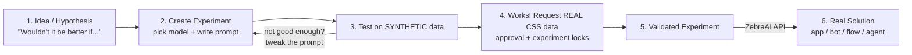

# ZebraAI, Explained Simply (but in Detail)

> A plain-language walkthrough of what ZebraAI is, the problem it solves, and how you
> use it — with a concrete worked example. Every claim here is grounded in the
> `ZebraAI-Wiki/` (the source of truth), with the exact wiki file cited so you can verify.

---

## 1. The one-sentence version

**ZebraAI is a secure, compliant "sandbox" where anyone in Customer Support (CSS) can
test ideas that mix a powerful AI (Azure OpenAI / GPT models) with real customer-support
case data — and, once an idea proves it works, turn it into a real tool.**

Source: [Overview.md](../../ZebraAI-Wiki/Get-Started-With-ZebraAI/Overview.md)
("*ZebraAI is an innovative, secure experimentation platform where users can test
scenarios that combine the power of Azure OpenAI with real CSS case data in a compliant
environment.*")

---

## 2. Why does this even need to exist? (The core problem)

Support engineers sit on a goldmine of information: thousands of past cases, email
threads, troubleshooting notes. Modern AI (like ChatGPT) is brilliant at reading text,
summarizing it, spotting patterns, and drafting replies.

So why not just paste customer cases into ChatGPT? **Because you can't.** Customer
support data contains sensitive, private customer information (PII). Pasting it into a
public AI tool would be a serious privacy and compliance violation.

That is the exact gap ZebraAI fills:

| The problem | Why it hurts | How ZebraAI solves it |
|-------------|--------------|-----------------------|
| Support teams want to use AI on real case data | Public AI tools aren't safe/compliant for customer data | Provides a **secure, compliant** environment approved for CSS data |
| Only "AI experts" can build AI tools | Ideas from front-line staff never get tried | **Democratizes** experimentation — no deep coding needed to start |
| Trying an AI idea normally takes weeks | Innovation is slow | Test an idea in **minutes** with prompts, not code |
| Using real customer data is risky | Privacy/PII exposure | **Synthetic data first**; real data only after approval, with auto PII protection |

Sources: [Overview.md](../../ZebraAI-Wiki/Get-Started-With-ZebraAI/Overview.md),
[Key-Features.md](../../ZebraAI-Wiki/Get-Started-With-ZebraAI/Key-Features.md),
[About-ZebraAI-Experiments.md](../../ZebraAI-Wiki/Get-Started-With-ZebraAI/About-ZebraAI-Experiments.md)

---

## 3. A simple analogy

Think of ZebraAI as a **science lab for AI ideas**:

- The **AI model** (GPT-4/4o/4o-mini) is your lab equipment.
- Your **prompt** (the instructions you write in plain English) is your experiment recipe.
- **Synthetic data** is the "safe practice sample" you test with first — fake but realistic.
- **Real CSS case data** is the "live sample" you only get to use after your method is
  proven and approved.
- An **Experiment** is the whole saved setup: equipment + recipe + settings, ready to run
  again and again.

You tweak the recipe, run it, look at the result, tweak again — exactly like the
scientific method. The wiki literally describes it this way: *"As is inherent in the
scientific method, ZebraAI is designed to support an iterative investigation and
validation of a hypothesis or idea."*
Source: [About-ZebraAI-Experiments.md](../../ZebraAI-Wiki/Get-Started-With-ZebraAI/About-ZebraAI-Experiments.md)

---

## 4. The central concept: an "Experiment"

**An Experiment is just an AI you customize for one specific purpose.**
Source: [About-ZebraAI-Experiments.md](../../ZebraAI-Wiki/Get-Started-With-ZebraAI/About-ZebraAI-Experiments.md)

When you create one, you make a few simple choices (from
[Create-An-Experiment.md](../../ZebraAI-Wiki/Get-Started-With-ZebraAI/Create-An-Experiment.md)):

1. **Experiment tab** — name, description, and who can see it (start **Private**;
   choose **Hackathon** if it's a hackathon project).
2. **User Experience tab** — the "shape" of the tool (e.g. a simple text box).
   *Note: this one setting can't be changed after creation.*
3. **Model tab** — which GPT model to use (GPT-4, GPT-4o, GPT-4o mini).
4. **Prompt tab** — the instructions. You can start from a **sample prompt**, write your
   own, or use the friendly **Builder Mode** (no coding needed).

Optional extras: a **Follow-Up Prompt** (runs a second step on the first step's output),
**Parameters** (creativity/randomness dials like Temperature and Top P), **Contributors**
(co-authors), and a **Custom UX** (add your own input fields).

Then you press **Create Experiment** and you're taken to the "Run" screen.

---

## 5. The lifecycle: idea → working tool

Key rules baked into this flow:

- **You must test on synthetic data first.** This protects real customer information.
  Source: [About-ZebraAI-Experiments.md](../../ZebraAI-Wiki/Get-Started-With-ZebraAI/About-ZebraAI-Experiments.md)
- **Iteration is expected.** Your prompt won't be perfect on the first try — run, analyze,
  adjust, repeat.
- **Real data is gated.** You request it via the "Request CSS Data Use" page; it goes
  through an **approval process**, and once submitted the experiment **locks** so the
  prompt/model can't be changed.
  Source: [Request-CSS-Data-Usage.md](../../ZebraAI-Wiki/How-To-Guides/Request-CSS-Data-Usage.md)
- **PII protection is automatic on real data.** When approved for real CSS data, a
  protective **system prompt is auto-injected** to guard PII.
  Source: [Create-An-Experiment.md](../../ZebraAI-Wiki/Get-Started-With-ZebraAI/Create-An-Experiment.md)

---

## 6. A worked example (this makes it click)

### The pain (problem statement)
Maria is a support engineer. Every morning she inherits cases from the overnight team.
Each case can be a long, messy thread — customer messages, engineer notes, error logs.
**Reading and understanding each case takes 10–15 minutes before she can even start
helping.** With a dozen cases, that's two hours gone just on *catching up*.

> **Problem statement:** "Support engineers lose significant time each day just reading
> and understanding long case histories before they can act."

### What Maria wishes existed
"Wouldn't it be better if something read the whole case and gave me a 5-line summary:
what's the issue, what's been tried, what the customer is feeling, and what to do next?"

That "wouldn't it be better if…" is the birth of an **idea** — exactly where ZebraAI
starts. Source: [About-ZebraAI-Experiments.md](../../ZebraAI-Wiki/Get-Started-With-ZebraAI/About-ZebraAI-Experiments.md)

### How she builds it in ZebraAI (no heavy coding)

1. **Create an Experiment** named *"Case Catch-Up Summary."*
2. **Pick a model** — GPT-4o (fast and accurate).
3. **Write a prompt** in plain English, for example:

   > "You are a support assistant. Read the case below. In 5 short bullet points, give:
   > (1) the core issue, (2) the likely cause, (3) what has already been tried,
   > (4) the customer's sentiment, and (5) the recommended next action. Be concise and
   > factual. Case: `{case data}`."

4. **Test on synthetic data** — ZebraAI provides fake-but-realistic cases so Maria can
   check the summaries without touching any real customer info.
5. **Run and review** — press **Submit**, read the 5-bullet summary, and if it's too long
   or misses the "what was tried" part, she **edits the prompt and runs again**. This is
   the iterate loop. Source:
   [Run-An-Experiment.md](../../ZebraAI-Wiki/Get-Started-With-ZebraAI/Run-An-Experiment.md)
6. **Chat for deeper digging** — after a run she can press **Chat** to ask follow-up
   questions about that specific case's summary.
   Source: [Run-An-Experiment.md](../../ZebraAI-Wiki/Get-Started-With-ZebraAI/Run-An-Experiment.md)

### Taking it live
Once the summaries are consistently good on synthetic data, Maria:

- **Requests real CSS data** so it works on actual cases (approval + auto PII protection),
  and/or
- **Requests an API endpoint** so the summary can appear right inside the tool her team
  already uses (a Teams bot, a web page, or an existing app), instead of visiting ZebraAI
  separately. Source:
  [About-ZebraAI-Experiments.md](../../ZebraAI-Wiki/Get-Started-With-ZebraAI/About-ZebraAI-Experiments.md)

### The outcome
That 10–15 minutes of reading per case becomes a 20-second glance at a summary. Multiply
by every engineer, every day — that's the kind of measurable impact ZebraAI is built to
unlock. (This "case summary" scenario is real: it already exists in production tools —
see [Rapid-Analyze.md](../../ZebraAI-Wiki/Experiment-Showcase/Rapid-Analyze.md).)

---

## 7. What ZebraAI can actually do (capabilities)

These are the "building blocks" you shape into ideas. All grounded in
[Common-Use-Cases.md](../../ZebraAI-Wiki/Get-Started-With-ZebraAI/Common-Use-Cases.md) and
[Key-Features.md](../../ZebraAI-Wiki/Get-Started-With-ZebraAI/Key-Features.md).

**Understand & summarize**
- Summarize long cases into short overviews.
- Answer questions about documents (Q&A over manuals, KB articles, tickets).

**Find patterns & insights**
- Text analytics: key topics, themes, and **sentiment**.
- Spot **emerging trends** (e.g. a spike in a new issue).
- **Cluster** similar cases to see what's trending or systemic.

**Create content**
- Draft KB articles, troubleshooting guides, FAQs for self-help.
- Draft personalized customer emails.
- **Translate / localize** into multiple languages.

**Automate & assist**
- Auto-categorize, prioritize, and route tickets.
- Recommend relevant products, articles, or next actions.
- Generate SQL queries and reports.

**The technical foundation**
- **Pre-trained GPT models**: GPT-4, GPT-4o, GPT-4o mini.
- **Hybrid search + vectorization** for grounding answers in support content.
- **Synthetic data** generation for safe testing.
- **Case data injection** into prompts (real data, post-approval).
- **Prompt test runs** for iterative refinement, plus shareable **sample prompts**.
- **API** to embed an experiment inside any app, bot, flow, or agent.
- **Secure Chat** (a private ChatGPT) for shaping ideas and even reviewing your prompts
  for PII/structure issues. Source:
  [Chat.md](../../ZebraAI-Wiki/Get-Started-With-ZebraAI/Chat.md)

---

## 8. The safety story (why it's "compliant")

This is what makes ZebraAI different from just using ChatGPT:

- **Synthetic-data-first**: you cannot start on real customer data; you validate on safe,
  fake data. Benefits: privacy protection, bias mitigation, controlled testing, and
  coverage of rare edge cases.
  Source: [Key-Features.md](../../ZebraAI-Wiki/Get-Started-With-ZebraAI/Key-Features.md)
- **Gated real data**: real CSS data requires an approval request describing your
  hypothesis, measurable outcome, target audience, and ROI. Source:
  [Request-CSS-Data-Usage.md](../../ZebraAI-Wiki/How-To-Guides/Request-CSS-Data-Usage.md)
- **Automatic PII protection**: on approved real-data experiments, a protective system
  prompt is injected automatically. Source:
  [Create-An-Experiment.md](../../ZebraAI-Wiki/Get-Started-With-ZebraAI/Create-An-Experiment.md)
- **Responsible AI**: built to Microsoft's ethical-AI standards, with a list of Restricted
  Uses. Source: [Overview.md](../../ZebraAI-Wiki/Get-Started-With-ZebraAI/Overview.md)

---

## 9. What you need to get in (access)

You can't just open it — access is staged. Source:
[Set-up-and-Access.md](../../ZebraAI-Wiki/Get-Started-With-ZebraAI/Set-up-and-Access.md)

1. **CoreIdentity role** (request **Contributor** to build; ~24–48h approval).
2. **VPN (MSFT-AzVPN-Manual) or GSA** network access.
3. Then sign in at the ZebraAI home page while connected.

Later, only when needed:
4. **API access** (register an app in Entra ID + request an endpoint) — to embed in a
   solution.
5. **Real CSS data** — only after the experiment works on synthetic data.

> Good news: for a hackathon demo you can usually get all the way with **synthetic data**,
> avoiding the real-data approval/lock cycle entirely.

---

## 10. How real teams use it (proof it works)

Existing production tools already run on ZebraAI experiments — useful both as proof and to
avoid rebuilding what exists:

- **Rapid Analyze** — case summaries, case trend/cluster analysis.
  [Rapid-Analyze.md](../../ZebraAI-Wiki/Experiment-Showcase/Rapid-Analyze.md)
- **CaseBuddy** — Similar Case discovery, "Know Me" customer context, Scope Assist, Case
  Transfer Agent, translation.
  [CaseBuddy-Production-Capabilities.md](../../ZebraAI-Wiki/Experiment-Showcase/CaseBuddy-Production-Capabilities.md)
- **Supportability Hub** — Apollo AI Authoring, Case Clusters, Case Review.
  [SupHub-Production-Capabilities.md](../../ZebraAI-Wiki/Experiment-Showcase/SupHub-Production-Capabilities.md)
- **Trellis** — a central AI hub for CSS: similar cases, backlog analysis, and
  leadership-facing views like Case/Tenant Recovery.
  [Trellis.md](../../ZebraAI-Wiki/Experiment-Showcase/Trellis.md)

---

## 11. The 30-second recap

- **What it is:** a secure lab to test AI + support-data ideas, then ship them.
- **Why it matters:** lets anyone safely use AI on customer data that public tools can't touch.
- **The unit of work:** an *Experiment* = model + prompt + settings.
- **The rule:** synthetic data first, real data only after it works (approval + PII guard).
- **The payoff:** wrap a validated experiment (via API) into an app/bot/flow/agent that
  saves time or improves support quality.

---

### Sources (all under `ZebraAI-Wiki/`)
- Get-Started-With-ZebraAI: `Overview.md`, `Key-Features.md`, `Common-Use-Cases.md`,
  `About-ZebraAI-Experiments.md`, `Create-An-Experiment.md`, `Run-An-Experiment.md`,
  `Chat.md`, `Set-up-and-Access.md`
- How-To-Guides: `Request-CSS-Data-Usage.md`,
  `Platform-Basics/How-to-request-CoreIdentity-role-for-ZebraAI.md`,
  `Platform-Basics/How-to-set-up-VPN-or-GSA-access-for-ZebraAI.md`
- Experiment-Showcase: `Rapid-Analyze.md`, `CaseBuddy-Production-Capabilities.md`,
  `SupHub-Production-Capabilities.md`, `Trellis.md`

> If anything here ever conflicts with the wiki, the wiki wins — it is the source of truth.
