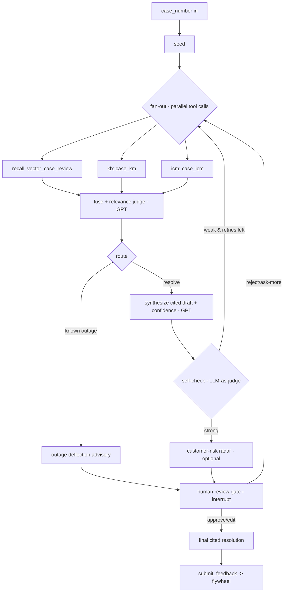

# Precedent AI — Phase 1 Plan: Agentic Backend (LangGraph + GPT reasoning + ZebraAI MCP)

> **Product:** Precedent AI (visual wordmark: *Pre-cedent AI*).
> **Phase:** 1 of 4 — **Backend / agent core.** Builds on Phase 0 (experiment JSON contracts +
> authored fixtures). Frontend (Phase 2) and Azure deploy (Phase 3) are planned separately.
> **Goal of this phase:** stand up a **fully agentic backend** — a **LangGraph** state-graph that
> **chains ZebraAI experiments as tools**, uses **GPT model reasoning** to fuse / judge / self-check,
> **deflects known outages**, and pauses at a **human-in-the-loop review gate** — running entirely on
> Phase 0's **synthetic mock fixtures**, with a **live path via the ZebraAI MCP server** behind one
> env var.
> **Source idea:** [Ideas/Precedent.md](../../Ideas/Precedent.md) (esp. §10, §13, §17).
> **Depends on:** [Precedent-AI-Phase0-ZebraAI-PLAN.md](./Precedent-AI-Phase0-ZebraAI-PLAN.md).
> **Grounded in:** `ZebraAI-Wiki/` (cited throughout).

---

## 1. Scope Summary

Build the **backend agent** and nothing else (no UI, no cloud deploy, no real CSS data):

1. A **`ZebraAIClient` seam** with two implementations behind `ZEBRAAI_MODE=mock|live`:
   - **`MockZebraAIClient`** — reads Phase 0 fixtures from `fixtures/zebraai/*.json`.
   - **`McpZebraAIClient`** — calls the **ZebraAI MCP server** `run_experiment` / `submit_feedback`
     tools over authenticated Streamable HTTP.
2. A **LangGraph agent** that chains the ZebraAI experiments as **tool nodes** (recall → KB → ICM),
   **fuses + relevance-judges**, **routes** (outage deflect / escalate / resolve), runs a bounded
   **self-check reflection loop**, and **interrupts for human review**.
3. **GPT reasoning nodes** (fuse, judge, synthesize, self-check) via **Azure OpenAI** (keys in env).
4. A thin **FastAPI** service, **CORS-enabled with auto OpenAPI docs**, exposing: start a resolution,
   fetch/resume after human review, and submit feedback — ready for the **React (Vite)** frontend.
5. **Tests**: per-node unit tests on mocks + an end-to-end graph test on the **flagship fixture**
   (`8809074412559830`) + the **"no precedent"** (sparse) honesty path.

**Out of scope for Phase 1:** frontend (Phase 2), Azure deployment (Phase 3), real CSS data, and any
new ZebraAI experiment creation (Phase 0 owns that).

> **Key decision — ZebraAI MCP as the live tool transport (see §6).** The live client is an **MCP
> client**, so "the agent calls ZebraAI as a tool" is literally true. Mock stays the default for the
> demo; live is a one-env-var flip, gated only by ZebraAI API/MCP approval.

---

## 2. Affected Areas

New `backend/` tree (Python) + reuse of Phase 0 `fixtures/zebraai/`. No changes to `ZebraAI-Wiki/`.

```
backend/
  pyproject.toml            # deps: langgraph, langchain-openai, httpx, fastapi, uvicorn, pydantic, azure-identity, pytest
  .env.example             # ZEBRAAI_MODE, MCP + Azure OpenAI settings (NO secrets committed)
  app/
    main.py                # FastAPI app + routes
    config.py              # pydantic-settings; validates required env at startup
    llm.py                 # Azure OpenAI chat model factory (GPT reasoning)
    models.py              # pydantic schemas mirroring the Phase 0 JSON contracts
    zebraai/
      client.py            # ZebraAIClient Protocol/ABC: run_experiment(...), submit_feedback(...)
      mock_client.py       # reads fixtures/zebraai/*.json
      mcp_client.py        # ZebraAI MCP JSON-RPC client (Streamable HTTP + Entra token)
      factory.py           # build client from ZEBRAAI_MODE
    graph/
      state.py             # PrecedentState (TypedDict) threaded through nodes
      graph.py             # build_graph(): nodes, edges, conditional routes, checkpointer
      nodes/
        seed.py            # normalize seed case
        recall.py          # Vector Case Review precedents (tool node)
        kb.py              # Case+KM KB grounding (tool node)
        icm.py             # Case+ICM outage check (tool node)
        fuse.py            # GPT: rank/keep relevant precedents
        route.py           # conditional: outage? / low-confidence? / high-risk?
        synthesize.py      # GPT: cited resolution draft + confidence
        selfcheck.py       # GPT LLM-as-judge; bounded retry
        risk.py            # optional customer-risk score (stretch)
        humangate.py       # interrupt() for approve/edit/reject
        feedback.py        # MCP submit_feedback (flywheel)
  tests/
    test_mock_client.py
    test_nodes.py
    test_graph_flagship.py # end-to-end on 8809074412559830
    test_graph_sparse.py   # honest "no precedent"
    test_mcp_client.py     # JSON-RPC contract vs mocked HTTP
fixtures/zebraai/          # from Phase 0 (flagship E1/E2/E3 + sparse + xbox)
```

---

## 3. Proposed Changes

### 3.1 The `ZebraAIClient` seam (mock ⇄ live, zero schema change)

One interface both implementations honor — the agent only ever sees this:

```python
class ZebraAIClient(Protocol):
    def run_experiment(self, experiment: str, case_number: str, **kw) -> dict: ...
    def submit_feedback(self, experiment: str, run_id: str, rating: str, note: str | None = None) -> dict: ...
```

- **`experiment`** is a logical name (`"vector_case_review" | "case_km" | "case_icm"`), mapped to a
  fixture filename (mock) or an **experiment GUID** (live MCP — friendly names are not supported by
  the MCP tool, [Using-ZebraAI-MCP-Server.md](../../ZebraAI-Wiki/How-To-Guides/Using-ZebraAI-MCP-Server.md)).
- **Per-experiment capability flags** (honest, matches Phase 0):
  - `vector_case_review` → **mock-only** (this type is **not** API/MCP-callable —
    [Ideas/Precedent.md](../../Ideas/Precedent.md) §7). Live mode still serves it from fixtures.
  - `case_km`, `case_icm` → **mock now, MCP-live when approved.**
- **`factory.build_client()`** reads `ZEBRAAI_MODE`; default `mock`.

### 3.2 The LangGraph agent (the "brain" — GPT reasoning + tool chaining)

Nodes and routing (grounded in [Ideas/Precedent.md](../../Ideas/Precedent.md) §17.4–§17.6):



- **Fan-out** = tool chaining across ZebraAI experiments (parallel branch nodes reduced into state).
- **GPT reasoning nodes** (`fuse`, `synthesize`, `selfcheck`, optional `risk`) call **Azure OpenAI**
  via `langchain-openai.AzureChatOpenAI`. These reason over **synthetic** retrieval outputs only.
- **Self-check loop** = LLM-as-judge rubric (grounded? sufficient? contradictions?) with a **bounded
  `retry_count`**; if still weak → emit honest **"no strong precedent"** (the trust beat,
  [Ideas/Precedent.md](../../Ideas/Precedent.md) §17.7).
- **Human gate** = LangGraph **`interrupt()`** + a **checkpointer** (`MemorySaver` for the demo) so
  the run pauses and can be resumed with the engineer's decision.

### 3.3 Agent state (`PrecedentState`)

TypedDict threaded through all nodes (from [Ideas/Precedent.md](../../Ideas/Precedent.md) §17.5):
`case_number`, `seed_case`, `precedents[]`, `kb_articles[]`, `incident|null`, `customer_360`,
`risk_score`, `draft{plan, reply, citations[]}`, `confidence`, `self_check{verdict, gaps}`,
`retry_count`, `route`, `review{decision, edited_text}`, `feedback`.
`models.py` pydantic classes mirror the **Phase 0 JSON contracts** so fixtures deserialize directly.

### 3.4 FastAPI surface (thin — the UI in Phase 2 consumes this)

| Method + path | Purpose |
|---|---|
| `POST /resolve` `{caseNumber}` | Run the graph until the human gate; return `threadId` + `draft` + `confidence` + `citations` + `route`. |
| `POST /resolve/{threadId}/review` `{decision, editedText?}` | Resume from `interrupt()`; `approve`/`edit` → finalize, `reject` → re-investigate. |
| `POST /feedback` `{experiment, runId, rating, note?}` | Calls `submit_feedback` (MCP live, no-op log in mock). |
| `GET /resolve/{threadId}` | Fetch current state/draft for a thread (React polling / reload). |
| `GET /healthz` | Liveness + reports `ZEBRAAI_MODE`. |

**React-facing contract (Phase 2 consumes this):**
- **CORS**: FastAPI `CORSMiddleware`, allowed origins from env `CORS_ALLOWED_ORIGINS`
  (default `http://localhost:5173` for Vite; comma-separated list), methods `GET,POST,OPTIONS`,
  JSON only. No cookies/credentials — the browser calls the API directly.
- **Stable JSON envelope** every route returns, so the UI has one shape to bind to:
  ```json
  { "threadId": "…", "status": "awaiting_review | finalized | investigating | error",
    "route": "resolve | deflect | escalate",
    "confidence": "high | medium | low",
    "draft": { "plan": "…", "reply": "…" },
    "citations": [ { "type": "case | kb | icm", "id": "…", "title": "…", "url": "…" } ],
    "outageDeflection": "… | null",
    "selfCheck": "passed | …",
    "requiresHumanApproval": true }
  ```
- **Typed errors**: `{ "status": "error", "error": { "code": "…", "message": "…" } }` with correct
  HTTP status codes (400 bad case number, 404 unknown thread, 502 upstream/MCP failure).
- **OpenAPI**: FastAPI auto-serves `/docs` + `/openapi.json` so the React team can generate a typed
  client. Pydantic response models make the schema authoritative.
- **Async, non-blocking** handlers so a long graph run (fan-out + self-check loop) doesn't stall the
  server; `threadId` returned immediately-on-pause via the human-gate `interrupt()`.

### 3.5 GPT model for the agent brain

- **Choice:** **Azure OpenAI** (GPT-4o / GPT-5-class) via env config — simplest, fully controllable,
  and keeps ZebraAI as the *retrieval* arsenal while GPT does the *reasoning*.
- **Alternative (noted, not built):** route reasoning through a ZebraAI generic/Function experiment
  via MCP ([Ideas/Precedent.md](../../Ideas/Precedent.md) §15.3) — more "all-ZebraAI" but adds an
  approval dependency; revisit only if it strengthens the demo.
- Temperature low (0.1–0.3) for the judge/synthesize nodes; secrets in env only.

---

## 4. ZebraAI MCP — does it make sense? (your question, answered)

**Yes — use it, and it's honest to say so.** Grounded in
[Using-ZebraAI-MCP-Server.md](../../ZebraAI-Wiki/How-To-Guides/Using-ZebraAI-MCP-Server.md):

**What it is:** ZebraAI hosts an **MCP server** at `https://zebra-ai-api-prd.ait.microsoft.com/mcp`
that exposes tools — including **`run_experiment`** and **`submit_feedback`** — over **Streamable
HTTP (JSON-RPC)** with **Microsoft Entra ID** auth. It uses the **same experiment access controls as
the ZebraAI API**.

**Why it fits Precedent AI perfectly:**
- It turns each ZebraAI experiment into a **standardized agent tool** — exactly the "tool chaining"
  framing of a LangGraph agent. Our `McpZebraAIClient.run_experiment(...)` is a thin JSON-RPC call.
- **`submit_feedback`** closes the human-in-the-loop **learning flywheel** (👍/👎 →
  [Ideas/Precedent.md](../../Ideas/Precedent.md) §15.5) with a first-class tool, not a bespoke API.
- It is the **cleanest live transport**: same Entra auth, one endpoint, tool-typed — so the live
  path is a drop-in behind `ZEBRAAI_MODE=live`.

**Honest limits (so we don't overclaim in the demo):**
- MCP is **not a shortcut around approval** — the experiment must be **API-approved** and the caller
  **authorized** (same gate as REST). So in the hackathon window the demo likely runs **mock**.
- **`run_experiment` takes an `experiment_id` GUID** (friendly names unsupported) + `search`,
  `max_rows`, `sensitive_do_not_log`. We store GUIDs in env, never in code.
- **Vector Case Review is not API/MCP-callable** — so the *recall* tool stays **mock** even in live
  mode; only **Case+KM / Case+ICM** can be real MCP calls once approved.
- MCP responses come back as `text/event-stream` (JSON-RPC result on the `data:` line) — the client
  must parse SSE.

**Recommendation:** build `McpZebraAIClient` now (it's small), wire `submit_feedback`, and **demo in
mock** — with a truthful talking point: *"Precedent calls ZebraAI through its MCP server as a tool;
here it's running on synthetic fixtures, and flips to live with one setting once API access lands."*
This maximizes Innovation + Feasibility scoring without overclaiming.

**MCP request shape we implement** (from the wiki):
```json
{ "jsonrpc": "2.0", "id": "2", "method": "tools/call",
  "params": { "name": "run_experiment",
    "arguments": { "experiment_id": "<GUID>", "search": "<case#>", "max_rows": 5, "sensitive_do_not_log": true } } }
```
Auth: Entra token, audience `api://9021b3a5-1f0d-4fb7-ad3f-d6989f0432d8`, scope `.../.default`
(via `azure-identity` `DefaultAzureCredential` or an az-cli token). Headers include
`MCP-Protocol-Version: 2024-11-05` and `Accept: application/json, text/event-stream`.

---

## 5. Constitution & Governance Compliance Check

- ✅ **Synthetic-data-first** — the entire agent runs on Phase 0 synthetic fixtures; GPT reasons only
  over synthetic retrieval outputs. No real CSS data.
- ✅ **No hardcoded secrets** — Azure OpenAI keys, MCP experiment GUIDs, tenant/resource IDs all in
  env (`config.py` validates at startup); `.env` is git-ignored, `.env.example` documents keys.
- ✅ **No secrets/PII in logs** — set `sensitive_do_not_log: true` on MCP calls; structured logging
  redacts tokens and case content; nothing personal is logged.
- ✅ **Grounded in the wiki** — MCP request/auth shape, tool list, and API gating cited from
  [Using-ZebraAI-MCP-Server.md](../../ZebraAI-Wiki/How-To-Guides/Using-ZebraAI-MCP-Server.md); no
  invented endpoints/fields. Open items flagged in §7.
- ✅ **Mandated order respected** — Phase 0 (create/validate/request API) precedes this integration;
  live calls stay disabled until approval lands.
- ✅ **Human-in-the-loop** — no output is "final" without the engineer's approval (`interrupt()`).

---

## 6. Test / Validation Strategy

**Principle:** the agent is ordinary software — every node is unit-testable offline against mocks
([Ideas/Precedent.md](../../Ideas/Precedent.md) §16).

- **`test_mock_client`** — each fixture deserializes into its `models.py` schema; unknown experiment
  raises a clear error.
- **`test_nodes`** — `fuse` keeps only relevant precedents; `synthesize` emits citations for every
  claim; `selfcheck` returns a verdict and respects the retry bound; `route` picks
  outage/escalate/resolve correctly from state.
- **`test_graph_flagship`** — end-to-end on `8809074412559830`: expects `route=deflect`-aware output
  citing **IcM 599372041** + KB **417802**, `confidence` high, and a pause at the human gate; then
  resume `approve` → finalized; `POST /feedback` invoked.
- **`test_graph_sparse`** — the "no precedent" case → agent emits honest low-confidence
  "no strong precedent" (no hallucinated cases/citations).
- **`test_mcp_client`** — against a **mocked HTTP** server: correct JSON-RPC body, headers,
  `sensitive_do_not_log:true`, SSE `data:` parsing, and a 401→token-refresh path. **No live network
  call in CI.**
- **Manual smoke:** `uvicorn` up → `POST /resolve` → review → `/feedback`, in `ZEBRAAI_MODE=mock`.

**Definition of Done (Phase 1):**
- [ ] `ZebraAIClient` seam + `Mock`/`Mcp` clients + factory; `ZEBRAAI_MODE` switch works.
- [ ] LangGraph graph with seed → fan-out → fuse/judge → route → synthesize → self-check loop →
      human gate → feedback, checkpointer-backed.
- [ ] FastAPI routes (`/resolve`, `/resolve/{id}/review`, `/resolve/{id}`, `/feedback`, `/healthz`).
- [ ] **CORS enabled** (origins from env) + auto **OpenAPI `/docs`** so the React app can consume it.
- [ ] All tests pass on mocks (flagship + sparse + node + MCP-contract).
- [ ] `.env.example` + startup validation; no secrets in repo; README run steps.

---

## 7. Risks & Open Questions

1. **MCP `run_experiment` input for search-and-select experiments (open)** — Case+KM / Case+ICM are
   *search-and-select*, not single-case lookups; confirm what `search`/args select the case at call
   time (carried from Phase 0 §8). *Mitigation:* mock-first; only affects the live flip.
2. **API/MCP approval lead time** — *LOW*: demo runs on mocks; live is a one-env-var swap.
3. **Recall is mock-only** — Vector Case Review isn't API/MCP-callable; precedent recall stays
   synthetic even in live mode. *Accept* — it's the documented reality; be transparent in the demo.
4. **Azure OpenAI availability** — the agent brain needs a GPT deployment; if none is handy, tests
   mock the LLM and the live brain is wired later. *Open:* which subscription/deployment to use.
5. **SSE parsing / MCP "in testing"** — the MCP server is flagged *in testing*
   ([Using-ZebraAI-MCP-Server.md](../../ZebraAI-Wiki/How-To-Guides/Using-ZebraAI-MCP-Server.md));
   contract may shift. *Mitigation:* isolate all MCP quirks in `mcp_client.py`.
6. **LangGraph `interrupt()` + checkpointer choice** — `MemorySaver` is fine for the demo; a
   durable store is a Phase 3 concern. *Open:* confirm resume semantics for the chosen version.
7. **Feedback identifiers** — `submit_feedback` needs an experiment id + run id; confirm the run id
   returned by `run_experiment` so 👍/👎 maps to the right run.

---

## 8. Approval Request

This Phase 1 plan delivers the **agentic backend**: a LangGraph state-graph that **chains ZebraAI
experiments as tools**, applies **GPT reasoning** to fuse / judge / self-check, **deflects known
outages**, and enforces a **human-in-the-loop gate** — running on Phase 0 synthetic fixtures, with a
**ZebraAI MCP live path** behind one env var. It uses the MCP server exactly as documented and is
honest about approval gating and the mock-only recall.

**Next after Phase 1 approval:** Phase 2 (frontend consuming these routes) + Phase 3 (Azure deploy).

**Implementation should wait for developer confirmation.** Please confirm this Phase 1 plan (or
request changes — e.g., Python vs. another stack, Azure OpenAI vs. ZebraAI-model reasoning, or which
add-ons to include) before any code is written.
