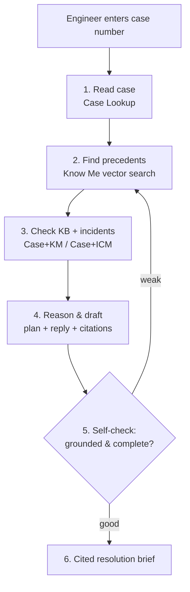
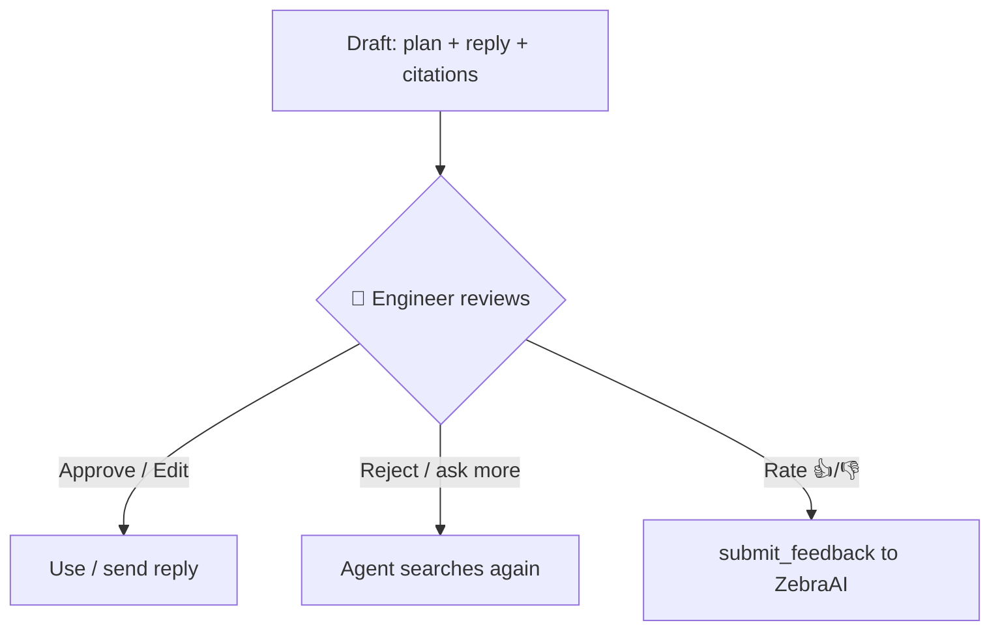
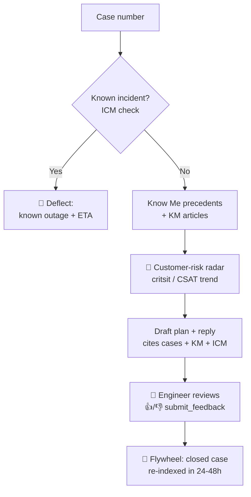
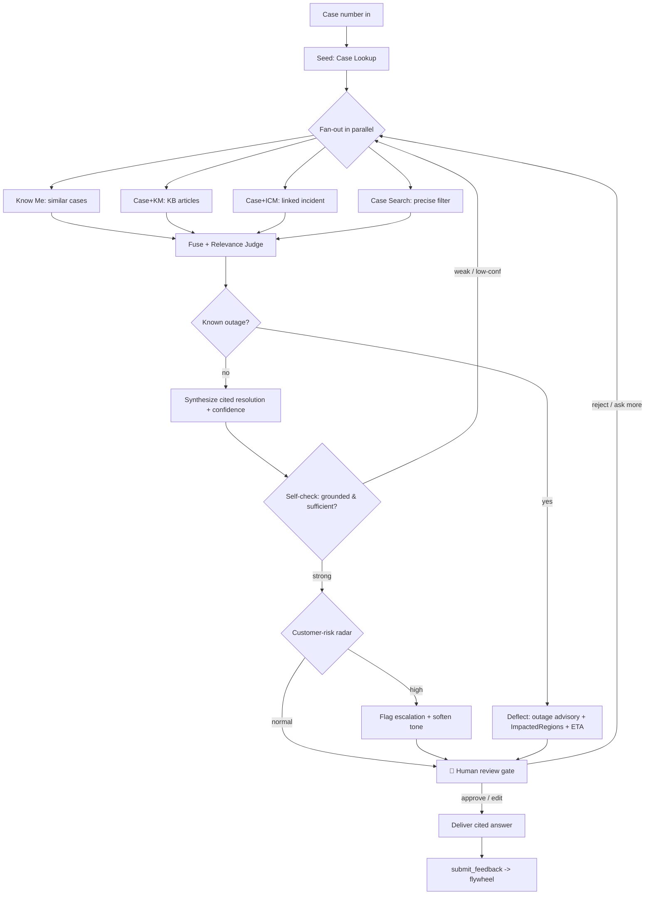

# Idea: "Precedent AI" — an agent that resolves cases by finding how they were solved before

> **Product name:** **Precedent AI** (short form: *Precedent*).
> **Wordmark (visual only):** stylized as **Pre-cedent AI** on the logo / hero slide — the hyphen
> spotlights *"Pre"* (= *before*, "it's already been solved before"). Sub-line: *"Because it's been
> solved before."* Use the plain **Precedent AI** in all text/docs/code/search; use **Pre-cedent AI**
> only as a visual design treatment.
> **Status:** ✅ **LOCKED** — chosen direction. Flagship full-power design is in §17 (the build
> target). Ready to hand to the `plan` agent.
> **Tagline:** *Every hard case has already been solved. Precedent AI finds it — and resolves like your best engineer.*
> **Build in one line:** a **LangGraph** agent that fans out across **ZebraAI** experiments
> (Know Me + Case+KM + Case+ICM + Case Search), fuses + self-checks the result, deflects known
> outages, scores customer risk, and hands the engineer a **cited, confidence-scored** resolution
> behind a human-review gate. See **§17** for the full design.

---

## 1. Problem statement

Support engineers waste time re-investigating problems that have **already been solved**, because
the knowledge — prior cases, KB articles, known incidents, customer history — is scattered and
locked in individual engineers' heads. This makes resolutions **slow, inconsistent, and dependent
on personal experience**. New engineers can't tap the org's collective memory; known issues get
re-solved from scratch; "this is a known incident" signals get missed.

These are exactly the pains ZebraAI targets: summarizing case interactions, recommending next
actions/KB, finding and reusing accurate information, and raising interaction quality.
Grounded in [Common-Use-Cases.md](../ZebraAI-Wiki/Get-Started-With-ZebraAI/Common-Use-Cases.md).

## 2. One-line solution

When a case comes in, **Precedent** instantly finds how the same problem was solved before,
verifies it against official guidance, and hands the engineer a **trustworthy, cited answer** —
so known problems are solved in seconds, not hours.

## 3. Who it's for

- **Primary:** a frontline CSS support engineer who was just assigned / picked up a case.
- **Secondary:** newer engineers (onboarding), and escalation managers (as a future extension).

## 4. Trigger / entry point

- **Primary (hero path):** engineer enters a **case number**.
- Same engine also works **event-driven** (a new/assigned/transferred case auto-feeds the case number) — a "in production this fires automatically" talking point.
- **Stretch:** free-text symptom (no case yet) — limited because the free-text embedding search is not API-callable (see §7).

## 5. How it works (end-to-end)

1. **Read the case** — look up the case: symptom, product, severity, customer.
   ZebraAI: **Commercial Case Lookup** ([ref](../ZebraAI-Wiki/Reference/Experiment-Types/Commercial-Case-Lookup.md)).
2. **Find precedents (cognitive)** — call the **Know Me** experiment; ZebraAI runs a **vector /
   semantic search** and returns similar **resolved** cases (`@{KnowMeRelatedClosedCases}`), how
   they were fixed (`@{ResolutionText}`, `@{RootCause...}`), similar **open** cases (is it
   trending?), plus a **customer 360** (CSAT, `@{CritsitRatio}`, `@{SurveyNegativeThemes}`,
   strategic flags). ZebraAI: **Know Me** ([ref](../ZebraAI-Wiki/Reference/Experiment-Types/Know-Me.md)).
3. **Check official guidance & known incidents** — KB articles + linked incidents/outages.
   ZebraAI: **Commercial Case + KM** ([ref](../ZebraAI-Wiki/Reference/Experiment-Types/Commercial-Case-KM.md)),
   **Commercial Case + ICM** ([ref](../ZebraAI-Wiki/Reference/Experiment-Types/Commercial-Case-ICM.md)).
4. **Reason & synthesize** — the agent reads the precedents, judges relevance, extracts the common
   fix, and drafts a **resolution plan** + **draft customer reply** + **citations** (case #s, KB IDs).
5. **Self-check** — the agent grades its own answer for grounding/completeness; if weak it loops
   back and searches more; if no real precedent exists it says so honestly (no hallucination).
6. **Deliver** — a clean, cited brief in seconds.

## 6. Division of labor (what makes it "cognitive")

- **ZebraAI** = the data + the search engine + the GPT models. The **Know Me** vector search finds
  precedents by *meaning*, not keywords — this is the cognitive retrieval, done by ZebraAI.
- **Our LangGraph app** = the brain: decides which experiments to call, judges relevance, drafts
  the answer, cites sources, and self-checks. This is the cognitive reasoning we add.

## 7. Key technical finding (API availability)

Three vector (semantic) search experiments exist; only one is API-callable — and it's the best:

| Experiment | Vector search | API-callable | Source |
|---|---|---|---|
| Commercial Case Embedding Search | Yes | **No** | [ref](../ZebraAI-Wiki/Reference/Experiment-Types/Commercial-Case-Embedding-Search.md) |
| Commercial Vector Case Review | Yes | **No** | [ref](../ZebraAI-Wiki/Reference/Experiment-Types/Commercial-Vector-Case-Review.md) |
| **Know Me** | **Yes** | **Yes** | [ref](../ZebraAI-Wiki/Reference/Experiment-Types/Know-Me.md) |

**Implication:** the case-number path is fully cognitive via API through **Know Me**. OData/keyword
search ([Commercial-Case-Search](../ZebraAI-Wiki/Reference/Experiment-Types/Commercial-Case-Search.md))
is only a fallback filter, not the brain.

## 8. Why it can win (judging criteria)

| Criterion | Why |
|---|---|
| **Innovation** | Agentic RAG + self-check across *multiple* experiment types (esp. the under-used Know Me) — beyond last year's "summarize one case". |
| **Impact** | Faster, consistent, evidence-grounded resolutions; stops re-solving solved problems; helps onboarding. |
| **Feasibility** | LangGraph + ZebraAI API/MCP on **synthetic data**; Know Me is API-callable; safe OData fallback. |
| **Collaboration** | Reuses shared experiments, KB, ICM — surfaces knowledge across teams. |

## 9. Smallest demoable slice

- Steps **1 → 2 → 4** on synthetic data = core "wow" (find precedent → cited answer).
- Then add Step **5** (self-check), then Step **3** (KB/ICM enrichment).
- Fully synthetic data; no real CSS data approval needed for the demo.

## 10. Tech approach

- **LangGraph** state-graph agent (conditional routing + a reflection cycle) — the natural fit for
  multi-tool orchestration with a self-check loop.
- ZebraAI reached via **API** (and/or the **MCP server** `run_experiment` tool).
- Never hardcode keys/endpoints — load from env vars; keep secrets/PII out of logs and the demo.

## 11. Open questions (for the `plan` agent)

1. Confirm **Know Me** API wiring end-to-end (auth scope, request/response shape, which `@{...}`
   fields come back) and that related-closed-cases include resolution text.
2. Which **surface** for the demo: VS Code panel, Teams (Zee), Copilot Studio, or a small web app?
3. Do we call ZebraAI via the **REST API** or the **MCP server**? (MCP is "in testing".)
4. How to represent the **self-check** loop (LLM-as-judge rubric; retry budget).
5. Synthetic test cases: build a small "golden set" of case + expected precedent for the demo —
   and confirm the chosen synthetic cases return decent `@{KnowMeRelatedClosedCases}` (§16 risk 1).
6. **ICM branch**: confirm the **Commercial Case + ICM** experiment is API-callable and which
   fields (`HowFixed`, `ImpactedRegions`, `ImpactStartDate`) come back (§15.1).
7. **Feedback loop**: wire the MCP `submit_feedback` tool for the 👍/👎 signal (§15.5).
8. How to compute the **customer-risk score** from Know Me signals (§15.2) — thresholds/weights.

## 12. Alternatives considered (not chosen here)

- **ProofLoop** — an eval/auto-improvement harness for ZebraAI experiments (uniquely developer,
  high Collaboration, less flashy).
- **Mentor** — engineer coaching + team skill-gap graph (warm story).

---

## 13. Human-in-the-loop review gate (core, not optional)

Precedent **assists**; the engineer **decides**. The AI never sends anything to a customer on its
own. After synthesis + self-check, the agent **pauses** for the engineer to **approve, edit, or
reject** the resolution plan and draft reply. Citations make the review fast (trust-but-verify in
seconds). A 👍/👎 (or a correction) is captured as feedback (see §15.5).

- **Why:** trust, accountability, and adoption — engineers trust "here's my suggestion, you decide".
- **Precedent from winners:** last year's *Case Transfer Agent* used a Teams human-review step
  before writing anything back — a proven pattern here.
- **Judging:** strengthens Innovation (responsible AI), Impact (real adoption), Feasibility.
- **Caution:** keep it *review*, not *rewrite* — read plan, glance at citations, approve/tweak.

## 14. The knowledge flywheel (auto re-index)

When an engineer **closes** a case (with resolution + root cause), ZebraAI **automatically
re-ingests** it via the twice-daily batch → Azure AI Search, so it becomes a **future precedent**
with **no manual indexing**. Precedent *rides on top of* this existing flywheel; it surfaces the
index at the right moment rather than building it.

- **Cadence:** NRT within 15 min; everything else within 24h; **Cornerstone/ICM 24–48h** lag.
  Sources: [Dataflow.md](../ZebraAI-Wiki/Reference/Data/Dataflow.md),
  [ZebraAI-FAQ.md](../ZebraAI-Wiki/Reference/ZebraAI-FAQ.md) (§6).
- **The story:** solve a hard case today → it becomes tomorrow's precedent automatically →
  the system gets smarter with every closed case. Strong **Impact** narrative.
- **Honest caveat:** a case closed an hour ago isn't a precedent yet (24–48h lag); you can't force
  an instant re-index.

## 15. Level-up / flashy extensions (grounded in the wiki)

Curated by flash-per-effort. The recommended demo layers **#1 + #2 + #4** on top of the core.

### 15.1 🚨 Outage-aware — "Is this a known incident?" *(top pick)*
Cases carry `@{ICMId}` / `@{ICMUrl}`; the **Commercial Case + ICM** experiment is API-capable and
exposes `HowFixed`, `ImpactedRegions`, `ImpactStartDate`. Instead of hunting a fix, Precedent can
say *"known outage ICM-48213, mitigation ETA 30 min"* → **deflect**, saving hours.
Sources: [Commercial-Case-ICM.md](../ZebraAI-Wiki/Reference/Experiment-Types/Commercial-Case-ICM.md),
[Data-Dictionary-ICM.md](../ZebraAI-Wiki/Reference/Data/Data-Dictionary-ICM.md).

### 15.2 🎯 Customer-risk radar
Know Me already returns `@{CritsitRatio}`, `@{SurveyNegativeThemes}`, `@{AvgDaysToClose}`, CSAT
trend. Precedent computes a **risk score** — *"critsit-prone, CSAT declining → handle with care,
escalate"* — so it advises not just *what* to do but *how urgently*.
Source: [Know-Me.md](../ZebraAI-Wiki/Reference/Experiment-Types/Know-Me.md).

### 15.3 🤖 ZebraAI as an agentic tool-caller *(stretch)*
The **Function/Tool** experiment lets the LLM choose which functions to call — and *"even ZebraAI
experiments can be called as functions"*. **API-capable (V2 endpoint only).** Enables nested
agentic reasoning (a Functions experiment orchestrating Know Me / KM / ICM as tools).
Sources: [Functions.md](../ZebraAI-Wiki/Reference/Experiment-Types/Functions.md),
[Experiment-Types.md](../ZebraAI-Wiki/Reference/Experiment-Types/Experiment-Types.md).

### 15.4 💬 Meet engineers where they live — Teams / Copilot Studio delivery
Surface Precedent through **Zee (ZebraAI agent for Teams & Copilot)**, the **Copilot Studio
connector**, or the **MCP server** — paste a case number in Teams, get a Precedent card back.
Feels production-ready. Sources:
[ZebraAI-Agent-(Zee)-for-Teams-and-Copilot.md](../ZebraAI-Wiki/Community-and-Support/ZebraAI-Agent-(Zee)-for-Teams-and-Copilot.md),
[How-to-use-the-ZebraAI-Connector-in-Power-Platform-or-Microsoft-Copilot-Studio.md](../ZebraAI-Wiki/How-To-Guides/How-to-use-the-ZebraAI-Connector-in-Power-Platform-or-Microsoft-Copilot-Studio.md),
[Using-ZebraAI-MCP-Server.md](../ZebraAI-Wiki/How-To-Guides/Using-ZebraAI-MCP-Server.md).

### 15.5 🔁 Closed-loop learning (thumbs → `submit_feedback`)
The MCP server exposes a **`submit_feedback`** tool. Engineer rates the suggestion → fed back →
combined with the §14 flywheel, Precedent visibly *learns*.
Source: [Using-ZebraAI-MCP-Server.md](../ZebraAI-Wiki/How-To-Guides/Using-ZebraAI-MCP-Server.md).

### 15.6 🌐 Answer in the customer's language
ZebraAI supports non-English support; find an English precedent but draft the reply in the
customer's language. Source: [ZebraAI-FAQ.md](../ZebraAI-Wiki/Reference/ZebraAI-FAQ.md) (§4).

### 15.7 ⛔ Avoid: TMaaS
TMaaS (topic modeling) looks tempting for trend detection but is **shut down** per the changelog —
don't build on it; do trend/clustering in our own agent instead.
Source: [.ChangeLog.md](../ZebraAI-Wiki/.SiteSettings/.ChangeLog.md).

### Recommended "flashy but feasible" flow (#1 + #2 + #4)

## 16. Testability (validated against the wiki)

**Yes — end-to-end, on synthetic data, with zero CSS-data approval.** A Contributor can create/run
experiments on synthetic data immediately; every experiment starts synthetic by default. Synthetic
data preserves *structure, relationships, and behavioral patterns* — so related-case links exist to
test Know Me against. Sources:
[About-ZebraAI-Experiments.md](../ZebraAI-Wiki/Get-Started-With-ZebraAI/About-ZebraAI-Experiments.md),
[CoreIdentity-Permissions.md](../ZebraAI-Wiki/Reference/ZebraAI-Platform/CoreIdentity-Permissions.md),
[Synthetic-Data-Creation-Process.md](../ZebraAI-Wiki/Reference/Data/Synthetic-Data-Creation-Process.md).

**Three independent test levels:**
1. **Experiment (no code)** — build Know Me + KM experiments in the UI, feed a synthetic case,
   eyeball output. Validates the *prompt* first (required step anyway).
2. **API** — call the experiment with a synthetic case number; assert the JSON shape.
3. **Agent** — the LangGraph part is ordinary software: unit-test each node and **mock the ZebraAI
   API** entirely. Routing, fusion, self-check, and "no precedent found" are testable **offline**.

**Concrete test cases:** golden case (returns plan + ≥1 citation + confidence); empty-precedent case
(agent honestly says "no strong precedent" — a great demo moment); KM-only case; mocked API-failure
(graceful degrade).

**Risks & mitigations (for the `plan` agent):**
1. *Synthetic precedent density* may be thin → pick/seed 2–3 synthetic cases confirmed to return
   good neighbors; build the demo around those.
2. *API access lead time* → request early; develop against **mocked** ZebraAI responses so you're
   never blocked; MCP `run_experiment` is an alternative path.
3. *No real closed cases for the demo* (nor should there be) → the synthetic flywheel demonstrates
   the concept fully.

---

## 17. Flagship / full-power design (the build target for the `plan` agent)

This is the **maximal** version of Precedent — the one we intend to build and demo. It deliberately
shows off **both** engines: **ZebraAI** as a multi-experiment retrieval/reasoning arsenal, and
**LangGraph** as the autonomous brain that fans out, cross-examines, self-critiques, and routes.
Everything below is grounded in the wiki and verified API-callable.

### 17.1 Vision (the flashy framing)

> **Precedent** — give it a case number and an autonomous agent *investigates*: it pulls similar
> cases, KB articles, and live incidents **in parallel**, cross-examines them, catches known
> outages, scores customer risk, writes a **cited, confidence-scored resolution** — and honestly
> says *"I'm not sure"* when it isn't. A junior engineer gets a senior engineer's judgment in
> ~30 seconds.

The differentiator vs. existing production tools (CaseBuddy *Similar Case*, Trellis *Nostalgic
VKB*, LittleAnt): those **surface single-experiment outputs for a human to read**. Precedent is an
**autonomous agent** that **fuses multiple sources**, **reasons across them**, **self-checks**
(reflection / LLM-as-judge), **deflects known outages**, **scores customer risk**, and keeps a
**human-review gate + feedback flywheel**. Retrieval is commoditized; the *agentic
orchestration + trust/verification layer* is the novel, judge-worthy wedge. **Demo rule: lead with
the reasoning/self-check story, never "another similar-case search."**

### 17.2 LangGraph superpowers we intentionally show off

1. **Parallel fan-out (map-reduce)** — call 4 ZebraAI experiments at once, then reduce/fuse.
2. **Conditional routing** — the graph decides its own path: outage → deflect; low similarity →
   widen search; high-risk customer → escalate.
3. **Reflection / self-check loop** — an LLM-as-judge node grades the draft; if weak it loops back
   and searches again (the "it corrected itself" moment).
4. **Human-in-the-loop gate** — `interrupt()` pauses for engineer approve / edit / reject before
   anything is "final" (see §13).
5. **Persistent memory + feedback** — approvals/edits feed back via the ZebraAI MCP
   `submit_feedback` tool → the flywheel (see §14, §15.5).

### 17.3 ZebraAI experiments wired as agent "tools" (the arsenal)

Each node calls a different ZebraAI experiment — this is what "full use of ZebraAI" means. **All
rows below are API-callable** (the two non-API vector types from §7 are intentionally excluded).

| Agent node | ZebraAI experiment (tool) | Returns (key fields) | Source |
|---|---|---|---|
| **Seed** | Commercial Case Lookup | `@{IssueDescription}`, `@{SymptomText}`, `@{SAP...}`, `@{CurrentSeverity}`, `@{ICMId}` | [ref](../ZebraAI-Wiki/Reference/Experiment-Types/Commercial-Case-Lookup.md) |
| **Recall (semantic)** | **Know Me** | related closed/open cases, `@{ResolutionText}`, `@{RootCause...}`, customer-360 (`@{CritsitRatio}`, `@{SurveyNegativeThemes}`, `@{AvgDaysToClose}`, CSAT) | [ref](../ZebraAI-Wiki/Reference/Experiment-Types/Know-Me.md) |
| **Filter (precise)** | Commercial Case Search / Advanced Editor | OData hard-filter by product / severity / date / CSAT | [ref](../ZebraAI-Wiki/Reference/Experiment-Types/Commercial-Case-Search.md), [ref](../ZebraAI-Wiki/Reference/Experiment-Types/Search-using-Advanced-Editor.md) |
| **KB grounding** | Commercial Case + KM | `@{CaseResults}` + `@{ContentResults}` (KB `@{Title}/@{Content}/@{Url}/@{Source}`) | [ref](../ZebraAI-Wiki/Reference/Experiment-Types/Commercial-Case-KM.md) |
| **Outage check** | Commercial Case + ICM | linked incident `HowFixed`, `ImpactedRegions`, `ImpactStartDate` | [ref](../ZebraAI-Wiki/Reference/Experiment-Types/Commercial-Case-ICM.md) |
| **(Stretch) autonomous tool-pick** | Function/Tool experiment (V2) | LLM chooses which experiment to call | [ref](../ZebraAI-Wiki/Reference/Experiment-Types/Functions.md) |
| **Feedback** | MCP `submit_feedback` | closes the learning loop | [ref](../ZebraAI-Wiki/How-To-Guides/Using-ZebraAI-MCP-Server.md) |

### 17.4 The full agent graph (maxed)

### 17.5 Agent state (shape sketch for the `plan` agent)

A single LangGraph state object threaded through all nodes (finalize exact schema in planning):

- `case_number`, `seed_case` (raw Case Lookup fields)
- `precedents[]` (Know Me: case #, resolution, root cause, similarity), `open_cases[]` (trending?)
- `kb_articles[]` (title, url, snippet), `incident` (ICM id, HowFixed, ImpactedRegions, ETA | null)
- `customer_360` (critsit ratio, CSAT trend, negative themes) → `risk_score`
- `draft` (resolution plan + customer reply + `citations[]`), `confidence` (0–1)
- `self_check` (verdict, gaps), `retry_count` (bounded), `route` (deflect | resolve | escalate)
- `review` (approve | edit | reject + edited text), `feedback` (👍/👎 + correction)

### 17.6 Node responsibilities (map-to-implementation)

- **Seed** — Case Lookup; extracts symptom/product/severity + `@{ICMId}` for the outage branch.
- **Fan-out** — parallel Know Me + Case+KM + Case+ICM + Case Search (OData filter scoped by the
  seed's product/severity to raise precision).
- **Fuse + Relevance Judge** — LLM ranks/keeps only genuinely relevant precedents; drops noise.
- **Outage router** — if a live/recent incident is linked → **deflect** with advisory (§15.1).
- **Synthesize** — draft plan + customer reply, each claim **cited** (case #, KB url, ICM id).
- **Self-check (LLM-as-judge)** — rubric: grounded? sufficient? contradictions? → loop or pass;
  bounded `retry_count`; if still weak, emit honest **"no strong precedent"** (§16 test case).
- **Customer-risk radar** — compute `risk_score` from Know Me 360 signals → escalate/soften (§15.2).
- **Human gate** — `interrupt()`; engineer approves/edits/rejects (§13).
- **Feedback** — MCP `submit_feedback` (§15.5) → flywheel (§14).

### 17.7 Three "wow" moments to script into the demo video

1. **Self-correction** — first pass is low-confidence; the judge node loops, widens the search,
   returns strong. Judges *see it think*.
2. **Outage deflection** — a case whose `@{ICMId}` maps to a live incident; the agent stops and
   says *"known outage in West Europe, ETA X — don't troubleshoot,"* instead of chasing a fix.
   Nobody else demos this.
3. **Honest "I don't know"** — a novel case with no precedent; it refuses to hallucinate and says
   so with low confidence. The *trust* beat that wins Innovation + Impact.

### 17.8 Build scope (ruthless, so it ships by judging week)

- **Core (must-build):** Seed → **Know Me + Case+KM** fan-out → Fuse/Judge → **self-check loop** →
  cited answer → **human gate**. That alone is the differentiated agent (maps to §9 slice + §13).
- **Flashy add-ons (build if time):** **ICM outage-deflection** branch (wow #2),
  **customer-risk radar**, **`submit_feedback`** flywheel.
- **Stretch / mention-only:** Function/Tool autonomous tool-picking (§15.3),
  Teams / Copilot Studio / MCP delivery surface (§15.4), customer-language reply (§15.6).
- **Data:** 100% **synthetic** for the entire build & demo — no CSS-data approval needed (§16).
- **Guardrails:** env-var secrets only; no keys/PII in logs or the demo; develop against **mocked**
  ZebraAI responses so API lead time never blocks (§16 risk 2). ⛔ Do **not** build on TMaaS (§15.7).

---

## 18. Positioning & competitive landscape (read before planning / demo)

### 18.1 The core insight: *which axis of ZebraAI do we extend?*

Every past hackathon winner is essentially an **extension of ZebraAI** — that's the proven winning
archetype. But almost all of them extend the **usability / scale / distribution / breadth** axis
(a nicer way to *run* experiments). Precedent deliberately extends a **different** axis:

> **Others extend how you *run* ZebraAI. Precedent extends how ZebraAI *thinks*.**
> A thin UI/portal layer *surfaces one experiment's output for a human to read*. Precedent is a
> **thick reasoning layer**: it runs *several* experiments, **fuses** them, **judges relevance**,
> **self-checks** (LLM-as-judge), **deflects known outages**, and returns a **cited,
> confidence-scored resolution** — autonomously, for one job: *resolve this case*.

**This is the single sentence the demo + `plan` must lead with.** Not "another similar-case search."

### 18.2 Prior art — retrieval is commoditized; reasoning is not

| Tool | What it extends | Overlap with Precedent |
|---|---|---|
| **Trellis AI Central** (multi-award winner; Azure Web App portal, 28+ scenarios, 2500-case scale, Excel export, 1100+ MAU, 615K cases/90d) | Usability + scale + reporting | 🟡 Contains a *Nostalgic VKB* similar-case scenario — but it's a **human-run portal**, not an agent |
| **CaseBuddy** — *Similar Case* + *Know Me* | Surfaced packaged experiences | 🔴 Similar-case + customer-360 exist — but **displayed**, not fused/reasoned |
| **Trellis — Nostalgic VKB** | A single lookup scenario | 🔴 Retrieval only |
| **LittleAnt** | Chains experiments (summaries, scoping) | 🟡 Chaining, not autonomous reasoning/self-check |
| **SupHub — Case Clusters** | Outage/pattern detection | 🟡 Overlaps §15.1 ICM idea — but not per-case deflection |

Sources: [CaseBuddy-Production-Capabilities.md](../ZebraAI-Wiki/Experiment-Showcase/CaseBuddy-Production-Capabilities.md),
[Trellis.md](../ZebraAI-Wiki/Experiment-Showcase/Trellis.md),
[LittleAnt.md](../ZebraAI-Wiki/Experiment-Showcase/LittleAnt.md),
[SupHub-Production-Capabilities.md](../ZebraAI-Wiki/Experiment-Showcase/SupHub-Production-Capabilities.md).

**Honest take:** raw "similar-case discovery" is **commoditized** (it's already a menu item in
multiple production tools). Precedent's novelty is **not** retrieval — it's the **agentic
orchestration + trust/verification layer** (fusion, self-check, honest "no precedent," outage
deflection, customer-risk radar, human gate, feedback flywheel).

### 18.3 Collaboration play — ride the platform, don't compete with it

Trellis has an explicit **"Run Any Experiment"** tab and onboards use-case scenarios. Rather than
building an island, Precedent can be **delivered through / onboarded as a Trellis scenario** —
inheriting its distribution (1100+ MAU), TRiP ARA + Privacy + Accessibility approvals, and
credibility. Framing: *"They extend how you run ZebraAI; we're the intelligence that runs on top —
and it plugs into the platform CSS already uses."* This directly strengthens the **Collaboration**
judging criterion (otherwise Precedent's weakest) and de-risks **Impact** (Trellis's metrics prove
the appetite is real). Treat as a positioning/stretch-delivery option, not a core build dependency.
