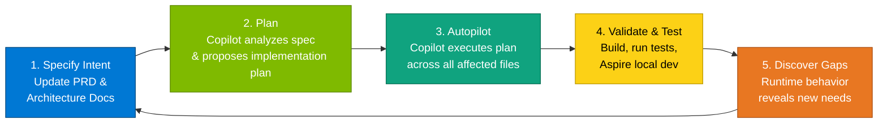
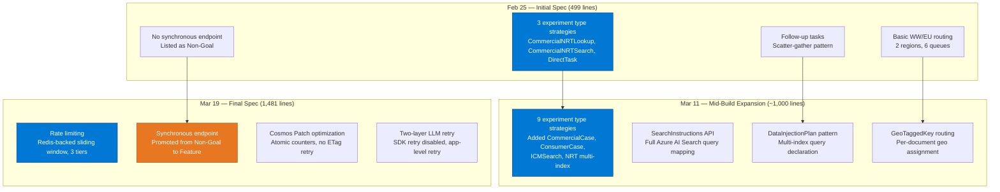
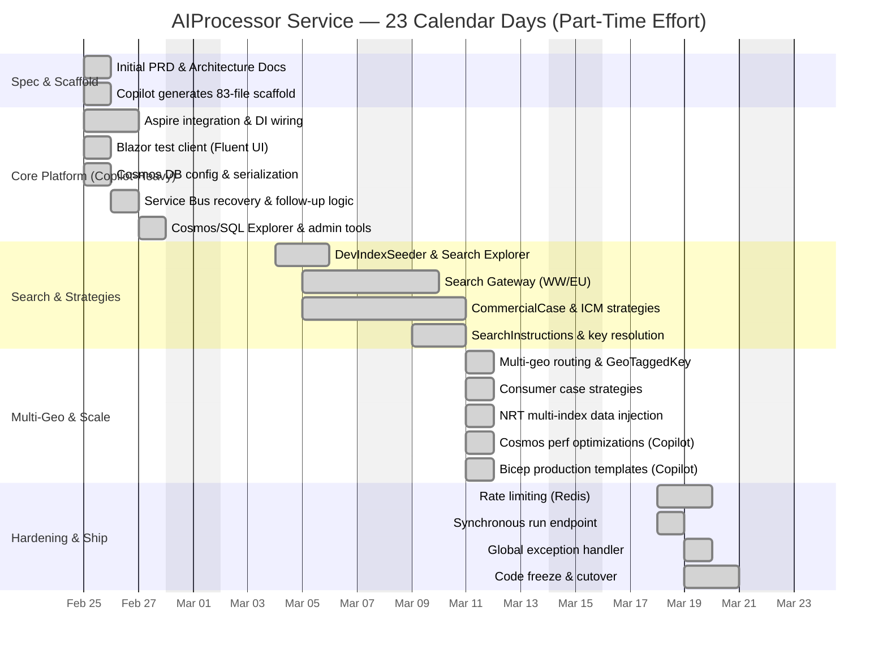
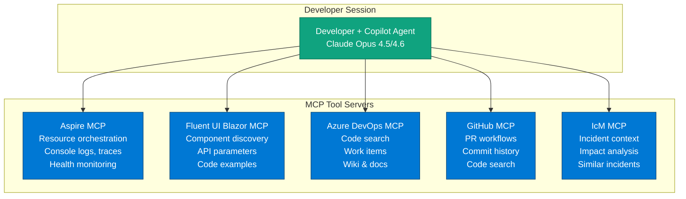
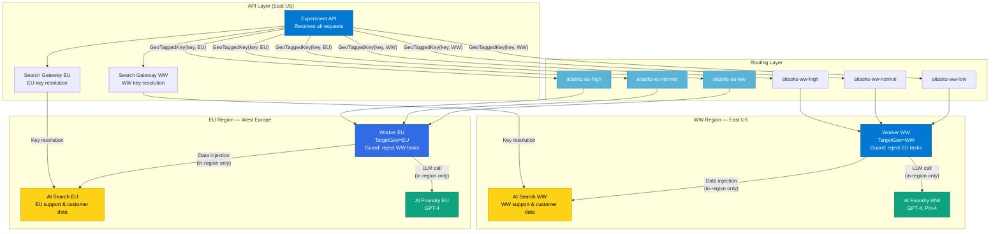

# Case Study: Spec-Driven Development with GitHub Copilot

  

**Building a Production AI Processing Service in 23 Days**

  

*AIProcessor Service — Microsoft Engineering Partnership between Azure CXP and S&O XIO*

  

---

  

## Executive Summary

  

A small team built a production-ready, multi-geo AI processing service in 23 calendar days using a **spec-driven development** methodology powered by **GitHub Copilot** (Claude Opus 4.5 and 4.6 models). The approach treated the Product Requirements Document (PRD) and architecture diagrams as living artifacts — iterating them *alongside* the code rather than writing them once upfront. Copilot's agentic capabilities, combined with MCP (Model Context Protocol) tool integrations, allowed the team to make major architectural pivots in hours instead of weeks.

  

The solution has been merged to the main branch and is currently undergoing integration testing and validation before production deployment.

  

**Key outcomes:**

- **119 commits** across 23 days, 11 projects, ~9,700 lines of C#

- **21 commits authored directly by Copilot** (18%), plus 16 co-authored — including the initial 83-file scaffold

- PRD evolved from **499 lines to 1,481 lines** (3× growth), architecture diagrams from **795 to 1,164 lines**

- Production-ready multi-geo service compliant with **EU Data Boundary (EUDB)** requirements

- Local development experience via **.NET Aspire** with 15+ orchestrated resources — **zero Azure subscription required**

- Scaled to handle **400K RU/s Cosmos DB**, **4K msg/sec Service Bus**, and **30 concurrent LLM calls per region**

  

---

  

## 1. The Challenge

  

CSS needed an AI processing service to run "experiments" — submitting batches of AI tasks (case analysis, incident triage, document synthesis) against Azure AI Foundry models with data injection from Azure AI Search. The requirements were demanding:

  

- **EUDB compliance**: EU support and customer data must never leave the EU region for processing

- **Scale**: Support 50K users running 1–2 experiments per day, up to 1K cases per experiment, with priority-based queue management

- **Microsoft-first**: Minimal third-party dependencies (corporate policy)

- **Fast delivery**: Working service needed within weeks, not months

- **Production-grade**: Optimistic concurrency, retry logic, rate limiting, observability — from day one

  

Traditional development would estimate this as a 3–6 month effort for a team of 4–6 engineers. The team had three developers — two building the service (while simultaneously maintaining the existing production site) and a third focused on production integration, ensuring the AI-generated code could be ported cleanly into the existing production codebase — plus Copilot.

  

### What This Would Have Looked Like Without AI

  

It's worth being explicit about the counterfactual. Without AI-assisted development, this project would have required:

  

| Aspect | Without AI | With AI (Actual) |

|--------|-----------|-----------------|

| **Team size** | 4–6 dedicated engineers | 3 part-time engineers |

| **Timeline** | 3–6 months | 23 calendar days (part-time) |

| **PRD authoring** | 2–3 weeks of meetings, drafts, reviews | Hours — AI-generated from high-level instructions, iterated same day |

| **Architecture diagrams** | 1–2 weeks by a senior architect | Generated alongside PRD, kept in sync automatically |

| **Initial scaffold** | 2–4 weeks to set up 11 projects, DI, Aspire wiring, test harness | Day 1 — 83 files, ~6,600 lines, building and running |

| **Adding a new experiment type strategy** | 2–3 days (interface, implementation, DI, tests, docs) | Hours — Plan→Autopilot across all layers |

| **Architectural pivot** (e.g., Search Gateway) | 1–2 sprints of design, implementation, testing | 4 days including end-to-end validation |

| **Cosmos performance optimization** | 1 sprint (analysis, refactor, test, deploy) | ~2 hours — 7 coherent commits in one session |

| **Keeping docs in sync** | Perpetually out of date (or a dedicated writer) | Automatically updated as part of every change |

| **Cross-layer consistency** | Code reviews catch ~70% of drift; the rest becomes tech debt | AI enforces patterns from spec — claim-check, ETag concurrency, geo-routing applied uniformly |

| **Bicep/IaC templates** | Separate workstream, often delayed until "later" | Generated alongside the application code by Copilot |

  

**The multiplier effect**: This isn't simply about writing code faster. The AI compressed the entire engineering lifecycle — specification, architecture, implementation, testing, documentation, and infrastructure — into a single accelerated workflow. A traditional team would spend significant time on coordination overhead (design meetings, code reviews for consistency, documentation catch-up sprints) that the spec-driven AI approach eliminated entirely. The spec *was* the coordination mechanism.

  

---

  

## 2. The Spec-Driven Development Methodology

  

### The Core Loop

  

Rather than treating specifications as a one-time planning artifact, the team used an iterative loop where the PRD and architecture diagrams were the **primary interface between human intent and AI-generated code**. Critically, even the initial PRD was AI-generated — the team provided high-level business requirements and constraints, and Copilot produced the first comprehensive specification. This meant AI was involved from the very first artifact, not just at the code layer.

  

  

### Plan → Autopilot: Directing the AI

  

A critical workflow pattern was the **Plan and Autopilot** model for directing Copilot. Rather than issuing low-level instructions ("add a method here, update this file there"), the developer described the *intent* and let Copilot break it down:

  

1. **Plan mode**: The developer described what needed to change — often by pointing at the updated PRD section. Copilot analyzed the codebase, identified all affected files and layers, and produced a structured implementation plan with TODO items and dependencies. The developer reviewed the plan, asked clarifying questions, and approved or adjusted before any code was written.

  

2. **Autopilot mode**: Once the plan was approved, Copilot executed autonomously — creating files, editing existing code, running builds and tests, and iterating on failures. For highly parallelizable work (e.g., adding a new experiment type strategy that touches Core interfaces, Infrastructure repositories, DI registration, and test fixtures), Copilot dispatched parallel sub-agents to work on independent files simultaneously.

  

This two-phase approach gave the developer **architectural control without micromanagement**. The plan was the contract; autopilot was the execution. If autopilot hit an unexpected issue (a test failure, a type mismatch), it self-corrected within the plan's boundaries or surfaced the issue for human decision.

  

**Example — Adding the ICM Search Strategy:**

- Developer updated the PRD's strategy table to add `ICMSearchStrategy` with its data injection pattern and field substitution rules

- *Plan mode*: Copilot proposed: "Create `ICMSearchStrategy.cs` extending the base pattern, register in DI, add test class `ICMSearchStrategyTests`, update strategy resolver, update architecture diagram's strategy section"

- Developer approved

- *Autopilot mode*: Copilot generated all files, wired DI, wrote tests, verified the build passed — delivered as a single coherent commit

  

**Example — Cosmos Performance Optimization (7 commits in ~2 hours):**

- Developer described the performance problem and the desired solution (Cosmos Patch for counters, cached FollowUpTaskId)

- *Plan mode*: Copilot identified 7 discrete changes across repositories, services, worker pipeline, Bicep templates, tests, and documentation — with dependency ordering

- *Autopilot mode*: Copilot executed all 7 changes sequentially, each building on the previous, running tests between steps

  

This pattern was especially powerful because the PRD and architecture diagrams gave Copilot enough context to produce *correct plans*. Without the spec, the plan would have been guesswork; with it, the plan was informed by the documented architecture, patterns, and constraints.

  

**The key insight**: By keeping the spec comprehensive and current, Copilot could generate code that was architecturally consistent across the entire solution — not just isolated file-level completions. When the PRD said "claim-check pattern with ~100 byte messages," every Service Bus interaction across the API, worker, and test projects followed that pattern. When the architecture diagrams showed two regional workers with geo-fenced processing, the generated code enforced TargetGeo guards at the message-processing level.

  

### How the PRD Evolved

  

The PRD (`AIProcessor_Service.md`) was not a static requirements document. It was a living specification that grew as the system's complexity increased:

  

  

**Notable pivot**: The synchronous endpoint (`POST /api/experiment-runs/start-and-wait`) was explicitly listed as a *Non-Goal* in the initial spec. When user feedback showed it was needed, the team updated the PRD to include it, added the specification for conditional Cosmos reads (`If-None-Match` ETag) to minimize polling cost, and Copilot generated the implementation — all within a single development session.

  

### Architecture Diagrams as Executable Specifications

  

The architecture diagrams file (`ARCHITECTURE_DIAGRAMS.md`) contained 10 Mermaid diagrams that served as machine-readable specifications:

  

1. **System Context** — component boundaries and data flows

2. **Experiment Strategy Pattern** — strategy resolution and pipeline steps

3. **Submit Experiment Run** — full sequence diagram with SearchInstructions flow

4. **Worker Task Processing** — claim-check dequeue, ETag concurrency, retry logic

5. **Scatter-Gather** — follow-up task lifecycle with dependency tracking

6. **Data Model (ER)** — Cosmos DB document schemas

7. **Deployment (Multi-Geo)** — WW/EU topology with Azure components

8. **Local Dev (Aspire)** — all 15+ local resources and their wiring

9. **Claim-Check Pattern** — message size optimization flow

10. **Search Boundary** — SDK ownership between gateway and worker

  

When Copilot needed to implement a new feature, the architecture diagrams provided the structural context that prevented drift. The diagrams were updated *before* code changes — they were the specification, not the documentation.

  

### Copilot Instructions as Persistent Context

  

A subtle but critical spec artifact was `.github/copilot-instructions.md` — a custom instructions file that loaded automatically at the start of every Copilot session. This file encoded:

  

- The Clean Architecture layer structure and dependency rules

- Processing flow (submit → route → inject → LLM → store)

- Multi-geo design constraints (WW/EU regions, 6 queues)

- Concurrency control patterns (ETag-based optimistic concurrency)

- Microsoft-first dependency policy

- Test conventions (xUnit, NSubstitute, naming patterns)

- Build and run commands

  

This meant every Copilot session — whether it was the first or the fiftieth — started with full architectural context. The developer didn't need to re-explain the solution's structure each time. The instructions file was itself a living document, updated as the architecture evolved.

  

---

  

## 3. Development Timeline

  

> **Note:** This was not a dedicated full-time effort. The team was simultaneously maintaining and operating the existing production site throughout this period. Development happened in focused bursts around existing operational responsibilities. Weekends (shown as gaps below) had no development activity.

  

  

### Day 1: From Intent to Running Code (Feb 25)

  

The most striking moment in the project was Day 1. The workflow demonstrates AI involvement at *every* layer — not just code generation, but specification authoring itself:

  

1. **The team provided high-level instructions** describing the business problem, compliance constraints, target Azure services, and desired processing patterns

2. **Copilot generated the initial PRD** (499 lines) from those instructions — producing a comprehensive specification covering Clean Architecture layers, entity schemas, API contracts, the scatter-gather pattern, follow-up task lifecycle, and multi-geo routing. The team reviewed, refined, and iterated on this generated spec until it accurately captured the architectural intent.

3. **Copilot generated the initial Architecture Diagrams** (795 lines) with Mermaid system context, sequence, deployment, and data model diagrams — derived from the PRD

4. **Copilot generated the entire initial codebase** — 83 files, ~6,600 lines of C# across 7 projects:

   - `AIProcessor.Core` — entities, interfaces, enums, services, strategies

   - `AIProcessor.Infrastructure` — Cosmos DB, SQL, Service Bus, AI Foundry integrations

   - `AIProcessor.ExperimentAPI` — REST API with Entra ID auth

   - `AIProcessor.AIModelAPI` — model endpoint registry

   - `AIProcessor.AITask` — background worker with concurrency control

   - `AIProcessor.AppHost` — .NET Aspire orchestrator

   - `AIProcessor.Tests` — xUnit tests with NSubstitute mocks

5. The code **built and ran** against local emulators on the same day

  

This was not a toy scaffold. The initial commit included:

- Optimistic concurrency (ETag-based writes)

- Claim-check messaging pattern

- SemaphoreSlim worker concurrency control

- Strategy pattern with runtime resolver

- Priority queue architecture (6 queues)

- Full test suite (4 test classes, ~900 lines)

  

### The Intensive Day: March 11

  

March 11 stands out in the commit history — 20 commits in a single day covering:

- Multi-geo task routing with GeoTaggedKey

- Consumer case strategies (mirroring commercial case patterns)

- NRT multi-index data injection (Events, Notes, Emails)

- LLM retry centralization and timeout tuning

- Ollama model expansion (phi3, llama3.2, phi4)

- Follow-up task aggregation with `{{InsertData}}` placeholder

- **Copilot-authored performance block** (7 sequential commits):

  - Eliminated expensive cross-partition Cosmos DB queries in worker hot path

  - Generated production Bicep templates (Cosmos, Service Bus, SQL)

  - Updated all documentation for consistency

  - Increased concurrency limits

  - Consolidated and expanded test coverage

  

This was possible because each change started with a PRD update, followed by a Plan→Autopilot cycle. Copilot had the full architectural context to make changes that were consistent across layers — and the plan/autopilot workflow meant the developer approved the *approach* once, then let Copilot execute across dozens of files without interruption.

  

---

  

## 4. Copilot's Role: Beyond Code Completion

  

### Authorship Breakdown

  

  

Copilot's contributions were not limited to boilerplate. The 21 directly-authored commits included:

  

| Category | Examples | Impact |

|----------|----------|--------|

| **Full-system scaffold** | Initial 83-file codebase from PRD | Entire solution architecture |

| **Feature implementation** | Blazor test client, AI task views, Cosmos serializer | New user-facing capabilities |

| **Performance optimization** | Eliminated cross-partition scans, atomic Cosmos Patch | Production-critical hot path fixes |

| **Infrastructure as Code** | Bicep templates for Cosmos, Service Bus, SQL | Production deployment readiness |

| **Test engineering** | Consolidated redundant tests, added missing coverage | Quality assurance |

| **Documentation sync** | Updated README, PRD, architecture diagrams | Spec–code consistency |

  

### The Opus 4.5/4.6 Difference

  

The team used Claude Opus 4.5 and 4.6 models through GitHub Copilot, which provided capabilities beyond standard code completion:

  

1. **Full-solution awareness**: Opus could reason about the entire solution — understanding how a change to a Core interface rippled through Infrastructure repositories, API controllers, worker processors, and test mocks. When adding a new experiment type strategy, it updated the resolver registration, the DI container, the test fixtures, and the PRD's strategy table.

  

2. **Architectural consistency**: Given the PRD's specification of patterns (claim-check, scatter-gather, optimistic concurrency), Opus applied them uniformly. It didn't just generate code that *worked* — it generated code that followed the *specified architecture*.

  

3. **Multi-file coherence**: A single prompt to add rate limiting produced changes spanning Redis configuration, worker middleware, API exception handling, Aspire AppHost wiring, test cases, and PRD updates — all internally consistent. The Plan→Autopilot workflow was essential here: the developer reviewed the plan showing all 8 files that would be touched, approved, and Copilot executed the full change set autonomously.

  

4. **Plan-aware execution**: The Plan and Autopilot workflow was uniquely effective with Opus-class models because they could reason about *dependency ordering* between changes. When adding the Search Gateway layer, Copilot's plan correctly identified that the new project had to be created before the API's DI could reference it, and that Aspire wiring had to happen before worker integration tests could validate the change. Lesser models would have produced a flat list of edits; Opus produced an ordered execution plan with build verification between steps.

  

5. **Spec-aware refactoring**: When the DataInjectionPlan pattern replaced the simpler BuildSearchQuery approach, Opus understood from the architecture diagrams that this was a strategy-level concern. It refactored the interface, updated all concrete strategies, modified the worker's processing pipeline, and adjusted the sequence diagrams.

  

---

  

## 5. Agency and MCP Server Integration

  

A critical accelerator was Copilot's **agentic capabilities** — the ability to autonomously interact with external tool servers via the Model Context Protocol (MCP). Rather than the developer manually looking up APIs, reading documentation, or navigating dashboards, Copilot's agent queried MCP servers directly during development sessions.

  

### MCP Servers Used

  

  

### Aspire MCP — Local Development Orchestration

  

The Aspire MCP server gave Copilot's agent direct visibility into the running local environment:

  

- **Resource health**: The agent could check whether the Cosmos emulator, Service Bus emulator, or Ollama containers were healthy before diagnosing a test failure

- **Console logs**: When a worker failed to process a task, the agent read structured logs from the Aspire dashboard to identify the root cause — without the developer switching windows

- **Distributed traces**: The agent could trace a request from API submission through Service Bus enqueue, worker dequeue, AI Search injection, and LLM call — identifying exactly where latency or errors occurred

- **Configuration debugging**: When environment variable wiring between Aspire resources was incorrect, the agent inspected the running resource state to identify mismatches

  

This was particularly valuable during the Aspire integration phase (Feb 25–26), where the AppHost grew from a simple 3-project orchestrator to a 15-resource constellation including emulators, gateways, seeders, and model simulators.

  

### Fluent UI Blazor MCP — Test Client UI

  

The Blazor test client (`AIProcessor.ExperimentAPI.TestClient`) was built using Fluent UI Blazor components. The Fluent UI Blazor MCP server allowed Copilot's agent to:

  

- **Discover components**: Query available components by category (DataGrid, Button, TextField, Badge) and get parameter signatures, enum values, and code examples

- **Correct API usage**: When building the Experiment Runs page with `FluentDataGrid`, the agent queried the MCP for correct column template syntax, sorting configuration, and pagination patterns — generating correct code on the first attempt

- **Migration awareness**: The MCP provided migration guides for Fluent UI Blazor v5 breaking changes, ensuring the test client used current APIs

  

### Azure DevOps & GitHub MCP — Workflow Integration

  

The Azure DevOps and GitHub MCP servers provided:

  

- **Code search across repositories**: The agent searched existing internal repos for patterns (e.g., how other teams configured `DefaultAzureCredential` with Aspire, or Service Bus claim-check implementations)

- **PR workflows**: Creating, reviewing, and merging the 55+ pull requests in the project

- **Work item tracking**: Linking commits to user stories and tracking feature completion

- **Wiki integration**: Searching internal architecture decision records and compliance documentation

  

### Auth Wiring with Agency

  

Authentication was one of the most complex integration points, spanning Entra ID, Managed Identity, tenant allow-lists, and DevBypass for local development. The agent's ability to query MCP servers and the codebase simultaneously was critical:

  

1. **Entra ID configuration**: The agent referenced Azure DevOps wiki pages for the team's tenant configuration patterns while generating `Microsoft.Identity.Web` setup code

2. **Managed Identity for Cosmos/Service Bus/SQL**: The agent ensured all Azure SDK clients used `DefaultAzureCredential` consistently — no connection strings or API keys leaked into configuration

3. **DevBypass for local dev**: The Aspire local environment doesn't have Entra ID. The agent implemented a conditional auth bypass (`[Authorize]` in production, open in dev) that the Aspire AppHost activates automatically

4. **Search Gateway auth**: The Search Gateways needed their own auth boundary — the agent configured separate auth policies for the gateway-to-search path vs. the API-to-gateway path

  

---

  

## 6. Rapid Architectural Pivots

  

The spec-driven methodology's greatest advantage was **architectural agility**. Major structural changes that would normally require weeks of planning, implementation, and testing were completed in hours because:

  

1. **Update the spec first** — 15–30 minutes to modify the PRD and/or architecture diagrams

2. **Copilot regenerates** — The agent reads the updated spec and produces consistent changes across all affected layers

3. **Validate immediately** — Aspire runs the full system locally for end-to-end verification

  

### Pivot 1: From 3 to 9 Experiment Type Strategies (Week 2–3)

  

**Before**: The initial spec defined three strategies — `CommercialNRTLookup`, `CommercialNRTSearch`, and `DirectTask`.

  

**After**: Real-world requirements revealed the need for distinct Commercial Case, Consumer Case, ICM, and NRT strategy families — each with single-doc and multi-doc variants.

  

**How it happened**: The PRD's strategy table was expanded, the architecture diagram's strategy pattern section was updated, and Copilot generated the new experiment type strategy classes following the established pattern — including inheritance hierarchies (`CommercialSearchCaseStrategy extends CommercialCaseStrategy`), DI registration, test fixtures, and PRD documentation.

  

**Time**: 2 days of focused work across the team, with Copilot handling the boilerplate propagation.

  

### Pivot 2: Adding the Search Gateway Layer (Mar 5–9)

  

**Before**: The API called Azure AI Search directly via the SDK.

  

**After**: Two regional Search Gateway services (`search-gateway-ww`, `search-gateway-eu`) owned all `Azure.Search.Documents` SDK calls. The API communicated with gateways via HTTP, and workers called AI Search directly for data injection.

  

**Why**: Security review required a boundary that could filter sensitive fields from search results before they reached the API response path. The gateway also centralized index management for the dev environment.

  

**How it happened**: The architecture diagrams were updated to show the new search boundary. The PRD was updated to specify the gateway's endpoints, auth model, and the split between API-path (via gateway) and worker-path (direct) search access. Copilot generated:

- A new `AIProcessor.SearchGateway` project with controllers, configuration, and Dockerfile

- Two Aspire resource registrations with distinct ports

- Updated API DI to use `ISearchGatewayService` (HTTP client) instead of direct SDK calls

- Updated worker to maintain direct AI Search access

- DevBypass auth configuration for local development

- Updated architecture diagrams reflecting the new boundary

  

**Time**: 4 days, including the Aspire wiring and end-to-end testing.

  

### Pivot 3: Cosmos DB Performance Optimization (Mar 11)

  

**Before**: Run count updates used read-modify-write with ETag retry loops (up to 5 retries, exponential backoff). Follow-up task lookup required a cross-partition `ARRAY_CONTAINS` scan.

  

**After**: Atomic `PatchItemAsync` with `PatchOperation.Increment` for counter updates (zero conflicts possible). Cached `FollowUpTaskId` on `ExperimentRun` for point reads instead of cross-partition scans.

  

**How it happened**: Production load testing revealed ETag conflicts under concurrent worker load. The PRD was updated to specify `PatchItemAsync` for counters and cached follow-up IDs. Copilot generated all 7 commits in sequence:

1. Eliminated cross-partition queries in worker hot path

2. Generated production Bicep templates with composite indexes

3. Updated all documentation

4. Increased concurrency limits

5. Eliminated second cross-partition scan in cancel flow

6. Consolidated test suite

  

**Time**: ~2 hours of Copilot-driven implementation on a single evening.

  

### Pivot 4: Adding Rate Limiting (Mar 18–19)

  

**Before**: No rate limiting. Workers processed all requests equally.

  

**After**: Redis-backed sliding-window rate limiting with three tiers (Default: 3 calls/min, Elevated: 10 calls/2 min, Enterprise: 100 calls/3 min). Azure Managed Redis with Entra ID auth in production; local Redis container via Aspire in dev.

  

**How it happened**: The PRD was updated with the rate limiting specification. Copilot generated:

- Redis integration in Aspire AppHost (`AddAzureManagedRedis` → `RunAsContainer`)

- `IRateLimitService` interface and Redis-backed implementation

- Worker middleware integration

- Two-tier failure handling (LLM 429 vs. caller quota — different retry behavior)

- Global exception handler mapping rate limit errors to appropriate HTTP status codes

- Aspire environment variable injection for tier configuration

- Test cases for rate limit distinction

  

**Time**: 2 days, including the distinction between LLM rate limits (retry indefinitely) and business-tier caller quotas (permanent failure).

  

---

  

## 7. Aspire for Local Dev, Azure for Production

  

### The Duality

  

A core architectural decision was using **.NET Aspire** for local development while targeting **Azure** for production. This meant every Azure service needed a local emulator or simulator — and the Aspire AppHost needed to wire them together with the same configuration model used in production.

```mermaid

graph TB

    subgraph "Local Development (Aspire AppHost)"

        direction TB

        L_API[API<br/>ASP.NET Core]

        L_Worker_WW[Worker WW<br/>TargetGeo=WW]

        L_Worker_EU[Worker EU<br/>TargetGeo=EU]

        L_SB[Service Bus Emulator<br/>Docker container<br/>6 queues]

        L_Cosmos[Cosmos DB Emulator<br/>Docker container<br/>vnext-preview]

        L_Redis[Redis Container<br/>Docker]

        L_Search_WW[AI Search Emulator WW<br/>ghcr.io/feature23]

        L_Search_EU[AI Search Emulator EU<br/>ghcr.io/feature23]

        L_Ollama_WW[Ollama WW<br/>phi3, llama3.2, phi4<br/>Optional GPU]

        L_Ollama_EU[Ollama EU<br/>phi3, llama3.2, phi4<br/>Optional GPU]

        L_GW_WW[Search Gateway WW]

        L_GW_EU[Search Gateway EU]

        L_ModelAPI[AIModelAPI]

        L_TestClient[Blazor Test Client]

        L_Seeder[DevIndexSeeder]

        L_DataSeeder[DevDataSeeder]

    end

    subgraph "Production (Azure)"

        direction TB

        P_API[API<br/>Azure Container Apps]

        P_Worker_WW[Worker WW<br/>ACA, East US]

        P_Worker_EU[Worker EU<br/>ACA, West Europe]

        P_SB[Azure Service Bus<br/>Premium, 2 namespaces<br/>4 MU each]

        P_Cosmos[Azure Cosmos DB<br/>400K RU/s autoscale]

        P_Redis[Azure Managed Redis<br/>Entra ID auth]

        P_Search_WW[Azure AI Search WW<br/>East US]

        P_Search_EU[Azure AI Search EU<br/>West Europe]

        P_AI_WW[Azure AI Foundry WW<br/>GPT-4, Phi-4]

        P_AI_EU[Azure AI Foundry EU<br/>GPT-4]

        P_GW_WW[Search Gateway WW<br/>ACA, East US]

        P_GW_EU[Search Gateway EU<br/>ACA, West Europe]

        P_ModelAPI[AIModelAPI<br/>ACA]

    end

    L_API -.- P_API

    L_Worker_WW -.- P_Worker_WW

    L_Worker_EU -.- P_Worker_EU

    L_SB -.- P_SB

    L_Cosmos -.- P_Cosmos

    L_Redis -.- P_Redis

    L_Search_WW -.- P_Search_WW

    L_Search_EU -.- P_Search_EU

    L_Ollama_WW -.- P_AI_WW

    L_Ollama_EU -.- P_AI_EU

    L_GW_WW -.- P_GW_WW

    L_GW_EU -.- P_GW_EU

    L_ModelAPI -.- P_ModelAPI

    style L_API fill:#0078d4,stroke:#004578,color:#fff

    style P_API fill:#0078d4,stroke:#004578,color:#fff

    style L_SB fill:#59b4d9,stroke:#2d7a91,color:#fff

    style P_SB fill:#59b4d9,stroke:#2d7a91,color:#fff

    style L_Cosmos fill:#e87722,stroke:#a84f14,color:#fff

    style P_Cosmos fill:#e87722,stroke:#a84f14,color:#fff

    style L_Ollama_WW fill:#10a37f,stroke:#0a6e54,color:#fff

    style P_AI_WW fill:#10a37f,stroke:#0a6e54,color:#fff

```

  

  

### Why This Mattered

  

1. **Zero Azure subscription for development**: A new team member could clone the repo, run `dotnet run --project src/AIProcessor.AppHost`, and have the entire multi-geo system running locally — including two AI model simulators, two search emulators, Service Bus with 6 queues, Cosmos DB, Redis, and all application services.

  

2. **Faithful local representation**: The Aspire AppHost replicated the production topology — two regional workers with distinct `TargetGeo` values, two search emulators representing WW and EU instances, separate Ollama containers simulating per-region AI Foundry deployments. The claim-check pattern, geo-routing, priority queues, and follow-up task lifecycle all worked identically.

  

3. **Configuration parity**: The same `AzureConfiguration` class hierarchy was used in both environments. Aspire injected environment variables (`Azure__ServiceBus__FullyQualifiedNamespace`, `Azure__AIFoundry__Regions__WW__Deployments__0__Endpoint`) that mapped directly to the production `appsettings.json` structure. No code-level `#if DEBUG` branches.

  

4. **Observability from day one**: Aspire's built-in dashboard provided OpenTelemetry traces, structured logs, and metrics for the entire system — the same signals available in Azure Monitor production.

  

### The Aspire AppHost in Detail

  

The AppHost (`Program.cs`, 265 lines) orchestrated 15+ resources:

  

| Resource | Aspire API | Docker Image | Purpose |

|----------|-----------|--------------|---------|

| Cosmos DB | `AddAzureCosmosDB().RunAsPreviewEmulator()` | vnext-preview | Run/Task state |

| Service Bus | `AddAzureServiceBus().RunAsEmulator()` | latest | 6 priority queues |

| Redis | `AddAzureManagedRedis().RunAsContainer()` | redis | Rate limiting |

| AI Search WW | `AddContainer("search-ww")` | ghcr.io/feature23/azuresearchemulator | WW search |

| AI Search EU | `AddContainer("search-eu")` | Same image | EU search |

| Ollama WW | `AddOllama("ai-model-simulator-ww")` | ollama/ollama | WW LLM sim |

| Ollama EU | `AddOllama("ai-model-simulator-eu")` | ollama/ollama | EU LLM sim |

| API | `AddProject<ExperimentAPI>()` | — | REST API |

| Worker WW | `AddProject<AITask>("worker-ww")` | — | WW processor |

| Worker EU | `AddProject<AITask>("worker-eu")` | — | EU processor |

| Search GW WW | `AddProject<SearchGateway>("search-gateway-ww")` | — | WW search proxy |

| Search GW EU | `AddProject<SearchGateway>("search-gateway-eu")` | — | EU search proxy |

| Model API | `AddProject<AIModelAPI>()` | — | Endpoint registry |

| Test Client | `AddProject<TestClient>()` | — | Blazor UI |

| DevDataSeeder | `AddProject<DevDataSeeder>()` | — | SQL view setup |

| DevIndexSeeder | `AddProject<DevIndexSeeder>()` | — | Search index seeding |

  

Dependencies were explicit: workers `WaitFor(cosmos)`, `WaitFor(serviceBus)`, `WaitFor(modelApi)`; the API `WaitForCompletion(devDataSeeder)` to ensure SQL views existed before accepting requests.

  

---

  

## 8. EUDB Compliance Architecture

  

### The Constraint

  

The EU Data Boundary (EUDB) requires that support and customer data originating from EU customers is processed within the EU. For an AI processing service, this means:

- **Data injection** (reading support and customer data from AI Search) must happen in the EU region

- **LLM processing** (sending prompts containing support and customer data to AI Foundry) must happen in the EU region

- **No cross-region data flow** for primary task processing

  

### The Multi-Geo Design

  

  

### Compliance Enforcement Mechanisms

  

| Mechanism | Layer | How It Works |

|-----------|-------|-------------|

| **GeoTaggedKey** | Task Generation | Each document key resolved from search is tagged with its source geo. Strategies use `GeoTaggedKey.Geo` to set `TargetGeo` per task. |

| **6-Queue Architecture** | Service Bus | Separate queues per region ensure messages are consumed by the correct regional worker. |

| **TargetGeo Guard** | Worker | If `task.TargetGeo != worker.TargetGeo`, the message is dead-lettered with reason `GeoMismatch`. |

| **In-Region AI Search** | Worker | Workers call only their regional AI Search instance — WW workers use WW endpoint, EU workers use EU endpoint. |

| **In-Region AI Foundry** | Worker | LLM calls are routed to in-region AI Foundry deployments via `LLMDeploymentManager`. |

| **SearchEUData Flag** | Experiment | Controls whether key resolution queries both WW and EU gateways, producing tasks in both geos. |

| **Follow-up → WW** | Design Rule | Follow-up/aggregation tasks always route to WW. They don't inject data — they only read already-processed results from Cosmos DB. |

  

### How This Was Specified

  

The EUDB design was embedded in the PRD from the initial version. The spec defined:

- `TargetGeo` enum on tasks with `WW = 0, EU = 1`

- Six named queues in the Service Bus section

- Worker `TargetGeo` configuration

- "No cross-geo data injection or LLM execution" as an explicit Non-Goal

  

When the `GeoTaggedKey` pattern was added (Mar 11) to support per-document geo routing, it was first specified in the PRD's Definitions section and the architecture diagram's task generation sequence — then Copilot generated the implementation across `TaskGenerationService`, all key-based strategies, and the corresponding test cases.

  

### Security Posture

  

Beyond geo-fencing, the architecture enforces a zero-trust security model:

  

- **No secrets in the cluster**: All Azure resources authenticate via Managed Identity (`DefaultAzureCredential`). No connection strings, API keys, or SAS tokens exist in configuration or source code.

- **Entra-only authentication**: Cosmos DB (`disableLocalAuth: true`), Service Bus (`disableLocalAuth: true`), and SQL Server (`azureADOnlyAuthentication: true`) all disable local/key-based auth entirely.

- **Least-privilege RBAC**: Workload identity principals receive only data-plane roles (e.g., Cosmos DB Data Contributor, Service Bus Data Sender/Receiver) — no control-plane access.

- **Search field filtering**: The Search Gateway strips sensitive fields from search results before they reach the API response path, preventing accidental data leakage through API responses.

- **TLS everywhere**: All inter-service communication is encrypted in transit.

  

---

  

## 9. Scaling Design

  

### Scaling Architecture

  

The system was designed to handle **50K users, each running 1–2 experiments per day, with up to 1K cases per experiment** — translating to 50K–100K experiment runs and up to 100M AI tasks per day at peak. The following scaling mechanisms support this load:

  

| Component | Scaling Strategy | Production Capacity |

|-----------|-----------------|-------------------|

| **Cosmos DB (AITasks)** | Autoscale RU/s | 400K RU/s peak (~305K RU/s estimated load) |

| **Cosmos DB (ExperimentRuns)** | Autoscale RU/s | Shared throughput pool |

| **Service Bus** | Messaging Units | 4 MU per namespace → ~4K msg/sec/queue |

| **Workers** | Horizontal pod autoscale | Scale on queue depth (Azure Container Apps KEDA) |

| **LLM Calls** | Multi-deployment load balancing | 30 concurrent per region (3 deployments × 10) |

| **AI Search** | Replica count | Independent scaling per region |

| **SQL (Experiments)** | Fixed (read-only lookups) | P1 tier (overkill — S3 sufficient) |

  

### Key Scaling Patterns

  

**Scatter-Gather**: An experiment run generates N primary tasks that execute in parallel across regional workers. A single follow-up task aggregates results when all primaries complete. This naturally parallelizes work across the worker fleet.

  

**Claim-Check**: Service Bus messages contain only `{taskId}` (~100 bytes). Full task data lives in Cosmos DB. This avoids the 256KB Service Bus message limit — prompts after data injection can exceed 1M tokens (~4MB+).

  

**Weighted Round-Robin**: Workers allocate concurrency slots proportionally across High (5), Normal (3), and Low (2) queues. This prevents low-priority starvation under sustained high/normal load while still prioritizing urgent work.

  

**Atomic Cosmos Patch**: Run count updates use `PatchItemAsync` with `PatchOperation.Increment` — no read-modify-write cycle, no ETag conflicts on counter updates. Only terminal-state transitions use ETag-guarded writes.

  

**Multi-Deployment LLM Management**: `LLMDeploymentManager` provides least-loaded selection across multiple AI Foundry deployments per region, with automatic failover. Thread-safe via `Interlocked.CompareExchange`. Disposable leases release capacity on completion.

  

**Composite Cosmos Indexes**: Production Bicep templates define 5 composite indexes optimized for the worker hot path — recovery scans, stale-task detection, run-filtered queries — reducing RU consumption by orders of magnitude.

  

---

  

## 10. Lessons Learned

  

### What Worked

  

1. **Spec-first, not spec-only**: The PRD was updated *before* code changes, but it evolved continuously. The 3× growth in PRD size reflects real learning, not scope creep.

  

2. **Architecture diagrams as contracts**: Mermaid diagrams were machine-readable enough for Copilot to use as implementation guides, and human-readable enough for architecture reviews.

  

3. **Plan → Autopilot as the operating model**: The developer's primary job became *reviewing plans*, not writing code. A typical session: update the PRD, describe the intent, review Copilot's plan (which files to touch, in what order, what tests to run), approve, and let autopilot execute. This gave the developer veto power over *approach* without needing to supervise every line. The plan served as an auditable record of what the AI intended to do — critical for compliance-sensitive changes.

  

4. **Copilot as team member, not tool**: The 21 directly-authored commits show Copilot operating at the level of a senior engineer — generating coherent multi-file changes that respected architectural boundaries. The plan/autopilot model formalized this: Copilot didn't just complete code, it *proposed and executed engineering work*.

  

5. **Agency with MCP servers eliminated context switching**: Instead of Alt-Tabbing between the IDE, Azure portal, documentation sites, and dashboards, the agent queried MCP servers directly — keeping the developer in flow state.

  

6. **Aspire made the spec testable**: Every architectural decision in the PRD could be validated locally within minutes. The full multi-geo topology ran on a single laptop.

  

7. **Rapid pivots without rework**: The synchronous endpoint pivot (Non-Goal → Feature), the Search Gateway layer addition, and the Cosmos Patch optimization each took hours, not weeks — because updating the spec fed directly into the plan/autopilot cycle.

  

### What Required Human Judgment

  

1. **Compliance decisions**: The EUDB geo-fencing strategy was a human architectural decision. Copilot implemented it faithfully, but the decision that "follow-up tasks go to WW because they only read processed results" required domain expertise.

  

2. **Performance diagnosis**: Identifying that cross-partition Cosmos scans were the bottleneck required understanding production load patterns. Copilot generated the fix once the problem was specified.

  

3. **Third-party dependency policy**: The "Microsoft-first" constraint was a business decision that shaped every technology choice. Copilot respected it once it was in the spec.

  

4. **Security boundary design**: The Search Gateway architecture (who owns the SDK, what fields get filtered) was a security review outcome. Copilot generated the implementation.

  

---

  

## 11. Metrics Summary

  

| Metric | Value |

|--------|-------|

| **Calendar days** | 23 (Feb 25 – Mar 20, 2026) — part-time, not a dedicated effort |

| **Total commits** | 119 |

| **Copilot-authored commits** | 21 (18%) |

| **Copilot co-authored commits** | 16 (additional 13%) |

| **Human contributors** | 3 parti-time engineers |

| **C# files** | 207 |

| **Lines of C#** | ~9,700 |

| **Projects in solution** | 11 |

| **Test classes** | 5+ |

| **PRD growth** | 499 → 1,481 lines (3×) |

| **Architecture diagram growth** | 795 → 1,164 lines (1.5×) |

| **Experiment type strategies** | 3 → 9 |

| **Aspire-managed resources** | 15+ |

| **Service Bus queues** | 6 (3 priorities × 2 regions) |

| **Production Cosmos RU/s** | 400K autoscale |

| **LLM concurrency per region** | 30 (3 × 10 deployments) |

  

---

  

## 12. Implications for Other Teams

  

This project was a single team's experience, but the methodology is transferable. For engineering leaders evaluating AI-assisted development:

  

1. **Invest in specs, not prompts**: The ROI of Copilot scales with the quality of the specification it works from. Teams that skip the PRD and jump straight to prompting get isolated code completions. Teams that maintain living specs get architecturally coherent systems.

  

2. **Plan→Autopilot requires trust — and verification**: The two-phase workflow only works when the AI's plans are reviewable and the results are testable. Aspire's local dev environment was the verification layer that made autopilot trustworthy. Without rapid local validation, the team would have needed more manual oversight.

  

3. **MCP servers are a force multiplier**: The value of agentic AI increases with the number of tool integrations available. Each MCP server (Aspire, Fluent UI, Azure DevOps, IcM) eliminated a category of context-switching. Organizations should invest in MCP server availability for their internal platforms.

  

4. **AI-generated specs need human review, not human authoring**: The initial PRD was AI-generated, but the team spent meaningful time reviewing and iterating it. The skill shift is from *writing specifications* to *evaluating and refining AI-generated specifications* — a faster process that still requires deep domain expertise.

  

5. **Part-time is the point**: This team was not freed from other responsibilities to build this service. The methodology worked *because* it could be executed in focused bursts. That's the real productivity story — not a dedicated sprint, but a sustainable pace alongside existing work.

  

---

  

## 13. Conclusion

  

The AIProcessor Service demonstrates that **spec-driven development with AI-powered code generation** can compress what would traditionally be a multi-month engineering effort into weeks — without sacrificing architectural rigor, compliance requirements, or production readiness. The solution is now merged to the main branch and undergoing integration testing before production deployment — the development phase that this case study covers is complete.

  

The key enablers were:

  

1. **AI-generated living PRD** — even the initial spec was produced by Copilot from high-level instructions, then iterated by the team. The PRD served as the single source of truth for both humans and AI throughout the project.

2. **Copilot Opus 4.5/4.6** models capable of full-solution reasoning, not just file-level completion

3. **Plan → Autopilot workflow** that gave developers architectural control while letting the AI execute autonomously across the full solution

4. **Agentic MCP integration** that eliminated context-switching between development and operational tools

5. **.NET Aspire** that made the full production topology locally runnable and testable

6. **A methodology** that embraced iteration — updating specs as requirements evolved, reviewing AI-generated plans, and trusting autopilot to propagate changes consistently

  

The AI involvement spanned every layer of the engineering process: from specification authoring, to architecture diagramming, to implementation planning, to code generation, to test writing, to infrastructure-as-code, to documentation. The human role was *intent, judgment, and validation* — deciding what to build, reviewing how to build it, and verifying it worked correctly.

  

This is not about replacing engineers. It's about changing **what engineers spend their time on** — from writing boilerplate and chasing consistency across layers, to specifying architecture, reviewing AI-proposed plans, and validating system behavior. The spec becomes the product; the plan becomes the contract; the code becomes the artifact.

  

---

  

*Prepared by AI - Designed and reviewed by humans*