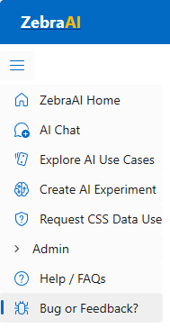

# Provide Feedback or File Bugs

Users can use the [ZebraAI Submission Form](https://forms.office.com/r/G9sMkZerd6) to submit feedback, feature requests, issues, and/or report bugs they have experienced on ZebraAI.

To access the form while on ZebraAI, users click on the **Bug or Feedback?** option (Below) or, they can access the form directly [here](https://forms.office.com/r/G9sMkZerd6).

The form will ask for the following information:

##Type of submission that's being provided:

- Bug Report
- Feature Request
- Onboard New Datasource
- Reporting
- System Feedback
- Other

##Submission Description:

###Bug Report or Feature Request  
  
When reporting a bug or requesting a new feature
- Provide the scenario and steps to reproduce the bug or feature request
- Provide the expected and actual outcome of the bug or feature request

###Request to Provision for API Use  
  
When provisioning an experiment for API use 
- Provide your PROD experiment Id.
- Acknowledge that your API use is for experimentation purposes only.
- The Client ID for any app that will be used to call your ZebraAI experiment.  
  
Note: Access via VPN/Authorized IPs only - Entra ID tokens only.  

##Business Impact
  
Provide a brief busienss impact statement.  This statement will be used to determine the priority of the request by the ZebraAI team.  
  
##Submit
  
Once the form has been filled, users can click the **Submit** button. 

The form will create an ADO request for the ZebraAI team with two types of notification:

- if you check the box to have email receipts sent for your responses, these additional emails will be sent.  
- After clicking on the **Submit** button, a new window will appear indicating "Your response has been successfully recorded."
- An email will be sent acknowledging the submission has been received.

Once a bug is closed the submitter will not receive notification but they can check if a newer build number is used. The latest build number is displayed in the footer of every page in the ZebraAI site.
