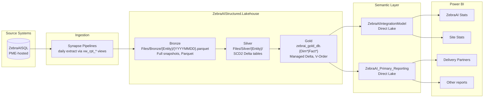
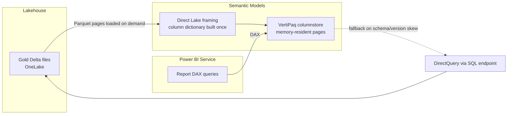

# ZebraAI Fabric Medallion — End-to-End Data Flow

  
**Scope:** Comprehensive technical description of the ZebraAI Fabric data platform: from the `ZebraAISQL` source-of-record, through Bronze / Silver / Gold layers in the `ZebraAIStructured` Lakehouse, into Direct Lake semantic models, and out to Power BI.

**Audience:** Data engineers, platform owners, BI architects, and reviewers performing an enterprise-scale architecture assessment.

  

---

  

## 1. Executive Summary

  

ZebraAI uses a Microsoft Fabric Medallion architecture (Bronze → Silver → Gold) implemented on a single Lakehouse, with PySpark notebooks performing all transformation and Fabric Data Pipelines providing orchestration. Reporting is served by Direct Lake semantic models over a Gold warehouse database.

  

|Aspect|Implementation  |
|--|--|
| **Storage** | `ZebraAIStructured.Lakehouse` (workspace `fb5b92e7-8d59-46e7-b2ed-2d75ca1b1e97`, lakehouse `13a8452e-dcbc-4aa3-8d14-bca8e07d9cd3`, default schema `dbo`) |
| **Bronze** | `Files/Bronze/{Entity}/{YYYYMMDD}.parquet` — full daily snapshots (Parquet, **not** Delta) |
| **Silver** | `Files/Silver/{Entity}/` — Delta tables, SCD2 (`isCurrent`, `startDate`, `endDate`) where `startDate`/`endDate` are stored as **`date`** (not timestamp) |
| **Gold** | Warehouse DB `zebrai_gold_db` — managed Delta tables (Dim full overwrite, Fact MERGE; first-time Fact creation also uses overwrite + `overwriteSchema=true`) |
| **Source** | `ZebraAISQL` (PME-hosted) → Synapse Pipelines → Bronze parquet snapshots; source views named `vw_rpt_*` are stripped to `{Entity}` on landing |
| **Orchestration** | Four Fabric Data Pipelines on a staggered daily schedule (schedules are configured via Fabric triggers, **not** in the pipeline JSON — see §3.3 for the runtime cadence reported by the team) |
| **Serving** | `ZebraAIIntegrationModel` + `ZebraAI_Primary_Reporting` semantic models (Direct Lake) → Power BI reports |
| **Workspace inventory** | 7 production notebooks (6 in `Garima/FinalNotebooks` + `SilverFeedback_FeedbackValue.Notebook` one folder above), 4 production pipelines, 18 Gold Dim tables + 1 derived (`DimApiIntegrationScenario`), 8 Gold Fact tables + 1 derived (`FactBridgeApiIntegrationScenario`) |

  

**Bottom line:** The architecture is functionally correct and follows medallion conventions, but it has accumulated systemic inefficiencies in **retention, dependency wiring, and storage hygiene** that will compound rapidly at multi-terabyte scale. Two verified code-level issues (a mismatched backfill canary in `SilverPrompt.Notebook` and a `lookbackDays` default that disagrees between pipeline and notebook) should be corrected; everything else is architectural. The dominant risks are full-snapshot Bronze with no retention policy, no cross-pipeline `dependsOn` wiring, no scheduled `VACUUM` (OPTIMIZE is run per-file but only inside `Silver_APILogV2`), and Gold Dim `overwriteSchema=true` re-framing Direct Lake on every run. See [Section 11 — Risk Register](#11-risk-register) and the companion recommendations document.

  

---

  

## 2. Logical Architecture

  



  

### Layer responsibilities

  

| Layer | Purpose | Contract | Format | Schema mutability |
|---|---|---|---|---|
| **Bronze** | Immutable landing zone for raw source extracts | Source-faithful, no transformation; full daily snapshot per entity | Parquet, file-per-day | Source-driven; schema drift accepted silently |
| **Silver** | Cleansed, conformed, historized | One SCD2 Delta table per business entity; bus keys + tracked columns; row-level history via `isCurrent`/`startDate`/`endDate` | Delta | Tracked-column drift handled via wrapper that drops unknown tracked columns |
| **Gold** | Star-schema analytical model | Dim tables = current Silver snapshot (overwrite); Fact tables = MERGE on business keys | Delta (managed, V-Order) | Schema overwrite on Dim publishes |

  

---

  

## 3. Physical Implementation

  

### 3.1 Storage layout

  

```

abfss://ZebraAI@msit-onelake.dfs.fabric.microsoft.com/

  ZebraAIStructured.Lakehouse/

    Files/

      Bronze/

        Api/                      20260518.parquet, 20260519.parquet, ...

        ApiLog/                   20260518.parquet, ...

        Experiment/               ...

        ExperimentFavorite/       ...

        ExperimentLike/           ...

        Feedback/                 ...

        Model/                    ...

        ModelParameter/           ...

        ModelPrompt/              ...

        Prompt/                   ...                (note: distinct from PromptLog)

        PromptLog/                ...

        Retention/                ...                (aggregate; skipped on backfill)

        Settings/                 ...

        User/                     ...                (used as backfill canary for Silver General)

        ActiveExperiments/        ...                (aggregate; skipped on backfill)

        Top20APIExps/             ...                (aggregate; skipped on backfill)

      Silver/

        Api/                      _delta_log/, part-*.parquet     (unpartitioned)

        ApiLog/                   partition by InsertedOn         (the "core/search" projection of Bronze/ApiLog)

        ApiLogParameter/          partition by InsertedOn

        ApiLogPrompt/             busKey = ApiId; partition by InsertedOn

        ApiLogResult/             partition by InsertedOn

        Experiment/               unpartitioned

        ExperimentFavorite/       unpartitioned

        ExperimentLike/           unpartitioned

        Feedback/                 partition by ExperimentId

        FeedbackValue/            busKey = (Id, source); partition by source

        Model/                    unpartitioned

        ModelParameter/           unpartitioned

        ModelPrompt/              unpartitioned

        Prompt/                   busKey = [Id] (notebook hard-coded; see §12 note); partition by Id

        PromptLogCore/            partition by InsertedOn   (create_mode="append" — only matters on first-time write)

        PromptLogParameter/       partition by InsertedOn   (create_mode="overwrite" on first-time write)

        PromptLogPrompt/          partition by ExperimentId (create_mode="append" — first-time only)

        PromptLogResult/          partition by ExperimentId (create_mode="overwrite" on first-time write)

        PromptLogSearch/          partition by InsertedOn   (create_mode="append" — first-time only)

        Retention/                unpartitioned

        Settings/                 unpartitioned

        Top20ApiExp/              unpartitioned

        ActiveExperiment/         unpartitioned

        User/                     unpartitioned

    Tables/                       (managed Delta backing zebrai_gold_db)

  zebrai_gold_db                  (warehouse DB; tables physically backed by OneLake Delta)

```

  

> **Naming quirk.** Bronze folder names for two aggregate entities are **plural** (`ActiveExperiments/`, `Top20APIExps/`) while their Silver and Gold projections are **singular** (`Silver/ActiveExperiment/`, `Silver/Top20ApiExp/`, `DimActiveExperiment`, `DimTop20ExpAPi`). This is intentional but worth knowing during incident triage.

  

### 3.2 Notebook inventory

  

All notebooks are bound to the same lakehouse (`13a8452e-dcbc-4aa3-8d14-bca8e07d9cd3`) and run on `synapse_pyspark`. `Utils` is invoked via `%run Utils` from every Silver notebook. Six notebooks live under `Garima/FinalNotebooks/`; `SilverFeedback_FeedbackValue.Notebook` lives one folder above (`Garima/../`), which is easy to miss when surveying the project.

  

| Notebook | Role | Source | Target(s) | Key behaviour |
|---|---|---|---|---|
| `Utils.Notebook` | Shared library | — | — | Hosts `ENTITIES_CONFIG`, `scd2_merge_append` (single MERGE-expire + single append-insert; `startDate`/`endDate` written as **`date`** type), `read_pipeline_params(default_lookback=5)`, `process_with_backfill` (ledger-based catch-up), `process_static_entity`, `process_dynamic_entity` (both **hard-code `create_mode="overwrite"`** ignoring the per-entity `create_mode` in `ENTITIES_CONFIG`), `repair_scd2_latest_wins` |
| `Silver General Notebook` | 9-entity general Silver builder | `Files/Bronze/{Retention, ExperimentFavorite, ExperimentLike, Model, Experiment, User, Settings, ActiveExperiments, Top20APIExps}/{date}.parquet` | `Files/Silver/{Retention, ExperimentFavorite, ExperimentLike, Model, Experiment, User, Settings, ActiveExperiment, Top20ApiExp}/` | SCD2 merge through `process_static_entity` / `process_dynamic_entity`. `AGGREGATE_TABLES = {Retention, ActiveExperiments, Top20APIExps}` are skipped on backfill (today-only). **No** OPTIMIZE call |
| `Silver_API.Notebook` | API reference SCD2 | `Files/Bronze/Api/` | `Files/Silver/Api/` (unpartitioned) | Flattens `Attributes` JSON; dedupes by `Id`; tracked_cols = every column except `Id`; passes `create_mode="overwrite"`. **No** OPTIMIZE call |
| `Silver_APILogV2.Notebook` | API call log projections | `Files/Bronze/ApiLog/` | `Files/Silver/{ApiLog, ApiLogParameter, ApiLogResult, ApiLogPrompt}/` | Sets session-level `spark.sql.files.maxPartitionBytes = 128 MB` then splits one Bronze table into 4 Silver projections. The "core/search" projection writes to `Silver/ApiLog/` (not `Silver/ApiLogCore/`). All 4 are partitioned by **`InsertedOn`** (not `ExperimentId`), busKey `Id` except `ApiLogPrompt` which uses `ApiId`. Calls a local `optimize_table(...)` helper after every file write that runs `OPTIMIZE … ZORDER BY (InsertedOn)` on each of the 4 tables. **This is the only Silver notebook that runs OPTIMIZE.** |
| `Silver_PromptLog.Notebook` | Prompt log projections | `Files/Bronze/PromptLog/` | `Files/Silver/{PromptLogCore, PromptLogSearch, PromptLogParameter, PromptLogResult, PromptLogPrompt}/` | 5 projections. Monkey-patches `scd2_merge_append` locally to drop tracked columns absent from the target schema (avoids `AnalysisException` on schema evolution). Partition columns: `InsertedOn` for `PromptLogCore`/`Search`/`Parameter`, `ExperimentId` for `Result`/`Prompt`. Three projections pass `create_mode="append"` (Core, Search, Prompt) and two pass `"overwrite"` (Parameter, Result) — but `create_mode` is **only consulted on the first-time write**; on every subsequent run the full SCD2 expire-and-insert logic runs regardless. **No** OPTIMIZE call |
| `SilverPrompt.Notebook` | Per-prompt SCD2 | `Files/Bronze/PromptLog/` | `Files/Silver/Prompt/` (partitioned by `Id`) | Derives `Name`, `Role`, `Content`, `Comment` from `Result` struct. `business_keys=["Id"]` is **hard-coded in the notebook**, even though `ENTITIES_CONFIG["Prompt"]` declares `["Id", "OrderNum"]`. **Defect:** the `process_with_backfill` call passes `bronze_dir=src_path + "Prompt/"` while the transform reads from `src_path + "PromptLog/"`. **No** OPTIMIZE call |
| `SilverFeedback_FeedbackValue.Notebook` (in `Garima/`, not `Garima/FinalNotebooks/`) | Feedback + values | `Files/Bronze/Feedback/` | `Files/Silver/Feedback/` (partition by `ExperimentId`, busKey `Id`), `Files/Silver/FeedbackValue/` (partition by `source`, busKey `(Id, source)`) | Strips HTML; explodes `OAx-y` rating structs into long form. Calls `scd2_merge_append` directly with `create_mode="overwrite"` and `event_time_col="InsertedOn"`. **No** OPTIMIZE call |
| `Gold_Notebooks.Notebook` | Gold star schema build | All `Files/Silver/*` | `zebrai_gold_db.{Dim*, Fact*}` | 18 Dim (full overwrite of current SCD2 rows with `overwriteSchema=true`) + 8 Fact (MERGE on business keys; first-time Fact creation uses overwrite + `overwriteSchema=true`); plus `DimApiIntegrationScenario` + `FactBridgeApiIntegrationScenario` built separately by exploding `IntegrationScenarios`. Validates `assert_gold_current_only` and `assert_no_historical_key_leakage` |

  

### 3.3 Pipeline inventory

  

| Pipeline | Schedule | Activities | Dependency wiring |
|---|---|---|---|
| `ZebraAiPipeline_General` | configured via Fabric trigger (team-reported daily ~04:00 CST) | `Trigger Feedback Silver Notebook`, `Trigger Api Silver  Notebook`, `Trigger Silver General Notebook`, `Trigger Silver Prompt Notebook` | **All four have `dependsOn: []`** — full parallel fan-out |
| `ZebraAi_PromptLog` | configured via Fabric trigger (team-reported daily ~04:00 CST) | `Trigger ZebraAIPromptLog` (= `Silver_PromptLog.Notebook`) | Single activity. **Does not invoke Gold.** |
| `ZebraAI_ApiLogV2` | configured via Fabric trigger (team-reported daily ~05:00 CST) | `ApiLog` (= `Silver_APILogV2.Notebook`, with the inline description "Writes into 4 tables: ApiLog, ApiLogParameter, ApiLogResult, ApiLogPrompt") | Single activity. **Does not invoke Gold.** |
| `RefreshSqlTables` | configured via Fabric trigger (team-reported daily ~22:00 CST) | `Trigger Gold Refresh Notebook` (= `Gold_Notebooks.Notebook`) | Single activity. **This is the only pipeline that builds Gold.** No explicit semantic-model refresh activity is present in the JSON; if a refresh runs, it is configured elsewhere (e.g. embedded inside `Gold_Notebooks` or as a separate Fabric refresh schedule) |

  

> **Important.** Schedules and any semantic-model refresh activity are **not present in the pipeline JSON** in the repo — they are configured at the Fabric workspace level via triggers and refresh schedules. The times above are the operating cadence reported by the team; they are not verifiable from source.

  

**Pipeline parameters (Silver pipelines):**

  

| Parameter | Type | Default | Purpose |
|---|---|---|---|
| `notebookVar` / `notebookVariable` | string | `@concat(formatDateTime(utcNow(),'yyyyMMdd'),'.parquet')` | Convenience constant — today's file name (unused by all current Silver notebooks, which derive their own date list from `lookbackDays` + `forceDates`) |
| `lookbackDays` | int | **2** | Number of days back to (re)process |
| `forceDates` | string | (empty) | Comma-separated explicit dates override |
| `failFast` | bool | true | Stop on first failure |

  

`RefreshSqlTables` takes only one parameter: `forceTables` (string, no default), passed through to `Gold_Notebooks`.

  

**Activity policy (all pipelines):** `timeout=12h`, `retry=2`, `retryIntervalInSeconds=600` (10 min).

  

---

  

## 4. Data Movement Patterns and Dependencies

  

### 4.1 Source → Bronze (ZebraAISQL → Synapse → Lakehouse)

  

* **Source.** `ZebraAISQL` (Azure SQL database hosted in the PME environment). Synapse linked services authenticate via the `ZebraAIKvPrd` Key Vault. Bronze entity tables are produced from views named `vw_rpt_{Entity}` in that database.

* **Pattern.** Full daily snapshot extraction (not CDC). The Synapse template `ZebraAISQL To MST Reporting` writes one Parquet file per entity per day to `zebraai/Bronze/{Entity}/{YYYYMMDD}` (the `vw_rpt_` prefix is stripped during landing).

* **Mechanism.** Synapse pipelines (separate workspace) read the views, write one `{YYYYMMDD}.parquet` file per entity per day to `Files/Bronze/{Entity}/`.

* **Idempotency.** Filename = ledger; re-running an extract for the same date overwrites the file.

* **Implication.** Every row in the source is rewritten to Bronze every day, even if nothing changed. At enterprise scale this is the single largest avoidable cost driver — see companion doc, Recommendation **S-1**.

  

### 4.2 Bronze → Silver (`scd2_merge_append`)

  

The shared helper `Utils.scd2_merge_append` implements SCD Type 2 logic with these inputs per entity (from `ENTITIES_CONFIG`):

  

| Config | Purpose |
|---|---|
| `bronze_path` | Source folder under `Files/Bronze/` |
| `silver_path` | Target folder under `Files/Silver/` |
| `bus_keys` | Business key columns identifying the same logical row across versions |
| `tracked_cols` | Columns that, when changed, close the current row and open a new version |
| `partition_cols` | Delta partition columns (used selectively — e.g. `InsertedOn` on ApiLog projections, `ExperimentId` on `Feedback` and `PromptLogResult`/`PromptLogPrompt`) |
| `recency_col` | Tie-breaker for picking the most recent Bronze row per key per day (default `InsertedOn`); used as `seq_col` to enforce monotonic SCD2 |
| `create_mode` | First-time write mode only (`overwrite` is the function default and the value the static/dynamic helpers hard-code). Once the target Delta table exists, full SCD2 logic runs on every call regardless of this value. See note below |

  

**Per-date processing loop:**

  

1. Resolve date list = `forceDates` ∪ `[today − lookbackDays … today]`.

2. For each date, read `{bronze_path}/{YYYYMMDD}.parquet`.

3. Drop duplicates within the day by `bus_keys` keeping max(`recency_col`).

4. Compare against current Silver rows (`isCurrent=true`) by `bus_keys`:

   * **Unchanged tracked columns** → no-op.

   * **Changed tracked columns** → expire current row via `MERGE … whenMatchedUpdate(set isCurrent=false, endDate=current_date)`, then insert a new row (`isCurrent=true`, `startDate=current_date`, `endDate='9999-12-31'`).

   * **Missing in Bronze** → leave Silver as-is (soft delete not modelled).

   * **New key** → insert with `isCurrent=true`.

5. The new SCD2 versions are appended once via `to_insert.write.format("delta").mode("append").option("mergeSchema","true").save(target_path)`.

  

> **SCD2 column types.** `startDate` and `endDate` are stored as **`date`** (not `timestamp`). The function explicitly casts the open-end sentinel `'9999-12-31'` to `date` and `current_timestamp()` to `to_date(now)`. The function will raise `"SCD2 config error"` if the existing target schema disagrees.

  

> **Note on `create_mode`.** Values used in code are `"overwrite"`, `"append"`, and (theoretically) `"merge"`. The parameter is only consulted on the **first-time write** when the Silver path does not yet exist; from that call onward the SCD2 expire-and-insert logic runs on every invocation. The parameter has one additional **runtime side-effect after creation**: when `create_mode != "overwrite"`, the function enforces a data-quality check that raises if the target already has multiple `isCurrent=true` rows for the same business key (i.e. existing corruption blocks further inserts); with `create_mode="overwrite"` that guard is intentionally skipped. The parameter is therefore misleadingly named; consider renaming to `initial_write_mode` and documenting the side-effect.

  

> **Helper call sites vs. direct call sites.** `process_static_entity` and `process_dynamic_entity` (used by `Silver General Notebook`) ignore the `ENTITIES_CONFIG` `create_mode` and pass a hard-coded `create_mode="overwrite"`. Notebooks that call `scd2_merge_append` directly (`Silver_API`, `Silver_APILogV2`, `Silver_PromptLog`, `SilverPrompt`, `SilverFeedback_FeedbackValue`) supply their own `create_mode` per call.

  

### 4.3 Silver → Gold (`Gold_Notebooks.Notebook`)

  

* `read_silver_current(silver_path)` filters Silver by `isCurrent=true` (preferred), falling back to `to_date(endDate)='9999-12-31'` or treating the table as fully current when neither marker exists.

* **Dim tables (overwrite):** `df.write.format("delta").mode("overwrite").option("overwriteSchema","true").saveAsTable(...)`.

  * Pros: simple, deterministic.

  * Cons: full rewrite of every Dim table every run, even if 0 rows changed; `overwriteSchema=true` invalidates Direct Lake cache.

* **Fact tables (MERGE):** `DeltaTable.forName(...).merge(...).whenMatchedUpdateAll().whenNotMatchedInsertAll().execute()` once the table exists. **First-time creation of a Fact also uses `mode("overwrite").option("overwriteSchema","true").saveAsTable(...)`** — the same Direct Lake re-framing cost is paid on the day a new Fact is introduced.

  * Pros: incremental upsert; only updated keys touched.

  * Cons: soft-deletes not propagated (a key disappearing from Silver remains in Gold).

* **Validation gates:**

  * `assert_gold_current_only` — every Gold row has `isCurrent=true` or `endDate='9999-12-31'`.

  * `assert_no_historical_key_leakage` — no key appears in Gold that exists **only** in Silver historical rows.

  

### 4.4 Gold → Semantic Model

  

* Both semantic models (`ZebraAIIntegrationModel`, `ZebraAI_Primary_Reporting`) are **Direct Lake** over `zebrai_gold_db`.

* Direct Lake reads Delta files directly from OneLake into the VertiPaq engine on demand — no scheduled import refresh required for data freshness.

* However, **schema-changing operations** (e.g. `overwriteSchema=true` on Dim tables) and large Delta version skew can trigger model framing failures and force fallback to DirectQuery, materially degrading report performance.

* `RefreshSqlTables` pipeline at 22:00 issues an explicit semantic-model refresh to update calculated columns / measures and re-frame Direct Lake column segments.

  

### 4.5 Semantic Model → Power BI

  

* Reports are connected live to the semantic models — no per-report refresh.

* Direct Lake means Power BI query latency is bounded by VertiPaq scan time over the OneLake-resident Delta files.

  

---

  

## 5. Entity Inventory

  

### 5.1 Reference / dimension entities (slow-changing)

  

Owned by `Silver General Notebook`, `Silver_API.Notebook`, `SilverFeedback_FeedbackValue.Notebook`:

  

| Silver path | Bronze name | Bus key(s) | Notes |
|---|---|---|---|
| `Silver/Api/` | `Api` | `Id` | Flattened `Attributes` JSON; exploded into `ApiIntegrationScenario` for Gold bridge |
| `Silver/Experiment/` | `Experiment` | `Id` | Core experiment definitions |
| `Silver/ExperimentFavorite/` | `ExperimentFavorite` | `Id` | Per-user favorites |
| `Silver/ExperimentLike/` | `ExperimentLike` | `Id` | Per-user likes |
| `Silver/Model/` | `Model` | `Id` | LLM / model configuration |
| `Silver/ModelParameter/` | `ModelParameter` | `ModelId` | Note: declared in ENTITIES_CONFIG; not currently written by any Silver notebook in this repo — served from prior history |
| `Silver/ModelPrompt/` | `ModelPrompt` | `ModelId` | Same caveat as above |
| `Silver/User/` | `User` | `Id` | User dimension; **also serves as the backfill canary folder for `Silver General Notebook` (`bronze_dir=src_path + "User/"`)** |
| `Silver/Settings/` | `Settings` | `SettingsId` (mapped from Bronze `Id`) | `Silver General` rewrites `Id` → `SettingsId` before SCD2 |
| `Silver/ActiveExperiment/` | `ActiveExperiments` (plural in Bronze) | `Id` | Aggregate view (skipped on backfill via `aggregate_today_only`) |
| `Silver/Top20ApiExp/` | `Top20APIExps` (plural in Bronze) | `Id` | Aggregate view (skipped on backfill) |
| `Silver/Retention/` | `Retention` | `Id` | Aggregate-style table (skipped on backfill); ironically, no retention is applied to itself |
| `Silver/Feedback/` | `Feedback` | `Id` | Partitioned by `ExperimentId`; `recency_col=InsertedOn`, `event_time_col=InsertedOn` |
| `Silver/FeedbackValue/` | `Feedback` (same Bronze, exploded) | `Id`, `source` | Long form derived by exploding `OAx-y` rating structs; partitioned by `source` |

  

### 5.2 Transactional / log entities (fast-growing)

  

Owned by `Silver_APILogV2.Notebook`, `Silver_PromptLog.Notebook`, `SilverPrompt.Notebook`:

  

| Silver path | Bus key(s) | Volume class | Partitioning | First-time `create_mode` |
|---|---|---|---|---|
| `Silver/ApiLog/` (the "core/search" projection — not `ApiLogCore`) | `Id` | High | `InsertedOn` | `overwrite` |
| `Silver/ApiLogParameter/` | `Id` | High | `InsertedOn` | `overwrite` |
| `Silver/ApiLogResult/` | `Id` | High | `InsertedOn` | `overwrite` |
| `Silver/ApiLogPrompt/` | `ApiId` | High | `InsertedOn` | `overwrite` |
| `Silver/PromptLogCore/` | `Id` | High | `InsertedOn` | `append` (only matters on first-time create) |
| `Silver/PromptLogSearch/` | `Id` | High | `InsertedOn` | `append` (only matters on first-time create) |
| `Silver/PromptLogParameter/` | `Id` | High | `InsertedOn` | `overwrite` |
| `Silver/PromptLogResult/` | `Id` | High | `ExperimentId` | `overwrite` |
| `Silver/PromptLogPrompt/` | `Id` | High | `ExperimentId` | `append` (only matters on first-time create) |
| `Silver/Prompt/` | `Id` (notebook hard-codes `["Id"]`; ENTITIES_CONFIG declares `["Id", "OrderNum"]`) | High | `Id` | `overwrite` |

  

> **Storage forecast:** Transactional entities dominate Lakehouse footprint and are the primary target for retention, partitioning by date, and OPTIMIZE/VACUUM hygiene. Today only the four `ApiLog*` projections run `OPTIMIZE … ZORDER BY (InsertedOn)` (per-file, inside `Silver_APILogV2.Notebook`); the five `PromptLog*` projections, `Prompt`, and `Feedback` get no compaction at all.

  

### 5.3 Gold star-schema

  

**18 Dimensions** (full overwrite from current Silver state): `DimExperiment`, `DimUser`, `DimModel`, `DimApi`, `DimActiveExperiment`, `DimExperimentFeedback`, `DimExperimentFeedbackValue`, `DimModelParameter`, `DimModelPrompt`, `DimRetention`, `DimSetting`, `DimTop20ExpAPi`, `DimPromptLog`, `DimPromptLogResult`, `DimPromptLogParameter`, `DimPromptLogSearch`, `DimPromptLogPrompt`, `DimPrompt`, plus `DimApiIntegrationScenario` (custom build).

  

**8 Facts** (MERGE on business key): `FactFeedback`, `FactApiLog`, `FactApiLogParameter`, `FactApiLogPrompt`, `FactApiLogResult`, `FactExperiment`, `FactExperimentLike`, `FactExperimentFavorite`, plus `FactBridgeApiIntegrationScenario` (custom build).

  

> **Observation:** Several Silver tables are republished as **both** a Dim *and* a Fact (e.g. `Experiment` → `DimExperiment` + `FactExperiment`). This is intentional for snowflake-style joins but doubles Gold storage for these entities. The Dim represents the current attribute set; the Fact represents the immutable event-of-existence.

  

---

  

## 6. Transformation Responsibilities

  

| Layer | What it MUST do | What it MUST NOT do |
|---|---|---|
| **Source → Bronze** | Capture full source row, faithfully, with extraction timestamp. Land one parquet per entity per day. | Filter rows, drop columns, rename columns, or change types. |
| **Bronze → Silver** | Dedupe within-day by bus key. Conform types. Flatten necessary JSON struct columns. Apply SCD2 history per `tracked_cols`. Partition large logs by `ExperimentId`. Skip aggregate-only entities on backfill. | Apply business logic. Join across entities. Compute KPIs. Drop history. |
| **Silver → Gold** | Project current SCD2 rows into Dim. MERGE into Fact on business key. Explode multi-valued attribute arrays into bridge tables. Validate current-only & no historical-key leakage. | Reach back through layers. Persist Silver-style history (`isCurrent`/`endDate`) — Gold should be analyst-friendly without SCD2 plumbing. |
| **Gold → Semantic Model** | Surface managed Delta tables to Direct Lake. Define measures, relationships, RLS. | Apply transformations (use Gold for that). |
| **Semantic Model → Power BI** | Live-query semantic model; rely on Direct Lake for freshness. | Per-report imports or custom queries that bypass the semantic model. |

  

> **Current state vs. ideal:** All five layer contracts are largely honoured. The notable exception is **Silver Gold leakage** — Gold tables for SCD2 entities still include the SCD2 marker columns (`isCurrent`, `startDate`, `endDate`) because Silver projections are pushed through without trimming. Direct Lake consumers can confuse analysts with these technical columns. Consider an explicit `select` list per Gold table.

  

---

  

## 7. Orchestration Flow

  

### 7.1 Pipeline-level sequence

  

```mermaid

sequenceDiagram

    autonumber

    participant Sched as Fabric Scheduler

    participant Syn as Synapse Pipelines (ZebraAISQL)

    participant LH as ZebraAIStructured Lakehouse

    participant Gen as ZebraAiPipeline_General (~04:00)

    participant Plog as ZebraAi_PromptLog (~04:00)

    participant Alog as ZebraAI_ApiLogV2 (~05:00)

    participant Refr as RefreshSqlTables (~22:00)

    participant SM as Semantic Models

    participant PBI as Power BI

  

    Syn->>LH: Land Bronze parquet snapshots (~midnight)

    Sched->>Gen: Fire (time only — no upstream dependency)

    Sched->>Plog: Fire (time only)

    par Parallel — no dependsOn between pipelines

        Gen->>LH: Trigger Feedback Silver Notebook

        Gen->>LH: Trigger Api Silver Notebook

        Gen->>LH: Trigger Silver General Notebook

        Gen->>LH: Trigger Silver Prompt Notebook

        Plog->>LH: Silver_PromptLog (5 projections; no Gold write)

    end

    Sched->>Alog: Fire (time only)

    Alog->>LH: Silver_APILogV2 (4 projections; per-file OPTIMIZE ZORDER InsertedOn; no Gold write)

    Sched->>Refr: Fire (time only)

    Refr->>LH: Gold_Notebooks (18 Dim overwrite + 8 Fact MERGE; DimApiIntegrationScenario + FactBridge built separately)

    Note over Refr,SM: Semantic-model refresh is not in pipeline JSON — must be configured separately if needed

    SM->>PBI: Direct Lake queries served on demand

```

  

### 7.2 Notebook-level sequence within a Silver run

  

```mermaid

flowchart TD

    A[Read pipeline params<br/>lookbackDays default 5 in notebook<br/>pipeline default 2] --> B

    B[Build date list:<br/>forceDates ∪ today−lookbackDays..today] --> C

    C{For each entity<br/>in ENTITIES_CONFIG or notebook list} --> D

    D{For each date} --> E

    E[Check backfill canary<br/>e.g. Bronze/User/{date}.parquet for Silver General<br/>Bronze/Feedback/{date}.parquet for Feedback<br/>etc.]

    E -- canary missing --> F[Skip date]

    E -- canary exists --> G[Read Bronze parquet]

    G --> H[Dedupe within day<br/>by bus_keys, max recency_col]

    H --> I[scd2_merge_append<br/>MERGE whenMatchedUpdate to expire<br/>+ single append-insert of new versions<br/>startDate/endDate stored as DATE]

    I --> J[Optional: Silver_APILogV2 only<br/>local optimize_table OPTIMIZE ZORDER InsertedOn]

    J --> K[Update ingestion ledger]

```

  

### 7.3 Cross-pipeline dependency gaps

  

The pipelines are **time-synchronised, not data-synchronised**. There is no explicit `dependsOn` between:

  

| Producer | Consumer | Gap |
|---|---|---|
| Synapse `ZebraAISQL` extract | `ZebraAiPipeline_General` (~04:00) | Time gap only — Silver may run on incomplete Bronze if Synapse is delayed |
| Silver pipelines (`General`, `PromptLog`, `ApiLogV2`) | `RefreshSqlTables` (Gold, ~22:00) | Time gap only — Gold runs even if any Silver pipeline failed silently. `RefreshSqlTables` is the **only** pipeline that writes Gold; the other three never call `Gold_Notebooks` |
| Inside `ZebraAiPipeline_General` | the four Silver triggers (Feedback / Api / General / Prompt) | No `dependsOn` — full parallel fan-out, ~4× peak Spark capacity demand |

  

---

  

## 8. Semantic Model and Power BI Flow

  

### 8.1 Direct Lake mechanics

  



  

**Key implications:**

* No scheduled refresh moves data — Direct Lake just frames new Delta versions.

* `overwriteSchema=true` (currently used on every Dim build) **invalidates the framing** and forces a full re-frame on next query.

* If Direct Lake cannot frame (schema mismatch, too many small files, broken statistics), the model **silently falls back to DirectQuery** with 10-100× query latency.

  

### 8.2 Reports

  

| Semantic model | Sample reports served |
|---|---|
| `ZebraAIIntegrationModel.SemanticModel` | `ZebraAI Stats`, `Site Stats`, `Site Stats with Details` |
| `ZebraAI_Primary_Reporting.SemanticModel` | `Delivery Partners`, additional operational reports |

  

---

  

## 9. Idempotency and Reprocessing Behaviour

  

| Layer | Re-running for the same date | Effect |
|---|---|---|
| **Bronze (Synapse)** | Overwrites the date's parquet file | ✅ Idempotent at the file level |
| **Silver SCD2 (`scd2_merge_append`)** | Runs `MERGE whenMatchedUpdate` (expire) + single append (insert new) | ✅ Idempotent — same-day rerun with unchanged Bronze produces zero new SCD2 versions |
| **Gold Dim** (overwrite) | Full rewrite | ✅ Idempotent (deterministic from current Silver) |
| **Gold Fact** (MERGE) | Upsert on business key | ✅ Idempotent |
| **Semantic model** | Re-frame | ✅ Idempotent |

  

> **Net assessment:** Reprocessing is **safe for the same date** under current code. The only correctness risk is in `SilverPrompt.Notebook`, where the backfill canary (`Bronze/Prompt/`) does not match the actual data path (`Bronze/PromptLog/`) — see Defect D-1 in [Section 12](#12-known-defects). This causes dates to be processed or skipped based on the wrong file's presence, but does not duplicate data when a date is processed.

  

---

  

## 10. Cost and Performance Profile (estimated)

  

| Cost driver | Current behaviour | Why it matters at scale |
|---|---|---|
| Full daily Bronze snapshot | 100% of source rows rewritten daily | At 1 TB source, this is ~365 TB/year of Bronze even if 0 rows change |
| Bronze stored as Parquet, not Delta | No time travel, no MERGE, every change = full file rewrite | Forced full rewrites preclude any incremental upgrade path |
| Gold Dim full overwrite + `overwriteSchema=true` | Full rewrite + Direct Lake re-frame on every Dim, every run | Wasted CU consumption, Direct Lake cache invalidation, report query lag spikes after each run |
| Parallel fan-out in `ZebraAiPipeline_General` | All four Silver triggers run concurrently | Spark capacity peak ~4× sequential — risks queueing on shared capacity |
| No `VACUUM` anywhere | Delta `_delta_log` grows unbounded across all Silver and Gold tables | Listing cost on every read, eventual planning-time degradation |
| OPTIMIZE only inside `Silver_APILogV2` | Four `ApiLog*` tables get `OPTIMIZE … ZORDER BY (InsertedOn)` after every file write; all other Silver tables (PromptLog×5, Prompt, Feedback, Api, Experiment, User, etc.) get no compaction | Small-file accumulation on the un-optimized tables; per-file (rather than scheduled) OPTIMIZE inside `Silver_APILogV2` re-runs even when the dataset is tiny |
| Five PromptLog projections of one Bronze table | One Bronze read + one SCD2 MERGE per projection per date — effectively 5× read & write amplification | Redundant scan + merge cost; ripe for consolidation |
| Iterate-by-date loop in every Silver notebook | One MERGE per date in the lookback window per entity | At `lookbackDays=5`, 5× the planning + commit overhead |

  

---

  

## 13. Glossary

  

| Term | Definition |
|---|---|
| **Medallion** | Bronze (raw) → Silver (conformed) → Gold (curated star schema) layering convention |
| **Delta Lake** | Open table format with ACID transactions over Parquet, supporting `MERGE`, time travel, `OPTIMIZE`, `VACUUM` |
| **SCD2** | Slowly-Changing Dimension type 2 — preserves row-level history via `isCurrent` / `startDate` / `endDate` markers |
| **Direct Lake** | Fabric semantic model mode that reads Delta files directly into VertiPaq without an import refresh |
| **Framing** | Direct Lake's process of mapping Delta files into VertiPaq column segments; triggered on schema change or model refresh |
| **V-Order** | Fabric-specific Parquet column ordering that accelerates Direct Lake scans |
| **OneLake** | Fabric's unified storage substrate (per-workspace ADLS Gen2 namespace) |
| **CU** | Capacity Unit — Fabric's billable compute metric |
| **Backfill canary** | A sentinel file used to determine whether Bronze has landed for a given date |
| **PME** | Source SQL system feeding ZebraAI extracts |

  

---