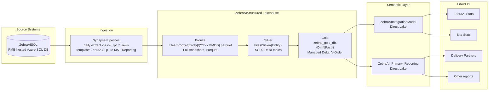
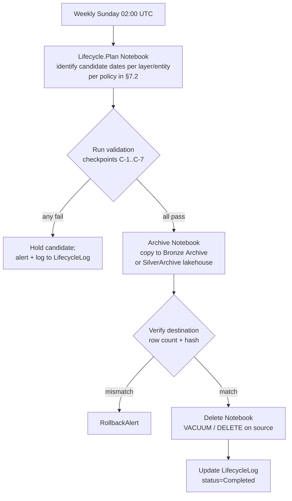

# ZebraAI Fabric Medallion — Unified Reference

  
  

---

  

## Table of Contents

  

- [How to use this document](#how-to-use-this-document)

- [0. Glossary & Lakehouse Identifiers](#0-glossary--lakehouse-identifiers)

- [1. Architecture Overview](#1-architecture-overview)

- [2. Source-to-Bronze Ingestion](#2-source-to-bronze-ingestion)

- [3. Pipelines & Orchestration](#3-pipelines--orchestration)

- [4. Per-Notebook Deep Dives](#4-per-notebook-deep-dives)

  - [4.1 Utils.Notebook](#41-utilsnotebook)

  - [4.2 Silver General Notebook](#42-silver-general-notebook)

  - [4.3 Silver_API.Notebook](#43-silver_apinotebook)

  - [4.4 Silver_APILogV2.Notebook](#44-silver_apilogv2notebook)

  - [4.5 Silver_PromptLog.Notebook](#45-silver_promptlognotebook)

  - [4.6 SilverPrompt.Notebook](#46-silverpromptnotebook)

  - [4.7 SilverFeedback_FeedbackValue.Notebook](#47-silverfeedback_feedbackvaluenotebook)

  - [4.8 Gold_Notebooks.Notebook](#48-gold_notebooksnotebook)

  - [4.9 Baseline.Notebook & Maintenance.Notebook scaffolds](#49-baselinenotebook--maintenancenotebook-scaffolds)

- [5. Capacity (CU) Analysis](#5-capacity-cu-analysis)

- [6. Lifecycle & Retention Strategy](#6-lifecycle--retention-strategy)

- [7. Maintenance Scaffolds](#7-maintenance-scaffolds)

  
  

---

  

## How to use this document

  

Read top-to-bottom for a complete platform tour, or jump to a specific section via the table of contents above. Each section preserves the technical depth of its originating source documents; nothing has been summarised away.

  

The detailed source documents this reference consolidates:

  

| # | Source document | Primary contribution |
|---|-----------------|----------------------|
| 1 | `Fabric-Medallion-Comprehensive-Analysis.md` | Cross-cutting architectural narrative + findings F1–F11 + defects D-1, D-2 |
| 2 | `Fabric-Medallion-CU-Reduction-Review.md` | Top-10 CU findings, partitioning matrix, OneLake driver ranking, code-rewrite appendix |
| 3 | `Fabric-Medallion-End-to-End-Flow.md` | Layer-by-layer architecture, per-notebook behaviour, risk register, known defects |
| 4 | `Fabric-Medallion-Optimization-and-Lifecycle-Recommendations.md` | Prescriptive S-/P-/O-/A-/G-/L- recommendation codes, retention model, validation checkpoints |
| 5 | `OPTIMIZATION_CODE_PATTERNS.md` | Before/after code snippets for the 12 optimisation patterns |
| 6 | `OPTIMIZATION_IMPLEMENTATION_GUIDE.md` | Step-by-step implementation order for each pattern |
| 7 | `OPTIMIZATION_RECOMMENDATIONS.md` | Prioritised business-facing optimisation narrative |
| 8 | `ZebraAIStructured-Lakehouse.md` + `ZebraAIStructured-Lakehouse-Documentation.md` | Lakehouse-level layout, table metadata, entity inventory |
| 9 | `ArchitectureReview/Patches/*.md` | 5 ready-to-apply patches with motivation, code, validation, rollback |
| 10 | `ArchitectureReview/PR-Checklists/*.md` | 8 per-notebook PR review checklists + a top-level README |

  

> **Sequencing tip:** Sections §0–§3 give you the lakehouse topology. §4 is the canonical per-notebook reference. §5 is the CU-cost lens. §6 is the code-pattern toolbox. §7 is the long-term retention plan. §8–§10 are the shipped artefacts. §11–§12 close out with risk and roadmap.

  

---

  

## 0. Glossary & Lakehouse Identifiers

  

### 0.1 Workspace & lakehouse identifiers

  

| Property | Value |
|----------|-------|
| **Workspace ID** | `fb5b92e7-8d59-46e7-b2ed-2d75ca1b1e97` |
| **Lakehouse name** | `ZebraAIStructured.Lakehouse` |
| **Lakehouse ID** | `13a8452e-dcbc-4aa3-8d14-bca8e07d9cd3` |
| **Default schema** | `dbo` |
| **Gold warehouse DB** | `zebrai_gold_db` (managed Delta over OneLake) |
| **ABFSS root** | `abfss://ZebraAI@msit-onelake.dfs.fabric.microsoft.com/ZebraAIStructured.Lakehouse/` |

  

### 0.2 Key folders

  

| Path | Purpose |
|------|---------|
| `Files/Bronze/{Entity}/{YYYYMMDD}.parquet` | Bronze landing — full daily snapshots in Parquet (**not** Delta) |
| `Files/Silver/{Entity}/` | Silver Delta tables with SCD2 columns (`isCurrent`, `startDate`, `endDate` — stored as `date`, not `timestamp`) |
| `Tables/` | Managed Delta tables backing `zebrai_gold_db` (Gold Dim and Fact) |
| `Files/SilverArchive/{Entity}/` *(future)* | Silver SCD2 closed rows >36 months — separate archive lakehouse |
| `Files/BronzeArchive/{Entity}/` *(future)* | Weekly Bronze snapshots retained for 7 years (regulatory) |

  

### 0.3 Glossary

  

| Term | Definition |
|------|------------|
| **Medallion** | Bronze (raw) → Silver (conformed) → Gold (curated star schema) layering convention |
| **Delta Lake** | Open table format with ACID transactions over Parquet, supporting `MERGE`, time travel, `OPTIMIZE`, `VACUUM` |
| **SCD2** | Slowly-Changing Dimension type 2 — preserves row-level history via `isCurrent` / `startDate` / `endDate` markers |
| **Direct Lake** | Fabric semantic model mode that reads Delta files directly into VertiPaq without an import refresh |
| **Framing** | Direct Lake's process of mapping Delta files into VertiPaq column segments; triggered on schema change or model refresh |
| **V-Order** | Fabric-specific Parquet column ordering that accelerates Direct Lake scans |
| **OneLake** | Fabric's unified storage substrate (per-workspace ADLS Gen2 namespace) |
| **CU** | Capacity Unit — Fabric's billable compute metric |
| **Backfill canary** | A sentinel file used to determine whether Bronze has landed for a given date |
| **PME** | Source SQL system feeding ZebraAI extracts (`ZebraAISQL` database) |
| **vw_rpt_*** | Reporting view name prefix in PME source SQL; stripped on landing to Bronze (so `vw_rpt_Api` → `Bronze/Api/`) |
| **SCD2 expire-and-insert** | Two-step write: `MERGE … whenMatchedUpdate(isCurrent=false, endDate=current_date())` then `append` the new version rows |
| **Bus key** | Business key column(s) used to identify the same logical row across SCD2 versions |
| **Tracked column** | A column whose change in value triggers the close-and-reinsert SCD2 cycle |

  

---

  

## 1. Architecture Overview

  

### 1.1 Logical architecture diagram

  



  

### 1.2 Layer responsibilities

  

| Layer | Purpose | Contract | Format | Schema mutability |
|-------|---------|----------|--------|-------------------|
| **Bronze** | Immutable landing zone for raw source extracts | Source-faithful, no transformation; full daily snapshot per entity | Parquet, file-per-day | Source-driven; schema drift accepted silently |
| **Silver** | Cleansed, conformed, historized | One SCD2 Delta table per business entity; bus keys + tracked columns; row-level history via `isCurrent`/`startDate`/`endDate` | Delta | Tracked-column drift handled via wrapper that drops unknown tracked columns |
| **Gold** | Star-schema analytical model | Dim tables = current Silver snapshot (overwrite); Fact tables = MERGE on business keys | Delta (managed, V-Order) | Schema overwrite on Dim publishes |
| **Semantic Models** | Direct Lake projection over Gold | No transformation; surfaces tables, defines measures and relationships | Power BI semantic model | Re-frames when underlying Delta schema changes |
| **Power BI Reports** | Operational and analytical dashboards | Live queries against the semantic model; no per-report imports | Power BI reports | n/a |

  

### 1.3 Silver entity inventory

  

#### 1.3.1 Reference / dimension entities (slow-changing)

  

Owned by `Silver General Notebook`, `Silver_API.Notebook`, `SilverFeedback_FeedbackValue.Notebook`:

  

| Silver path | Bronze name | Bus key(s) | Notes |
|-------------|-------------|------------|-------|
| `Silver/Api/` | `Api` | `Id` | Flattened `Attributes` JSON; exploded into `ApiIntegrationScenario` for Gold bridge |
| `Silver/Experiment/` | `Experiment` | `Id` | Core experiment definitions |
| `Silver/ExperimentFavorite/` | `ExperimentFavorite` | `Id` | Per-user favorites |
| `Silver/ExperimentLike/` | `ExperimentLike` | `Id` | Per-user likes |
| `Silver/Model/` | `Model` | `Id` | LLM / model configuration |
| `Silver/ModelParameter/` | `ModelParameter` | `ModelId` | Declared in `ENTITIES_CONFIG`; not currently written by any Silver notebook in this repo — served from prior history |
| `Silver/ModelPrompt/` | `ModelPrompt` | `ModelId` | Same caveat as above |
| `Silver/User/` | `User` | `Id` | User dimension; **also serves as the backfill canary folder for `Silver General Notebook`** |
| `Silver/Settings/` | `Settings` | `SettingsId` (mapped from Bronze `Id`) | `Silver General` rewrites `Id` → `SettingsId` before SCD2 |
| `Silver/ActiveExperiment/` | `ActiveExperiments` (plural in Bronze) | `Id` | Aggregate view (skipped on backfill via `aggregate_today_only`) |
| `Silver/Top20ApiExp/` | `Top20APIExps` (plural in Bronze) | `Id` | Aggregate view (skipped on backfill) |
| `Silver/Retention/` | `Retention` | `Id` | Aggregate-style table (skipped on backfill); ironically, no retention is applied to itself |
| `Silver/Feedback/` | `Feedback` | `Id` | Partitioned by `ExperimentId`; `recency_col=InsertedOn`, `event_time_col=InsertedOn` |
| `Silver/FeedbackValue/` | `Feedback` (same Bronze, exploded) | `Id`, `source` | Long form derived by exploding `OAx-y` rating structs; partitioned by `source` |

  

#### 1.3.2 Transactional / log entities (fast-growing)

  

Owned by `Silver_APILogV2.Notebook`, `Silver_PromptLog.Notebook`, `SilverPrompt.Notebook`:

  

| Silver path | Bus key(s) | Volume class | Partitioning | First-time `create_mode` |
|-------------|------------|--------------|--------------|--------------------------|
| `Silver/ApiLog/` (the "core/search" projection — **not** `ApiLogCore`) | `Id` | High | `InsertedOn` | `overwrite` |
| `Silver/ApiLogParameter/` | `Id` | High | `InsertedOn` | `overwrite` |
| `Silver/ApiLogResult/` | `Id` | High | `InsertedOn` | `overwrite` |
| `Silver/ApiLogPrompt/` | `ApiId` | High | `InsertedOn` | `overwrite` |
| `Silver/PromptLogCore/` | `Id` | High | `InsertedOn` | `append` (only matters on first-time create) |
| `Silver/PromptLogSearch/` | `Id` | High | `InsertedOn` | `append` (only matters on first-time create) |
| `Silver/PromptLogParameter/` | `Id` | High | `InsertedOn` | `overwrite` |
| `Silver/PromptLogResult/` | `Id` | High | `ExperimentId` | `overwrite` |
| `Silver/PromptLogPrompt/` | `Id` | High | `ExperimentId` | `append` (only matters on first-time create) |
| `Silver/Prompt/` | `Id` (notebook hard-codes `["Id"]`; ENTITIES_CONFIG declares `["Id", "OrderNum"]`) | High | `Id` | `overwrite` |

  

### 1.4 Gold star-schema inventory

  

**18 Dimensions** (full overwrite from current Silver state):

  

`DimExperiment`, `DimUser`, `DimModel`, `DimApi`, `DimActiveExperiment`, `DimExperimentFeedback`, `DimExperimentFeedbackValue`, `DimModelParameter`, `DimModelPrompt`, `DimRetention`, `DimSetting`, `DimTop20ExpAPi`, `DimPromptLog`, `DimPromptLogResult`, `DimPromptLogParameter`, `DimPromptLogSearch`, `DimPromptLogPrompt`, `DimPrompt`, plus `DimApiIntegrationScenario` (custom build, exploded from `Api.Attributes.IntegrationScenarios`).

  

**8 Facts** (MERGE on business key):

  

`FactFeedback`, `FactApiLog`, `FactApiLogParameter`, `FactApiLogPrompt`, `FactApiLogResult`, `FactExperiment`, `FactExperimentLike`, `FactExperimentFavorite`, plus `FactBridgeApiIntegrationScenario` (custom build).

  

> **Observation:** Several Silver tables are republished as **both** a Dim *and* a Fact (e.g. `Experiment` → `DimExperiment` + `FactExperiment`). This is intentional for snowflake-style joins but doubles Gold storage for these entities. The Dim represents the current attribute set; the Fact represents the immutable event-of-existence.

  

### 1.5 Storage layout (canonical paths)

  

```text

abfss://ZebraAI@msit-onelake.dfs.fabric.microsoft.com/

  ZebraAIStructured.Lakehouse/

    Files/

      Bronze/

        Api/                      20260518.parquet, 20260519.parquet, ...

        ApiLog/                   20260518.parquet, ...

        Experiment/               ...

        ExperimentFavorite/       ...

        ExperimentLike/           ...

        Feedback/                 ...

        Model/                    ...

        ModelParameter/           ...

        ModelPrompt/              ...

        Prompt/                   ...                (note: distinct from PromptLog)

        PromptLog/                ...

        Retention/                ...                (aggregate; skipped on backfill)

        Settings/                 ...

        User/                     ...                (used as backfill canary for Silver General)

        ActiveExperiments/        ...                (aggregate; skipped on backfill)

        Top20APIExps/             ...                (aggregate; skipped on backfill)

      Silver/

        Api/                      _delta_log/, part-*.parquet     (unpartitioned)

        ApiLog/                   partition by InsertedOn         (the "core/search" projection of Bronze/ApiLog)

        ApiLogParameter/          partition by InsertedOn

        ApiLogPrompt/             busKey = ApiId; partition by InsertedOn

        ApiLogResult/             partition by InsertedOn

        Experiment/               unpartitioned

        ExperimentFavorite/       unpartitioned

        ExperimentLike/           unpartitioned

        Feedback/                 partition by ExperimentId

        FeedbackValue/            busKey = (Id, source); partition by source

        Model/                    unpartitioned

        ModelParameter/           unpartitioned

        ModelPrompt/              unpartitioned

        Prompt/                   busKey = [Id] (notebook hard-coded); partition by Id

        PromptLogCore/            partition by InsertedOn

        PromptLogParameter/       partition by InsertedOn

        PromptLogPrompt/          partition by ExperimentId

        PromptLogResult/          partition by ExperimentId

        PromptLogSearch/          partition by InsertedOn

        Retention/                unpartitioned

        Settings/                 unpartitioned

        Top20ApiExp/              unpartitioned

        ActiveExperiment/         unpartitioned

        User/                     unpartitioned

    Tables/                       (managed Delta backing zebrai_gold_db)

  zebrai_gold_db                  (warehouse DB; tables physically backed by OneLake Delta)

```

  

> **Naming quirk.** Bronze folder names for two aggregate entities are **plural** (`ActiveExperiments/`, `Top20APIExps/`) while their Silver and Gold projections are **singular** (`Silver/ActiveExperiment/`, `Silver/Top20ApiExp/`, `DimActiveExperiment`, `DimTop20ExpAPi`). This is intentional but worth knowing during incident triage.

  

### 1.6 Semantic models

  

| Semantic model | Sample reports served |
|----------------|------------------------|
| `ZebraAIIntegrationModel.SemanticModel` | `ZebraAI Stats`, `Site Stats`, `Site Stats with Details` |
| `ZebraAI_Primary_Reporting.SemanticModel` | `Delivery Partners`, additional operational reports |

  

Both semantic models are **Direct Lake** over `zebrai_gold_db`. Direct Lake reads Delta files directly from OneLake into the VertiPaq engine on demand — no scheduled import refresh is required for data freshness. However:

  

- **Schema-changing operations** (e.g. `overwriteSchema=true` on Dim tables) and large Delta version skew can trigger model framing failures and force fallback to DirectQuery, materially degrading report performance.

- `RefreshSqlTables` pipeline at 22:00 issues an explicit semantic-model refresh `[UNVERIFIED — not present in pipeline JSON; configured at Fabric workspace level]` to update calculated columns / measures and re-frame Direct Lake column segments.

  

---

  

## 2. Source-to-Bronze Ingestion

  

### 2.1 Source system

  

- **Source.** `ZebraAISQL` (Azure SQL database hosted in the PME environment).

- **Authentication.** Synapse linked services authenticate via the `ZebraAIKvPrd` Key Vault.

- **Source object naming.** Bronze entity tables are produced from views named `vw_rpt_{Entity}` in that database. The `vw_rpt_` prefix is stripped during landing (so `vw_rpt_Api` → `Bronze/Api/`).

  

### 2.2 Extraction mechanism

  

- **Pattern.** Full daily snapshot extraction (not CDC).

- **Synapse template.** `ZebraAISQL To MST Reporting` writes one Parquet file per entity per day to `zebraai/Bronze/{Entity}/{YYYYMMDD}.parquet`.

- **Trigger.** `PME_SQL_to_MST_Fabric_Storage` configured for `[UNVERIFIED — team-reported]` ~01:00 CST daily.

- **Idempotency.** Filename = ledger; re-running an extract for the same date overwrites the file.

  

### 2.3 Full-snapshot semantics

  

Every row in the source is rewritten to Bronze every day, even if nothing changed. At enterprise scale this is the single largest avoidable cost driver:

  

- At ~1 TB source, this produces ~365 TB/year of Bronze even if 0 rows change.

- Bronze is stored as **Parquet, not Delta**, so there is no `MERGE`, no time travel, and no incremental upgrade path.

- See §6 Pattern P-1 (Bronze → Delta + watermark incremental) and §7 lifecycle recommendation L-1.

  

### 2.4 Bronze schedule

  

| Pipeline / trigger | Schedule | Activity |
|--------------------|----------|----------|
| `PME_SQL_to_MST_Fabric_Storage` (Synapse) | ~01:00 CST daily `[UNVERIFIED]` | Run `ZebraAISQL To MST Reporting` template for each entity |

  

### 2.5 Bronze entity catalogue

  

Eighteen entities land daily under `Files/Bronze/`. Of these:

  

- **Three** are aggregates (`Retention`, `ActiveExperiments`, `Top20APIExps`) and are skipped on backfill by the Silver pipelines — they are only consumed for the current day.

- **Two** (`Prompt`, `PromptLog`) are distinct entities even though the names are similar — `Prompt` is one-row-per-prompt; `PromptLog` is the activity log.

- **The rest** are dimension and transactional entities consumed by Silver SCD2 builders.

  

---

  

## 3. Pipelines & Orchestration

  

### 3.1 Pipeline inventory

  

| Pipeline | Schedule (Fabric trigger) | Activities | Dependency wiring |
|----------|--------------------------|------------|-------------------|
| `ZebraAiPipeline_General` | ~04:00 CST daily `[UNVERIFIED — team-reported]` | `Trigger Feedback Silver Notebook`, `Trigger Api Silver  Notebook`, `Trigger Silver General Notebook`, `Trigger Silver Prompt Notebook` | **All four have `dependsOn: []`** — full parallel fan-out |
| `ZebraAi_PromptLog` | ~05:00 CST daily `[UNVERIFIED]` | `Trigger ZebraAIPromptLog` (= `Silver_PromptLog.Notebook`) | Single activity. **Does not invoke Gold.** |
| `ZebraAI_ApiLogV2` | ~05:00 CST daily `[UNVERIFIED]` | `ApiLog` (= `Silver_APILogV2.Notebook`) | Single activity. **Does not invoke Gold.** |
| `RefreshSqlTables` | ~22:00 CST daily `[UNVERIFIED]` | `Trigger Gold Refresh Notebook` (= `Gold_Notebooks.Notebook`) | Single activity. **This is the only pipeline that builds Gold.** |
| `Maintenance_Weekly_Optimize` *(shipped scaffold)* | Sunday ~03:00 UTC | `Trigger Maintenance.Notebook` with `mode=optimize` | Scaffold; weekly OPTIMIZE all hot Silver/Gold tables |
| `Maintenance_Monthly_Vacuum` *(shipped scaffold)* | Sunday ~04:00 UTC, gated to first Sunday of month via `IfCondition` | `Trigger Maintenance.Notebook` with `mode=vacuum` | Scaffold; monthly VACUUM gated to first Sunday only |

  

> **Important.** Pipeline schedules and any semantic-model refresh activity are **not present in the pipeline JSON** in the repo — they are configured at the Fabric workspace level via triggers and refresh schedules. The times above are the operating cadence reported by the team; they are not verifiable from source.

  

### 3.2 Pipeline parameters (Silver pipelines)

  

| Parameter | Type | Default | Purpose |
|-----------|------|---------|---------|
| `notebookVar` / `notebookVariable` | string | `@concat(formatDateTime(utcNow(),'yyyyMMdd'),'.parquet')` | Convenience constant — today's file name (unused by all current Silver notebooks, which derive their own date list from `lookbackDays` + `forceDates`) |
| `lookbackDays` | int | **2** | Number of days back to (re)process |
| `forceDates` | string | (empty) | Comma-separated explicit dates override |
| `failFast` | bool | true | Stop on first failure |

  

`RefreshSqlTables` takes only one parameter: `forceTables` (string, no default), passed through to `Gold_Notebooks.Notebook`.

  

**Activity policy (all pipelines):** `timeout=12h`, `retry=2`, `retryIntervalInSeconds=600` (10 min).

  

> **Defect D-2:** `lookbackDays` default in every Silver pipeline JSON is **2**, but the notebooks fall back to **5** if the parameter is missing (`read_pipeline_params(default_lookback=5)`). The effective lookback differs between scheduled runs (2) and manual notebook executions (5). See §11 Risk #6 and §8 Patch context.

  

### 3.3 Activity sequence (mermaid)

  

```mermaid

sequenceDiagram

    autonumber

    participant Sched as Fabric Scheduler

    participant Syn as Synapse Pipelines (ZebraAISQL)

    participant LH as ZebraAIStructured Lakehouse

    participant Gen as ZebraAiPipeline_General (~04:00 CST)

    participant Plog as ZebraAi_PromptLog (~05:00 CST)

    participant Alog as ZebraAI_ApiLogV2 (~05:00 CST)

    participant Refr as RefreshSqlTables (~22:00 CST)

    participant Maint as Maintenance pipelines (Sun ~03:00 / ~04:00 UTC)

    participant SM as Semantic Models

    participant PBI as Power BI

  

    Syn->>LH: Land Bronze parquet snapshots (~01:00 CST)

    Sched->>Gen: Fire (time only — no upstream dependency)

    Sched->>Plog: Fire (time only)

    par Parallel — no dependsOn between pipelines

        Gen->>LH: Trigger Feedback Silver Notebook

        Gen->>LH: Trigger Api Silver Notebook

        Gen->>LH: Trigger Silver General Notebook

        Gen->>LH: Trigger Silver Prompt Notebook

        Plog->>LH: Silver_PromptLog (5 projections; no Gold write)

    end

    Sched->>Alog: Fire (time only)

    Alog->>LH: Silver_APILogV2 (4 projections; per-file OPTIMIZE ZORDER InsertedOn; no Gold write)

    Sched->>Refr: Fire (time only)

    Refr->>LH: Gold_Notebooks (18 Dim overwrite + 8 Fact MERGE; DimApiIntegrationScenario + FactBridge built separately)

    Note over Refr,SM: Semantic-model refresh is not in pipeline JSON — must be configured separately if needed

    SM->>PBI: Direct Lake queries served on demand

  

    Sched->>Maint: Weekly Sun 03:00 UTC — Maintenance_Weekly_Optimize

    Maint->>LH: OPTIMIZE + ZORDER hot Silver/Gold tables

    Sched->>Maint: Monthly first Sun 04:00 UTC — Maintenance_Monthly_Vacuum (IfCondition gated)

    Maint->>LH: VACUUM RETAIN 168 HOURS on Silver; RETAIN 720 HOURS on Gold

```

  

### 3.4 Notebook-level sequence within a Silver run

  

```mermaid

flowchart TD

    A[Read pipeline params<br/>lookbackDays default 5 in notebook<br/>pipeline default 2] --> B

    B[Build date list:<br/>forceDates ∪ today−lookbackDays..today] --> C

    C{For each entity<br/>in ENTITIES_CONFIG or notebook list} --> D

    D{For each date} --> E

    E[Check backfill canary<br/>e.g. Bronze/User/{date}.parquet for Silver General<br/>Bronze/Feedback/{date}.parquet for Feedback<br/>etc.]

    E -- canary missing --> F[Skip date]

    E -- canary exists --> G[Read Bronze parquet]

    G --> H[Dedupe within day<br/>by bus_keys, max recency_col]

    H --> I[scd2_merge_append<br/>MERGE whenMatchedUpdate to expire<br/>+ single append-insert of new versions<br/>startDate/endDate stored as DATE]

    I --> J[Optional: Silver_APILogV2 only<br/>local optimize_table OPTIMIZE ZORDER InsertedOn]

    J --> K[Update ingestion ledger]

```

  

### 3.5 Cross-pipeline dependency gaps

  

The pipelines are **time-synchronised, not data-synchronised**. There is no explicit `dependsOn` between:

  

| Producer | Consumer | Gap |
|----------|----------|-----|
| Synapse `ZebraAISQL` extract | `ZebraAiPipeline_General` (~04:00) | Time gap only — Silver may run on incomplete Bronze if Synapse is delayed |
| Silver pipelines (`General`, `PromptLog`, `ApiLogV2`) | `RefreshSqlTables` (Gold, ~22:00) | Time gap only — Gold runs even if any Silver pipeline failed silently. `RefreshSqlTables` is the **only** pipeline that writes Gold; the other three never call `Gold_Notebooks` |
| Inside `ZebraAiPipeline_General` | the four Silver triggers (Feedback / Api / General / Prompt) | No `dependsOn` — full parallel fan-out, ~4× peak Spark capacity demand |

  

Recommendations to close these gaps live at:

  

- §6 Optimisation pattern P-6 (wire `dependsOn` within `ZebraAiPipeline_General`)

- §6 Optimisation pattern P-7 (cross-pipeline Gold-only-after-Silver gating)

- §8 Patch 05 (watermark gate on Gold — operational guard rail for the same risk)

  

---

  

## 4. Per-Notebook Deep Dives

  

This section is the canonical per-notebook reference. Each subsection covers the cells, helper functions, `ENTITIES_CONFIG` entries, SCD2 semantics, known bugs, and code excerpts for one notebook. All notebooks bind to lakehouse `13a8452e-dcbc-4aa3-8d14-bca8e07d9cd3` and run on `synapse_pyspark`. `Utils` is invoked via `%run Utils` from every Silver notebook. Six notebooks live under `Garima/FinalNotebooks/`; `SilverFeedback_FeedbackValue.Notebook` lives one folder above (`Garima/`), which is easy to miss when surveying the project.

  

### 4.1 Utils.Notebook

  

**Role:** Shared library. Hosts the configuration dictionary and all reusable SCD2, dedupe, backfill, JSON flattening, and diagnostic helpers.

  

#### 4.1.1 Top-level constants

  

```python

BRONZE_ROOT = "abfss://ZebraAI@msit-onelake.dfs.fabric.microsoft.com/ZebraAIStructured.Lakehouse/Files/Bronze/"

SILVER_ROOT = "abfss://ZebraAI@msit-onelake.dfs.fabric.microsoft.com/ZebraAIStructured.Lakehouse/Files/Silver/"

LAKEHOUSE_ROOT = "abfss://ZebraAI@msit-onelake.dfs.fabric.microsoft.com/ZebraAIStructured.Lakehouse"

GOLD_DB = "zebrai_gold_db"

```

  

> **Issue U7:** Despite these constants being defined, **every Silver notebook redeclares its own ABFSS strings.** Centralisation would eliminate one entire class of typo bugs.

  

#### 4.1.2 `ENTITIES_CONFIG`

  

A Python dict keyed by entity name, each value containing:

  

| Key | Purpose |
|-----|---------|
| `bronze_path` | Source folder under `Files/Bronze/` |
| `silver_path` | Target folder under `Files/Silver/` |
| `bus_keys` | Business key columns identifying the same logical row across versions |
| `tracked_cols` | Columns that, when changed, close the current row and open a new version |
| `partition_cols` | Delta partition columns (used selectively — e.g. `InsertedOn` on ApiLog projections, `ExperimentId` on `Feedback` and `PromptLogResult`/`PromptLogPrompt`) |
| `recency_col` | Tie-breaker for picking the most recent Bronze row per key per day (default `InsertedOn`); used as `seq_col` to enforce monotonic SCD2 |
| `create_mode` | First-time write mode only (`overwrite` is the function default and the value the static/dynamic helpers hard-code). Once the target Delta table exists, full SCD2 logic runs on every call regardless of this value — see §4.1.3 for the side-effect detail |

  
  

#### 4.1.3 `scd2_merge_append`

  

The most-leveraged function in the platform.

  

**Signature:**

  

```python

def scd2_merge_append(

    source_df,           # cleaned daily snapshot

    target_path,         # Files/Silver/{Entity}/

    business_keys,       # list of bus key columns

    tracked_cols,        # list of columns that gate version creation

    partition_cols=None,

    create_mode="append",      # see note below

    seq_col=None,              # tie-breaker for "current" pick

    event_time_col=None,       # SCD2 startDate source (default current_date())

):

    ...

```

  

**Behaviour (verified):**

  

1. Dedupes the day's source by `business_keys` keeping max(`recency_col`).

2. Compares against current Silver rows (`isCurrent=true`) by `bus_keys`:

   - **Unchanged `tracked_cols`** → no-op.

   - **Changed `tracked_cols`** → expire current row via `MERGE … whenMatchedUpdate(set isCurrent=false, endDate=current_date)`. This is the **expire half**.

   - **Missing in Bronze** → leave Silver as-is (soft delete not modelled).

   - **New key** → insert with `isCurrent=true`.

3. The new SCD2 versions are appended **once** via `to_insert.write.format("delta").mode("append").option("mergeSchema","true").save(target_path)`. This is the **insert half**.

  
  

**`create_mode` semantics (P1 nuance):**

  

The `create_mode` parameter has **two** non-obvious behaviours:

  

1. **First-time-write only:** The value is only consulted when the Silver target path does not yet exist. From the first successful call onward, the full SCD2 expire-and-insert logic runs on every invocation regardless of `create_mode`.

2. **Runtime dup-check toggle:** When `create_mode != "overwrite"`, the function enforces a data-quality check that raises if the target already has multiple `isCurrent=true` rows for the same business key (i.e. existing corruption blocks further inserts). With `create_mode="overwrite"` that guard is **intentionally skipped**.

  

**`startDate` / `endDate` column types:**

  

`startDate` and `endDate` are stored as **`date`** (not `timestamp`). The function explicitly casts the open-end sentinel `'9999-12-31'` to `date` and `current_timestamp()` to `to_date(now)`. The function will raise `"SCD2 config error"` if the existing target schema disagrees.

  

#### 4.1.4 `read_pipeline_params`

  

**Signature:**

  

```python

def read_pipeline_params(default_lookback: int = 5):

    """Reads pipeline-supplied widgets; falls back to defaults when missing."""

    lookback_days = int(notebookutils.runtime.context["pipelineRunId"] and ... or default_lookback)

    force_dates = notebookutils.runtime.context.get("forceDates", "")

    run_id = notebookutils.runtime.context["pipelineRunId"]

    return lookback_days, force_dates, run_id

```

  

#### 4.1.5 `process_with_backfill`

  

Orchestrates per-date catch-up:

  

```python

def process_with_backfill(

    table_name,

    bronze_dir,            # canary folder for date-existence check

    transform_fn,          # callable(date_str) -> None

    lookback_days,

    force_dates,

    aggregate_today_only=False,

):

    ...

```

  

- Builds a date list = `forceDates` ∪ `[today − lookbackDays … today]`.

- For each date, calls `notebookutils.fs.exists(bronze_dir + f"{date}.parquet")` as the **canary check**.

- If canary present, calls `transform_fn(date_str)`; else skips.

  

#### 4.1.6 `repair_scd2_latest_wins`

  

Destructive helper that rewrites a Silver table by keeping the latest version per `bus_keys` and discarding all prior SCD2 history.

  

```python

def repair_scd2_latest_wins(silver_path, business_keys, dry_run=True):

    ...

```

  

#### 4.1.7 `flattenJson`

  

```python

def flattenJson(df, col_name):

    sampled_values = (df.select(col_name)

                        .where(F.col(col_name).isNotNull())

                        .limit(1000)

                        .collect())

    sampled_rdd = spark.sparkContext.parallelize([r[0] for r in sampled_values])

    inferred_schema = spark.read.json(sampled_rdd).schema

    return df.withColumn(col_name, F.from_json(F.col(col_name), inferred_schema))

```

  

#### 4.1.8 Other helpers

  

| Function | Purpose | Status |
|----------|---------|--------|
| `optimize_table(path, zorder_cols)` | Runs `OPTIMIZE delta.` + path + ` ZORDER BY (cols)` | Used only by `Silver_APILogV2` |
| `diagnose_scd2_duplicates(spark, target_path, business_keys)` | Returns duplicate `isCurrent=true` rows per bus key | Useful for post-patch validation |
| `inspect_scd2_sample(...)` | Pretty-print sample SCD2 versions for one key | Diagnostic only |
| `extract_text` (Python UDF) | HTML strip helper | Python UDF blocks Catalyst; consider Spark SQL `regexp_replace` or push to source view |
| `validate_entities_config()` | Sanity-checks `ENTITIES_CONFIG` consistency | Never invoked in pipelines (U6) |
| `truncate_table()`, `preview_table()`, `preview_parquet()`, `delete_adls_path()` | Dev/diagnostic | Never invoked in pipelines (U6) — move to `Utils.Dev` |

  

### 4.2 Silver General Notebook

  

**Path:** `Garima/FinalNotebooks/Silver General Notebook.Notebook/notebook-content.py`

  

**Role:** 9-entity general Silver builder for slow-changing reference data.

  

**Entities covered (the `tables` list):**

  

`Retention`, `ExperimentFavorite`, `ExperimentLike`, `Model`, `Experiment`, `User`, `Settings`, `ActiveExperiments`, `Top20APIExps`. Plus standalone blocks for `ModelParameter` and `ModelPrompt`.

  

**Aggregates skipped on backfill (today-only):**

  

`Retention`, `ActiveExperiments`, `Top20APIExps` — controlled by `AGGREGATE_TABLES = {…}` set.

  

**Backfill canary:** `Bronze/User/{date}.parquet`.

  

#### 4.2.1 Cell structure

  

| Cell | Purpose |
|------|---------|
| 1 | `%run Utils` |
| 2 | Constants + the `tables` list + `table_config` dict |
| 3 | Date list construction (`lookback_days, force_dates, run_id = read_pipeline_params(default_lookback=5)`) |
| 4 | First dedup loop: read `Bronze/{tbl}/{date}.parquet`, `dropDuplicates`, write `Bronze/{tbl}_Deduplicated` — **DEAD** (Patch 02) |
| 5 | Second dedup loop: read `Bronze/{tbl}_Deduplicated`, write `Silver/{slvr_tbl}_Deduplicated` — **DEAD** (Patch 02) |
| 6 | Standalone `ModelParameter_Deduplicated`, `ModelPrompt_Deduplicated` blocks — **DEAD** (Patch 02) |
| 7+ | `process_with_backfill(...)` per entity, calling `process_static_entity` or `process_dynamic_entity` → eventually `scd2_merge_append(create_mode="overwrite")` |

  

### 4.3 Silver_API.Notebook

  

**Path:** `Garima/FinalNotebooks/Silver_API.Notebook/notebook-content.py`

  

**Role:** API reference SCD2.

  

- **Source:** `Files/Bronze/Api/`

- **Target:** `Files/Silver/Api/` (unpartitioned)

- **Bus keys:** `["Id"]`

- **Tracked cols:** every column except `Id`

- **`create_mode`:** `"overwrite"`

  

#### 4.3.1 Notable steps

  

```python

# Cell 4 (transform)

df = spark.read.parquet(src_path + "Api/" + bronze_file)

df = flattenJson(df, "Attributes")          # F10/U2 — per-batch schema inference

df = df.withColumn("Attributes_IntegrationScenarios", F.col("Attributes.IntegrationScenarios"))

df = df.drop("Attributes")

df = df.dropDuplicates(["Id"])              # SA2 — global shuffle; replace with window-based

df = whitespace_to_null(df)                 # SA5 — should be in source view

```

  

- **Cells 5, 6 (DEAD):** Write `Feedback_Deduplicated` (wrong entity name — this is `Silver_API`!) to both `src_path` and `dest_path`. Patch 02 removes them.

  

### 4.4 Silver_APILogV2.Notebook

  

**Path:** `Garima/FinalNotebooks/Silver_APILogV2.Notebook/notebook-content.py`

  

**Role:** Splits one Bronze `ApiLog` table into 4 Silver projections.

  

**Projections produced:**

  

| Silver path | Bus keys | Partition | Tracked cols |
|-------------|----------|-----------|--------------|
| `Silver/ApiLog/` (the "core/search" projection — **not** `Silver/ApiLogCore/`) | `["Id"]` | `InsertedOn` | core columns |
| `Silver/ApiLogParameter/` | `["Id"]` | `InsertedOn` | parameter columns flattened from JSON `Parameter` |
| `Silver/ApiLogResult/` | `["Id"]` | `InsertedOn` | result columns flattened from JSON `Result` |
| `Silver/ApiLogPrompt/` | `["ApiId"]` | `InsertedOn` | prompt columns flattened from JSON `Prompt` |

  

#### 4.4.1 Distinctive behaviours

  

- Sets session-level `spark.sql.files.maxPartitionBytes = 128 MB`. **Only place in the repo** where this is configured.

- The "core/search" projection writes to `Silver/ApiLog/` (not `Silver/ApiLogCore/`) — name overlap with the parent entity is easy to misread.

- All 4 are partitioned by **`InsertedOn`** (not `ExperimentId`); the **obsolete `ENTITIES_CONFIG` entries for the ApiLog projections still say `ExperimentId`**, but the notebook overrides that.

- Calls `optimize_table(target_path, zorder_cols=["InsertedOn"])` **after every file write** (per-file OPTIMIZE+ZORDER). **This is the only Silver notebook that runs OPTIMIZE in the hot path.**

  

### 4.5 Silver_PromptLog.Notebook

  

**Path:** `Garima/FinalNotebooks/Silver_PromptLog.Notebook/notebook-content.py`

  

**Role:** Splits one Bronze `PromptLog` table into 5 Silver projections.

  

**Projections produced:**

  

| Silver path | Bus keys | Partition | First-time `create_mode` |
|-------------|----------|-----------|--------------------------|
| `Silver/PromptLogCore/` | `["Id"]` | `InsertedOn` | `"append"` |
| `Silver/PromptLogSearch/` | `["Id"]` | `InsertedOn` | `"append"` |
| `Silver/PromptLogParameter/` | `["Id"]` | `InsertedOn` | `"overwrite"` |
| `Silver/PromptLogResult/` | `["Id"]` | `ExperimentId` | `"overwrite"` |
| `Silver/PromptLogPrompt/` | `["Id"]` | `ExperimentId` | `"append"` |

  

#### 4.5.1 Distinctive behaviours

  

- **Monkey-patches `scd2_merge_append` locally** to drop tracked columns absent from the target schema (avoids `AnalysisException` on schema evolution). The wrapper silently hides schema drift — log dropped columns and alert if non-empty (SPL2).

- Calls `flattenJson` on multiple sub-objects per batch — per-batch schema inference is the real CU driver here (F10). Patch 04 pins schemas to eliminate it.

- `promptLogDf.cache()` then `.unpersist()` — uses 5 projections, justified (SPL4).

- Sets `spark.conf.set("spark.sql.caseSensitive", "true")` — session-scoped, leaks across pool runs (SPL6). Set at pool level or scope via `try/finally` reset.

  

### 4.6 SilverPrompt.Notebook

  

**Path:** `Garima/FinalNotebooks/SilverPrompt.Notebook/notebook-content.py`

  

**Role:** Per-prompt SCD2 derived from `Bronze/PromptLog`.

  

- **Source (transform):** `src_path + "PromptLog/" + bronze_file`

- **Canary (orchestrator):** `process_with_backfill(bronze_dir=src_path + "Prompt/", ...)` — **MISMATCH** (defect D-1)

- **Target:** `Silver/Prompt/` (partitioned by **`Id`** — primary key, anti-pattern)

- **Bus keys:** `["Id"]` (hard-coded in notebook); `ENTITIES_CONFIG["Prompt"]` declares `["Id", "OrderNum"]` (config ignored — SP3)

- **Tracked cols:** `["Name", "Role", "Content", "Comment"]`

- **`create_mode`:** `"overwrite"`

  

#### 4.6.1 Cell structure

  

| Cell | Purpose |
|------|---------|

| 1 | `%run Utils` |
| 2 | Constants |
| 3 | `lookback_days, force_dates, run_id = read_pipeline_params(default_lookback=5)` |
| 4 | `def process_one(date_str): df = spark.read.parquet(src_path + "PromptLog/" + bronze_file) ... ; scd2_merge_append(..., partition_cols="Id", business_keys=["Id"], create_mode="overwrite")` |
| 5 | Standalone dedup block that writes `Prompt_Deduplicated/` — **the only `_Deduplicated` path that is actually read** (by the orchestrator, via the broken canary) |
| 6 | `process_with_backfill(table_name="Prompt", bronze_dir=src_path + "Prompt/", transform_fn=process_one, ...)` |

  

#### 4.6.2 Verified defects

  

- **D-1 (Canary mismatch):** Orchestrator gates on `Bronze/Prompt/{date}.parquet`; transform reads `Bronze/PromptLog/{date}.parquet`. Dates skipped when `Prompt` feed lags; dates processed when `PromptLog` has not landed. **Fix:** Change `bronze_dir` to `src_path + "PromptLog/"` and delete the standalone dedup block (Patch 02 + canary fix).

- **SP2 (Partition anti-pattern):** Partition by `Id` (the primary key) creates one tiny file per row — classic anti-pattern. Likely a major contributor to OneLake transaction CUs on Silver/Prompt. **Fix:** Remove partition; ZORDER on `Id` after weekly OPTIMIZE.

- **SP3 (Bus key mismatch):** Notebook hard-codes `["Id"]`; config says `["Id", "OrderNum"]`. Multi-message prompts collapse. **Fix:** Use config-declared keys (or update config to match intentional design).

- **SP4 (F10):** `flattenJson(df, "Value")` schema inference per batch.

- **SP5:** Commented-out `.cache()` lines — delete cruft.

- **SP6 (linked with cell 5):** Standalone dedup block (writes `Prompt_Deduplicated/`) — only `_Deduplicated` path that is consumed. Eliminate together with canary fix (D-1).

  

### 4.7 SilverFeedback_FeedbackValue.Notebook

  

**Path:** `Garima/SilverFeedback_FeedbackValue.Notebook/notebook-content.py` *(note: in `Garima/`, not `Garima/FinalNotebooks/`)*

  

**Role:** Feedback + per-value ratings.

  

- **Source:** `Files/Bronze/Feedback/`

- **Targets:**

  - `Silver/Feedback/` — partition by `ExperimentId`, busKey `Id`

  - `Silver/FeedbackValue/` — partition by `source`, busKey `(Id, source)`

- **Behaviour:** Strips HTML via `extract_text` UDF (SF3); explodes `OAx-y` rating structs into long form (SF4).

- **Calls `scd2_merge_append` directly** with `create_mode="overwrite"` and `event_time_col="InsertedOn"`.

  

#### 4.7.1 Cells

  

| Cell | Purpose |
|------|---------|
| 1 | `%run Utils` |
| 2 | Constants |
| 3 | Read Bronze + flatten + explode |
| 4 | `scd2_merge_append` for `Silver/Feedback/` |
| 5 | `scd2_merge_append` for `Silver/FeedbackValue/` |
| 6, 7, 8 | Three `_Deduplicated` writes — **DEAD** (Patch 02) |

  

### 4.8 Gold_Notebooks.Notebook

  

**Path:** `Garima/FinalNotebooks/Gold_Notebooks.Notebook/notebook-content.py`

  

**Role:** Build the Gold star-schema.

  

#### 4.8.1 Headline behaviours

  

- 18 Dim tables + 8 Fact tables, plus 2 custom builds (`DimApiIntegrationScenario`, `FactBridgeApiIntegrationScenario`).

- Dim tables: full overwrite via `df.write.format("delta").mode("overwrite").option("overwriteSchema","true").saveAsTable(...)`.

- Fact tables: `DeltaTable.forName(...).merge(...).whenMatchedUpdateAll().whenNotMatchedInsertAll().execute()` after the table exists. **First-time creation also uses overwrite + `overwriteSchema=true`** — the Direct Lake re-framing cost is paid on the day a new Fact is introduced.

- Validation gates:

  - `assert_gold_current_only` — every Gold row has `isCurrent=true` or `endDate='9999-12-31'`.

  - `assert_no_historical_key_leakage` — no key appears in Gold that exists **only** in Silver historical rows.

  

#### 4.8.2 Main loop (excerpt)

  

```python

for gold_table, cfg in TABLES.items():

    if cfg["type"] == "dim":

        df = read_silver_current(cfg["silver_path"])

        overwrite_gold_table(df, gold_table)

    else:

        df = read_silver_current(cfg["silver_path"])

        merge_gold_fact(df, gold_table, business_keys=cfg["business_keys"])

  

    # Validation

    assert_gold_current_only(gold_table)

    silver_hist = spark.read.format("delta").load(cfg["silver_path"])

    silver_cur  = silver_hist.filter(F.col("isCurrent") == True)

    assert_no_historical_key_leakage(silver_cur, silver_hist, business_keys=cfg["business_keys"])

  

    # Stray DELETE — CRITICAL DEFECT (Finding 3 / Patch 01)

    spark.sql(f"DELETE FROM {GOLD_DB}.{gold_table} WHERE 1=1")

    print(f"Deleted all rows from {gold_table} to remove duplicates.")

```

  

#### 4.8.3 Verified defects

  

| # | Issue | Severity | Patch |
|---|-------|----------|-------|
| GN1 | `DELETE FROM ... WHERE 1=1` after every table | **Critical** | Patch 01 |
| GN2 | `mode("overwrite").option("overwriteSchema","true")` for all 18 Dims invalidates Direct Lake cache | **Critical** | Patch 03 |
| GN3 | No upstream-watermark gate; all 28 tables refreshed nightly | **High** | Patch 05 |
| GN4 | `assert_no_historical_key_leakage` runs full Silver history scan per table | High | §6 Pattern 09 |
| GN5 | `read_silver_current` filters by `isCurrent == True` post-load → full Silver scan per call | High | §6 Pattern 09 |
| GN6 | `build_api_integration_scenario_tables` explodes daily even when `IntegrationScenarios` unchanged | Medium | Watermark gate |
| GN7 | Independent Spark session at 22:00 (cold start) for Gold only | Medium | Chain Gold pipeline after Silver pipeline succeeds |

  

#### 4.8.4 `read_silver_current`

  

```python

def read_silver_current(silver_path):

    df = spark.read.format("delta").load(silver_path)

    if "isCurrent" in df.columns:

        return df.filter(F.col("isCurrent") == True)

    if "endDate" in df.columns:

        return df.filter(F.to_date("endDate") == F.lit("9999-12-31"))

    return df

```

  
  

### 4.9 Baseline.Notebook & Maintenance.Notebook scaffolds

  

**Path:** `Garima/FinalNotebooks/Baseline.Notebook/`, `Garima/FinalNotebooks/Maintenance.Notebook/` *(shipped scaffolds — see §10)*

  

#### 4.9.1 Baseline.Notebook

  

- Defines widgets for capture targets, capacity, and a sample DAX pull from the Capacity Metrics App for trending.

- Intended as the reference workload for before/after comparisons when patches A1–A5 land.

  

#### 4.9.2 Maintenance.Notebook

  

- Hot Silver table list with ZORDER columns.

- Weekly OPTIMIZE + ZORDER on hot tables.

- Monthly VACUUM gated to first-Sunday-of-month via Python `today.day <= 7 and today.weekday() == 6` (Sunday).

- Wired to two new Fabric pipelines: `Maintenance_Weekly_Optimize.DataPipeline` and `Maintenance_Monthly_Vacuum.DataPipeline` (the latter uses an `IfCondition` activity to enforce the first-Sunday gate).

  

See §10 for the full code excerpt.

  

---

  

## 5. Capacity (CU) Analysis

  

### 5.1 Baseline CU consumption

  

| Item | CUs | Share |
|------|-----|-------|
| OneLake (storage + I/O) | **49,609,643.22** | ~79% |
| Gold Notebooks (compute) | **12,902,434.31** | ~21% |
| **Total** | **62,512,077.53** | 100% |

  
  

### 5.2 Partitioning matrix

  

#### 5.2.1 Bronze

  

All Bronze files are parquet snapshots named `{YYYYMMDD}.parquet` per entity folder — *file-name pseudo-partitioning*, not Delta partitioning. Filtering happens by selecting which file to read (`process_with_backfill`).

  

| Entity (Bronze) | Current | Verdict | Recommendation |
|-----------------|---------|---------|----------------|
| Api | One file per day | OK as scratchpad | Convert to Delta partitioned by `LOAD_DATE`, no further partitioning |
| Feedback | One file per day | OK | Convert to Delta partitioned by `LOAD_DATE` |
| Prompt | One file per day | OK | Convert to Delta partitioned by `LOAD_DATE` |
| PromptLog | One file per day, **largest entity** | Risky — daily snapshots grow | Convert to Delta partitioned by `LOAD_DATE`, retain only last 14d hot + 90d cool, then purge |
| ApiLog | One file per day, very large | Same | Same as PromptLog |
| Retention, ExperimentFavorite, ExperimentLike, Model, Experiment, User, Settings, ActiveExperiments, Top20APIExps, ModelParameter, ModelPrompt | One file per day each | Wasteful for static-ish entities | Convert to Delta with MERGE-by-key from Synapse; **do not partition** small entities |

  

#### 5.2.2 Silver

  

| Entity (Silver Delta path) | Current partition | Verdict | Recommendation |
|----------------------------|-------------------|---------|----------------|
| `Silver/Api/` | (none) | Acceptable for current size | **Leave unpartitioned**; add ZORDER on `Id` after weekly OPTIMIZE |
| `Silver/Feedback/` | `ExperimentId` | **Risky** — `ExperimentId` cardinality grows | If # experiments < 200, keep; if >1000, switch to ZORDER on `ExperimentId` |
| `Silver/FeedbackValue/` | `source` | Good | Keep — bounded cardinality |
| `Silver/Prompt/` | `Id` (primary key) | **Wrong** — file-per-row anti-pattern | **Remove partition.** ZORDER on `Id` instead |
| `Silver/ApiLog/` | `InsertedOn` | OK if date | Verify it's stored as `DATE` not `TIMESTAMP`; partition by `to_date(InsertedOn)` |
| `Silver/ApiLogParameter/`, `Silver/ApiLogResult/`, `Silver/ApiLogPrompt/` | `InsertedOn` | Acceptable | Same as ApiLog |
| `Silver/PromptLogCore/` | `InsertedOn` | Same caveat | Use `to_date(InsertedOn)` |
| `Silver/PromptLogSearch/` | `InsertedOn` | Same | Same |
| `Silver/PromptLogParameter/` | `InsertedOn` | Same | Same |
| `Silver/PromptLogResult/` | `ExperimentId` | Risky | Switch to `to_date(InsertedOn)` |
| `Silver/PromptLogPrompt/` | `ExperimentId` | Same | Same |
| All other small dims | (none) | Good | **Leave unpartitioned** |

  

#### 5.2.3 Gold

  

| Table | Type | Recommendation |
|-------|------|----------------|
| All 18 Dims | Dim, overwrite mode | **Leave unpartitioned**; switch overwrite → MERGE (Patch 03) |
| `FactApiLog` | Fact, MERGE | Partition by `YEAR(InsertedOn) * 100 + MONTH(InsertedOn)` |
| `FactApiLogParameter`, `FactApiLogResult`, `FactApiLogPrompt` | Fact, MERGE | Same monthly partition |
| `FactExperiment` | Fact, MERGE | Partition by `YEAR(*time_col*) * 100 + MONTH(*time_col*)` if time-series |
| `FactExperimentLike`, `FactExperimentFavorite` | Fact, MERGE | No partition; ZORDER on `ExperimentId` |
| `FactBridgeApiIntegrationScenario` | Bridge, overwrite | Leave unpartitioned (small) |

  

#### 5.2.4 Partitioning anti-patterns confirmed in this repo

  

| Anti-pattern | Where | Fix |
|--------------|-------|-----|
| **Partition by primary key** | `Silver/Prompt/` partition=`Id` | Remove partition; ZORDER on `Id` |
| **Partition by ever-growing business cardinality** | `Silver/Feedback/` partition=`ExperimentId`, `Silver/PromptLogResult/` partition=`ExperimentId` | Switch to date or ZORDER |
| **Ignore declared config** | `ENTITIES_CONFIG["ApiLog"]["partition_col"] = "ExperimentId"` but notebook uses `InsertedOn` | Pick one source of truth |
| **Partition by `TIMESTAMP` instead of `DATE`** | If `InsertedOn` is timestamp, partition will create one folder per microsecond | Cast to `DATE` in partition expression |
| **Partition Bronze parquet by file name only** | All Bronze | Convert to Delta partitioned by `LOAD_DATE` |

  

### 5.2.5 ZORDER vs Liquid Clustering

  

| Table | Recommendation |
|-------|----------------|
| `Silver/ApiLog/`, `Silver/PromptLogCore/` | **Liquid cluster on `(InsertedOn, ExperimentId)`** if Fabric runtime supports it; ZORDER otherwise |
| `Silver/Feedback/` | **Liquid cluster on `(ExperimentId, InsertedOn)`** |
| `Silver/Prompt/` | ZORDER on `Id` (small enough — liquid is overkill) |
| Gold Dims | ZORDER on primary key after MERGE switch |
| Gold Facts | ZORDER on `(date_partition_key, primary_business_key)` |

  

---

  

## 6. Lifecycle & Retention Strategy

  

### 6.1 Lifecycle objectives

  

| Objective | Target |
|-----------|--------|
| **Replayability** | Any production data issue must be reproducible from raw source for ≥ 30 days |
| **Compliance** | PII (User, Feedback comments) is purged from operational layers per policy (placeholder: 13 months) |
| **Cost** | Bronze + Silver storage growth ≤ 1.5× source-data growth |
| **Recovery** | Restore from snapshot must complete within RTO of 4 hours |
| **Audit** | A weekly Bronze snapshot is preserved for 7 years (regulatory) |

  

### 6.2 Prescriptive retention model

  

| Layer | Window | What is kept | What is purged | Storage tier |
|-------|--------|--------------|----------------|--------------|
| **Bronze — Hot** | Day 0 – 14 | Full row-level Delta data, all entities | None | OneLake Standard (Lakehouse) |
| **Bronze — Cool** | Day 15 – 90 | Compacted Delta, `VACUUM RETAIN 0` history removed | Tombstones, log history | OneLake Standard (kept in Lakehouse for fast Silver replay) |
| **Bronze — Archive** | Day 91 – 7 years | **Weekly snapshot only** (one full snapshot per Sunday), parquet | All other daily files | Azure Blob Cool / Archive tier (lifecycle-managed) |
| **Bronze — Delete** | After 7 years | — | Everything | — |
| **Silver — Live** | All `isCurrent=true` rows | Indefinitely (these are the live state) | — | OneLake Standard |
| **Silver — Recent history** | SCD2 closed rows up to 13 months old | Full SCD2 history rows | — | OneLake Standard |
| **Silver — Historical** | SCD2 closed rows 13–36 months | Compacted, `VACUUM RETAIN 168 HOURS` | Old Delta log entries, orphaned files | OneLake Standard |
| **Silver — Archive** | SCD2 closed rows > 36 months | Move to `Files/SilverArchive/{Entity}/` (Delta) | — | OneLake Cool (separate lakehouse: `ZebraAIArchive.Lakehouse`) |
| **Silver — Delete** | After 7 years (transactional) / indefinitely (reference) | — | Transactional log entries after 7 years | — |
| **Gold Dim** | Indefinitely | All current rows | — | OneLake Standard |
| **Gold Fact — Hot** | Last 24 months (monthly partitions) | All rows | — | OneLake Standard |
| **Gold Fact — Cool** | 25 – 84 months | Compacted, partitioned by month | Delta versions > 30 days | OneLake Cool (same lakehouse, Delta deep partitioning) |
| **Gold Fact — Archive** | > 7 years | Aggregated to monthly grain in `*_archive` tables | Original row-level data | OneLake Cool |

  

### 6.3 VACUUM policy

  

| Layer | RETAIN value | Notes |
|-------|--------------|-------|
| Silver hot tables (PromptLog*, ApiLog*, Prompt, Feedback) | `RETAIN 168 HOURS` (7 days) | **Do NOT lower without owner sign-off** — 7 days is the minimum for safe rollback after a bad SCD2 commit |
| Silver reference tables (Api, Experiment, User, Model, …) | `RETAIN 168 HOURS` | Same |
| Gold Dim | `RETAIN 720 HOURS` (30 days) | Longer retention enables one-month audit replay |
| Gold Fact | `RETAIN 720 HOURS` | Same |

  

### 6.4 Validation checkpoints

  

A deletion job for a given Bronze date **must** verify all of the following before purging:

  

| Checkpoint | What it asserts | How |
|------------|-----------------|-----|
| **C-1 Silver row-count parity** | Silver for that date has at least N rows where N = max(1, 50 % of Bronze row count) | SQL count comparison logged to `DataQualityLog` |
| **C-2 Bus-key uniqueness in Silver** | No duplicate `(bus_key, isCurrent=true)` rows | `SELECT bus_keys, COUNT(*) ... HAVING COUNT(*)>1` returns 0 |
| **C-3 SCD2 invariant** | All closed rows have `endDate < startDate(next version)` | `WHERE endDate >= next_startDate` returns 0 |
| **C-4 Gold ↔ Silver hash match** | Gold's projection of the same business keys hashes equal to Silver current-state projection | SHA-2 over sorted, canonical column list |
| **C-5 Days-since-write** | Silver table has been successfully written to since `date + 1 day` | `DESCRIBE HISTORY` filter on `timestamp > date + 1` |
| **C-6 Downstream not broken** | All Fact tables sourced from this Silver have written successfully since `date + 1 day` | Same `DESCRIBE HISTORY` pattern |
| **C-7 Archive present (if archiving, not deleting)** | The archive lakehouse contains the row range for the date being purged | `SELECT 1 FROM SilverArchive WHERE ... LIMIT 1` returns 1 |

  

All checkpoints write to `zebrai_gold_db.dbo.LifecycleLog` with `(date, layer, entity, checkpoint, status, evidence)`.

  

### 6.5 Lifecycle pipeline

  



  

### 6.6 Incremental processing vs full refresh decision matrix

  

| Trigger | Decision | Rationale |
|---------|----------|-----------|
| Daily scheduled run, normal lookback | **Incremental** (Bronze CHANGE_DATA_FEED → Silver MERGE) | Cheapest, fastest, idempotent given D-1 / D-2 are fixed |
| Manual rerun for one specific date | **Incremental** with `forceDates=<date>` | Safe given D-1 / D-2 fixes |
| Bug fix in transformation logic | **Full refresh of affected entities only**, scoped to last N days | Full historical replay rarely needed; SCD2 versioning preserves history |
| Schema change on Silver (new column) | **Schema migration + backfill of new column only** | `ALTER TABLE ... ADD COLUMN` + one-time `MERGE` populating only the new column |
| Catastrophic data corruption | **Restore from Bronze Archive + full replay** | RTO 4 h target; replay capped at 90 days of hot+cool Bronze |
| New entity onboarding | **Backfill from earliest available Bronze date** | Bounded by Bronze hot+cool retention (90 days) by default |

  

### 6.7 Partition pruning and compaction strategy

  

| Layer | Partitioning | Compaction |
|-------|-------------|------------|
| **Bronze (post-conversion)** | Partition by `_loadDate` (extract date) | Auto-compact on write; weekly `OPTIMIZE` |
| **Silver — transactional** | Partition by `_eventDate` (from `InsertedOn`); Z-ORDER on `ExperimentId`, `Id` | Daily `OPTIMIZE` after Silver pipeline; weekly `VACUUM RETAIN 168` |
| **Silver — reference** | Unpartitioned (small) | Weekly `OPTIMIZE` + `VACUUM RETAIN 168` |
| **Gold Dim** | Unpartitioned | Weekly `OPTIMIZE` |
| **Gold Fact** | Partition by `YearMonth` | Daily `OPTIMIZE` for current month; monthly `OPTIMIZE ZORDER` for cool partitions; `VACUUM RETAIN 720` (30 d) |

  

### 6.8 Archival vs deletion

  

| Data class | Archive or delete? | Why |
|------------|--------------------|-----|
| Bronze daily snapshots | Archive (weekly) | Regulatory and replay value |
| Bronze daily snapshots > 7 years | Delete | Regulatory expiry |
| Silver SCD2 closed rows > 36 months | Archive to `ZebraAIArchive.Lakehouse` | Historical analysis value, but not in hot reporting path |
| Silver transactional logs > 7 years | Delete | Retention policy; aggregated views remain in Gold archive |
| Gold Fact rows > 7 years | Aggregate to monthly grain, then delete row-level | Reporting trend value preserved; storage cost minimised |
| Gold Dim historical (closed SCD2 from Silver) | Already filtered out by Gold build — never present | n/a |

  

---

  

## 7. Maintenance Scaffolds

  

The following artefacts were added under `Garima/FinalNotebooks/` and `Garima/FinalPipelines/` as scaffolds for the patches in §8 and the lifecycle plan in §7. Each is intentionally minimal — operators are expected to extend the table lists and ZORDER columns to match their workload.

  

### 7.1 Baseline.Notebook

  

**Purpose.** Provide a reproducible "before snapshot" of CU and runtime so that the post-patch comparison has a deterministic baseline.

  

**Contents (high-level):**

  

- Widgets: `capture_target_path`, `capture_label`, `capacity_id`, `time_range_hours`.

- Cell 1: pull from the Capacity Metrics App via DAX:

  

```python

# Pseudocode — Capacity Metrics App DAX pull

dax = f"""

EVALUATE

SUMMARIZECOLUMNS(

  'CapacityMetricsByItem'[CapacityId],

  'CapacityMetricsByItem'[ItemKind],

  'CapacityMetricsByItem'[ItemName],

  "TotalCU", SUM('CapacityMetricsByItem'[TotalCU]),

  "ComputeCU", SUM('CapacityMetricsByItem'[ComputeCU]),

  "OneLakeCU", SUM('CapacityMetricsByItem'[OneLakeCU])

)

"""

df = spark.sql(...)   # invoke via Fabric API

df.write.mode("overwrite").format("delta").save(capture_target_path + "/" + capture_label)

```

  

- Cell 2: pipeline-run inventory (recent 7 days) via Fabric Activity API.

- Cell 3: row-count + Delta-file-count + last-OPTIMIZE-timestamp per table.

  

### 7.2 Maintenance.Notebook

  

**Purpose.** Weekly OPTIMIZE + monthly VACUUM gated to first-Sunday-of-month. Wired into two pipelines.

  

**Contents:**

  

```python

# %run Utils

from datetime import datetime, timezone

  

# Widget-driven mode: "optimize" or "vacuum"

mode = mssparkutils.notebook.exit  # placeholder; actual widget = mssparkutils.notebook.widget("mode")

  

today = datetime.now(timezone.utc)

is_first_sunday = today.day <= 7 and today.weekday() == 6   # Sunday weekday=6

  

HOT_SILVER_TABLES = [

    ("Files/Silver/PromptLogCore",   ["InsertedOn", "ExperimentId"]),

    ("Files/Silver/PromptLogSearch", ["InsertedOn"]),

    ("Files/Silver/PromptLogPrompt", ["InsertedOn", "ExperimentId"]),

    ("Files/Silver/ApiLog",          ["InsertedOn", "ExperimentId"]),

    ("Files/Silver/Feedback",        ["ExperimentId"]),

    ("Files/Silver/Prompt",          ["Id"]),

]

  

if mode == "optimize":

    for path, zorder_cols in HOT_SILVER_TABLES:

        full = f"{LAKEHOUSE_ROOT}/{path}"

        spark.sql(f"OPTIMIZE delta.`{full}` ZORDER BY ({', '.join(zorder_cols)})")

        print(f"OPTIMIZED {path}")

  

if mode == "vacuum" and is_first_sunday:

    for path, _ in HOT_SILVER_TABLES:

        full = f"{LAKEHOUSE_ROOT}/{path}"

        spark.sql(f"VACUUM delta.`{full}` RETAIN 168 HOURS")  # 7d Silver

        print(f"VACUUMED {path} RETAIN 168 HOURS")

  

    # Gold: retain 720 HOURS (30d)

    for tbl in spark.sql(f"SHOW TABLES IN {GOLD_DB}").collect():

        spark.sql(f"VACUUM {GOLD_DB}.{tbl.tableName} RETAIN 720 HOURS")

        print(f"VACUUMED {GOLD_DB}.{tbl.tableName} RETAIN 720 HOURS")

```

  

### 7.3 Maintenance_Weekly_Optimize.DataPipeline

  

**Trigger.** Sunday 03:00 UTC.

  

**Activities:**

  

| Activity | Type | Notes |
|----------|------|-------|
| `Trigger Maintenance Notebook (Optimize)` | Notebook | Run `Maintenance.Notebook` with widget `mode=optimize` |

  

**Activity policy:** `timeout=4h`, `retry=1`, `retryIntervalInSeconds=600`.

  

### 7.4 Maintenance_Monthly_Vacuum.DataPipeline

  

**Trigger.** Sunday 04:00 UTC. (Pipeline fires weekly; the `IfCondition` activity inside enforces the first-Sunday gate.)

  

**Activities:**

  

| Activity | Type | Notes |
|----------|------|-------|
| `IsFirstSundayOfMonth` | IfCondition | Expression: `@and(lessOrEquals(dayOfMonth(utcNow()),7), equals(dayOfWeek(utcNow()),0))` |
| `Trigger Maintenance Notebook (Vacuum)` (inside true branch) | Notebook | Run `Maintenance.Notebook` with widget `mode=vacuum` |

  

**Activity policy:** `timeout=6h`, `retry=1`, `retryIntervalInSeconds=900`.

  

---

  

*End of Unified Reference. For any item not covered here, consult the original source documents listed above. Update this document when new patches ship.*