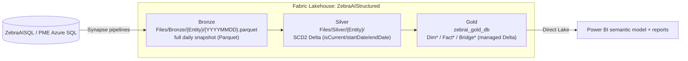
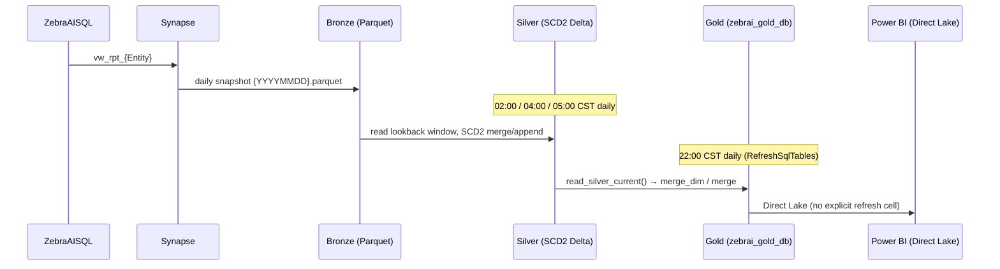

# ZebraAI Reporting Data Pipeline

  
  

---

  

## Table of Contents

  

1. [Executive Summary](#1-executive-summary)

2. [System Overview](#2-system-overview)

3. [Data Pipeline Architecture](#3-data-pipeline-architecture)

4. [Data Flow End-to-End](#4-data-flow-end-to-end)

5. [Data Models & Tables](#5-data-models--tables)

6. [Processing Logic (Spark / SQL)](#6-processing-logic-spark--sql)

7. [Orchestration & Scheduling](#7-orchestration--scheduling)

8. [Dependencies & Integrations](#8-dependencies--integrations)

9. [Path to Production](#9-path-to-production)

10. [Data Validation — Old vs New](#10-data-validation--old-vs-new)

11. [Known Gaps, Risks & Remediation](#11-known-gaps-risks--remediation)

12. [Appendix](#12-appendix)

  

---

  

## 1. Executive Summary

  

The ZebraAI Reporting Data Pipeline is a **Microsoft Fabric Medallion (Bronze → Silver → Gold)** lakehouse

that turns operational ZebraAI application data (experiments, models, API logs, prompt logs, feedback) into a

Direct Lake star schema (`zebrai_gold_db`) for Power BI reporting and cost/usage analytics.

  

**Verified shape of the current (modernized) pipeline:**

  

- **Bronze** — full daily Parquet snapshots landed by Synapse pipelines at `Files/Bronze/{Entity}/{YYYYMMDD}.parquet`.

- **Silver** — SCD2 Delta tables at `Files/Silver/{Entity}/` with `isCurrent` / `startDate` / `endDate` history columns.

- **Gold** — managed Delta star schema in `zebrai_gold_db` (Dimensions via merge-then-delete, Facts via incremental upsert), gated by a Silver-watermark refresh log for compute savings.

  (Source: `Gold_Notebooks.Notebook/notebook-content.py`, `Utils.Notebook/notebook-content.py`)

  
  

---

  

## 2. System Overview

  

### 2.1 Purpose

  

Provide CSS (Customer Service & Support) and platform teams a governed analytical view of ZebraAI usage:

experiment runs, model/prompt configuration, API and prompt-log telemetry, user feedback, retention, and

cost/consumption — surfaced through Power BI over a Direct Lake semantic model.

  

### 2.2 Platform & Location (verified)

  

| Property | Value | Source |
|---|---|---|
| Platform | Microsoft Fabric Lakehouse | repo inspection |
| Lakehouse | `ZebraAIStructured` | lakehouse inspection |
| Workspace ID | `fb5b92e7-8d59-46e7-b2ed-2d75ca1b1e97` | lakehouse inspection |
| Lakehouse ID | `13a8452e-dcbc-4aa3-8d14-bca8e07d9cd3` | lakehouse inspection |
| Default schema | `dbo` | lakehouse inspection |
| Gold database | `zebrai_gold_db` (managed Delta) | `Gold_Notebooks.Notebook` |
| OneLake shortcuts | **None** | lakehouse inspection |
| Source system | ZebraAISQL (PME Azure SQL) → Synapse → Bronze | repo + `ZebraAI-Synapse/` |

  

### 2.3 Layer responsibilities

  

(Source: `Utils.Notebook`, `Gold_Notebooks.Notebook`, `ArchitectureReview/Fabric-Medallion-End-to-End-Flow.md`)

  

---

  

## 3. Data Pipeline Architecture

  

### 3.1 Bronze layer

  

- **Format:** Parquet (not Delta). Full daily snapshot per entity, named by date: `{YYYYMMDD}.parquet`.

- **Producer:** Synapse pipelines copy `vw_rpt_{Entity}` → `{Entity}` from ZebraAISQL into `Files/Bronze/{Entity}/`.

- **Reader contract:** Silver notebooks read a **lookback window** of daily snapshots (default `lookbackDays = 5`).

  (Source: `Utils.Notebook` `read_pipeline_params` / `process_with_backfill`; `FinalPipelines/*`)

  

### 3.2 Silver layer (SCD2 Delta)

  

- **Format:** Delta with SCD2 history columns: `isCurrent` (bool), `startDate` (DATE), `endDate` (DATE).

- **Core engine:** `scd2_merge_append(...)` in `Utils.Notebook` — on first load it creates the table; on

  subsequent loads it expires changed current rows and appends new versions.

- **Config:** `ENTITIES_CONFIG` in `Utils.Notebook` declares per-entity `business_keys`, source folder,

  mode, `seq_col`, and `create_mode`.

  (Source: `Utils.Notebook/notebook-content.py`)

  

### 3.3 Gold layer (star schema)

  

- **Dimensions** (`merge_dim`): MERGE on business keys **with `whenNotMatchedBySourceDelete()`** so keys

  dropped from Silver-current are removed from Gold; first run seeds via overwrite.

- **Facts** (`merge`): `whenMatchedUpdate` + `whenNotMatchedInsert` on business keys; **no delete** (history

  accumulates; soft-deleted rows are excluded by `read_silver_current()`).

- **Bridges:** `DimApiIntegrationScenario` (append, stable surrogate key) + `FactBridgeApiIntegrationScenario`

  (full overwrite so removed scenarios disappear).

- **Refresh gate:** `_gold_refresh_log` stores the last Silver watermark per Gold table; unchanged Silver →

  table skipped (≈5–15% idle-hour CU savings). Widgets `forceTables` / `forceRefreshAll` bypass the gate.

  (Source: `Gold_Notebooks.Notebook/notebook-content.py`, lines ~96–123, 217–277, 363–476, 539–602)

  

---

  

## 4. Data Flow End-to-End

  

  

**Daily critical path (verified order):**

1. **02:00 CST** — `ZebraAiPipeline_General` runs 4 Silver notebooks in parallel (Feedback/FeedbackValue, API, General, Prompt).

2. **04:00 CST** — `ZebraAi_PromptLog` runs PromptLog Silver → Bronze CDF snapshot → Bronze monitoring (sequential).

3. **05:00 CST** — `ZebraAI_ApiLogV2` runs the ApiLog Silver notebook (writes 4 ApiLog projections).

4. **22:00 CST** — `RefreshSqlTables` runs `Gold_Notebooks` to refresh all Dim/Fact/Bridge tables.

   (Source: `FinalPipelines/*/pipeline-content.json` + `.schedules`)

  

There is a ~17-hour gap between Silver completion and Gold refresh, so they do not normally overlap, **but there

is no explicit Silver→Gold completion gate** (see §11, Risk O3).

  

---

  

## 5. Data Models & Tables

  

### 5.1 Gold dimensions (verified)

  

| Gold table | Source Silver entity | Merge keys | Notes |
|---|---|---|---|
| `DimExperiment` | `Silver/Experiment` | `[Id]` | |
| `DimUser` | `Silver/User` | `[Id]` | |
| `DimModel` | `Silver/Model` | `[Id]` | |
| `DimApi` | `Silver/Api` | `[Id]` | |
| `DimActiveExperiment` | `Silver/ActiveExperiment` | `[Id]` | |
| `DimExperimentFeedback` | `Silver/Feedback` | `[Id]` | |
| `DimExperimentFeedbackValue` | `Silver/FeedbackValue` | `[Id, source]` | |
| `DimModelParameter` | `Silver/ModelParameter` | `[ModelId]` | |
| `DimModelPrompt` | `Silver/ModelPrompt` | `[ModelId]` | |
| `DimRetention` | `Silver/Retention` | `[Id]` | |
| `DimSetting` | `Silver/Settings` | `[SettingsId]` | |
| `DimTop20ExpAPi` | `Silver/Top20ApiExp` | `[Id]` | |
| `DimPromptLog` | `Silver/PromptLogCore` | `[Id]` | refresh-lag candidate |
| `DimPromptLogResult` | `Silver/PromptLogResult` | `[Id]` | refresh-lag candidate |
| `DimPromptLogParameter` | `Silver/PromptLogParameter` | `[Id]` | refresh-lag candidate |
| `DimPromptLogSearch` | `Silver/PromptLogSearch` | `[Id]` | |
| `DimPromptLogPrompt` | `Silver/PromptLogPrompt` | `[Id]` | refresh-lag candidate |
| `DimPrompt` | `Silver/Prompt` | `[Id, OrderNum]` | |
| `DimApiIntegrationScenario` | `Silver/Api` (exploded) | surrogate `IntegrationScenarioKey` | append-only, stable surrogate |

  

(Source: `Gold_Notebooks.Notebook` TABLES dict, lines ~96–123; bridge build lines ~539–602)

  

### 5.2 Gold facts (verified)

  

| Gold table | Source Silver entity | Merge keys | Strategy |
|---|---|---|---|
| `FactFeedback` | `Silver/Feedback` | `[Id]` | incremental MERGE |
| `FactApiLog` | `Silver/ApiLog` | `[Id]` | incremental MERGE — ✅ healthy |
| `FactApiLogParameter` | `Silver/ApiLogParameter` | `[Id]` | incremental MERGE |
| `FactApiLogPrompt` | `Silver/ApiLogPrompt` | `[ApiId]` | incremental MERGE |
| `FactApiLogResult` | `Silver/ApiLogResult` | `[Id]` | incremental MERGE |
| `FactExperiment` | `Silver/Experiment` | `[Id]` | incremental MERGE |
| `FactExperimentLike` | `Silver/ExperimentLike` | `[Id]` | incremental MERGE |
| `FactExperimentFavorite` | `Silver/ExperimentFavorite` | `[Id]` | incremental MERGE |
| `FactBridgeApiIntegrationScenario` | `Silver/Api` (exploded) | `[ApiId, ExperimentId, IntegrationScenarioKey]` | **full overwrite** |

  

(Source: `Gold_Notebooks.Notebook`, lines ~96–123, 178–214)

  

> **`FactExperimentParameter` is intentionally REMOVED** from the Gold build: *"(Removed: FactExperimentParameter

> — no Silver/Parameter writer exists.)"* (Source: `Gold_Notebooks.Notebook`, line ~129). If this table still

> appears in `zebrai_gold_db` (it did in the 2026-05-31 `SHOW TABLES`), it is an **orphan from the old pipeline**

> that was never dropped — not part of the current flow. See risk D3.

  

### 5.3 Silver SCD2 columns

  

Every SCD2 Silver table carries: business key columns, payload columns, plus `isCurrent` (bool),

`startDate` (DATE), `endDate` (DATE). Gold reads only `isCurrent = true` via `read_silver_current()`.

(Source: `Utils.Notebook`, `Gold_Notebooks.Notebook` lines ~136–162)

  

---

  

## 6. Processing Logic (Spark / SQL)

  

### 6.1 Silver — `scd2_merge_append` (Utils)

  

- **First load** (`if not fs.exists(target_path)`): create the Silver Delta table honoring `create_mode`.

- **Incremental:** compute `latest_per_key(src, keys, seq_col)`; expire prior current rows whose payload

  changed (set `isCurrent=false`, `endDate=today`); append new/changed versions as current.

- **Integrity guard:** a "multiple current rows per business key" check exists **but is gated by

  `if create_mode != "overwrite"`** — so for any entity called with `create_mode="overwrite"` the guard never

  runs. (Source: `Utils.Notebook`, `scd2_merge_append`)

  

### 6.2 Gold — `read_silver_current`, `merge_gold_dim`, `merge_gold_fact`

  

- `read_silver_current(silver_path)`: filters Silver to `isCurrent = true` (or `endDate = '9999-12-31'`).

- `merge_gold_dim`: first run overwrite-seeds; thereafter MERGE on keys **with `whenNotMatchedBySourceDelete()`**.

- `merge_gold_fact`: MERGE `whenMatchedUpdate` + `whenNotMatchedInsert`; no delete.

- **Validation asserts run after each write:**

  - `assert_gold_current_only` — every Gold row must be current.

  - `assert_no_historical_key_leakage` — no Gold key may exist only among Silver historical rows.

  - `assert_counts_match_current` — for `overwrite`/`merge_dim`, Gold count **must equal** Silver-current; for facts, Gold ≥ Silver-current.

  (Source: `Gold_Notebooks.Notebook`, lines ~136–162, 217–277, 283–357)

  

### 6.3 Refresh watermark gate

  

`_gold_refresh_log(gold_table, silver_source, silver_max_modified, silver_row_count, refresh_started_at,

refresh_completed_at, rows_written, skipped, skip_reason)`. A table is skipped when

`silver_watermark <= last_gold_refresh` and not forced. `forceRefreshAll=true` or listing the table in

`forceTables` bypasses the gate. (Source: `Gold_Notebooks.Notebook`, lines ~363–476)

  

---

  

## 7. Orchestration & Scheduling

  

### 7.1 Pipelines (verified)

  

| Pipeline | Cadence | Time | TZ | Activities (order) | Notebooks |
|---|---|---|---|---|---|
| `ZebraAiPipeline_General` | Daily | 02:00 | CST | 4 parallel (no dependsOn) | SilverFeedback_FeedbackValue, Silver_API, Silver General, SilverPrompt |
| `ZebraAi_PromptLog` | Daily | 04:00 | CST | sequential ×3 | Silver_PromptLog → Bronze_Snapshot_To_Delta_CDF → Bronze Monitoring |
| `ZebraAI_ApiLogV2` | Daily | 05:00 | CST | 1 | Silver_APILogV2 (writes ApiLog, ApiLogParameter, ApiLogResult, ApiLogPrompt) |
| `RefreshSqlTables` | Daily | 22:00 | CST | 1 | Gold_Notebooks (all Dim/Fact/Bridge) |
| `Lifecycle_Weekly_Audit` | Weekly (Sun) | 02:00 | UTC | sequential ×3 | Lifecycle_Plan → Lifecycle_Validate → Lifecycle_Archive |
| `Maintenance_Weekly_Optimize` | Weekly (Sun) | 03:00 | UTC | 1 | Maintenance (OPTIMIZE, 7-day lookback) |
| `Maintenance_Monthly_Vacuum` | Weekly (Sun), 1st-Sunday gate | 04:00 | UTC | IfCondition → 1 | Maintenance (VACUUM, 168h retention) |

  

(Source: `FinalPipelines/*/pipeline-content.json` and `.schedules`)

  

### 7.2 Key parameters & defaults (verified)

  

| Pipeline | Parameter | Default |
|---|---|---|
| General / ApiLogV2 / PromptLog | `lookbackDays` | **5** |
| General / ApiLogV2 / PromptLog | `failFast` | `true` |
| General | `notebookVar` | `{yyyyMMdd}.parquet` |
| RefreshSqlTables | `forceTables` | (none) |
| Lifecycle_Weekly_Audit | `bronze_keep_days` / `silver_archive_after_days` / `gold_archive_after_days` | 14 / 90 / 365 |
| Maintenance_Weekly_Optimize | `optimize_lookback_days` | 7 |
| Maintenance_Monthly_Vacuum | `vacuum_retention_hours` | 168 |

  
  

---

  

## 8. Dependencies & Integrations

  

- **Upstream:** ZebraAISQL (PME Azure SQL) via `ZebraAI-Synapse/` pipelines → Bronze Parquet.

- **Compute:** Fabric Spark notebooks (`FinalNotebooks/`), `notebookutils` / `mssparkutils` for fs + widgets.

- **Storage:** OneLake (`Files/Bronze`, `Files/Silver`, `Files/BronzeDelta`); managed Delta `zebrai_gold_db`.

- **Serving:** Power BI Direct Lake semantic model over Gold. **No explicit semantic-model refresh cell** —

  Direct Lake auto-reflects Delta changes. (Source: `Gold_Notebooks.Notebook`, end of file)

- **Lifecycle/maintenance:** OPTIMIZE, VACUUM, and archive/retention notebooks (`Maintenance`, `Lifecycle_*`).

- **No OneLake shortcuts** are used (all data physically lands in this lakehouse).

  

---

  

## 9. Path to Production

  

**Environment model (verified context):** the entire Fabric workspace **is** production — there is no

separate dev/test workspace and no PR-gated promotion; notebook/pipeline edits land live (build-in-place).

  

**Implications & recommended guardrails:**

1. **Change safety** — because edits are live, validate every notebook change with `forceTables` on a single

   table before a full refresh.

2. **Reconciliation runs** — use `forceRefreshAll=true` (RefreshSqlTables) to re-sync Gold after any Silver repair.

3. **Backfill** — `process_with_backfill` + `lookbackDays` allow re-ingesting recent Bronze snapshots without manual file handling.

4. **Reversibility** — Silver/Gold are Delta; `DESCRIBE HISTORY` + time travel provide rollback for repairs

   (VACUUM retention is 168h, so repairs are recoverable within 7 days).

  

---

  

## 10. Data Validation — Old vs New

  

The 2026-05-31 validation compared Gold against Silver-current for every table. Results (verified from the run):

  

### 10.1 Healthy / faithful

  

| Table | Gold | Silver-current | Δ | Dup keys |
|---|---:|---:|---:|---:|
| `FactApiLog` | 14,123,801 | 14,123,801 | 0 | 0 |
| `DimApiIntegrationScenario` | 10 | 10 | 0 | 0 |
| `FactBridgeApiIntegrationScenario` | 2,565 | — | — | 0 null keys |

  

> **ApiLog is fully represented and is the cleanest table in the lake.** It has no `Dim` by design (it is

> event/fact data, modeled as the `FactApiLog*` family).

  

### 10.2 Duplicate-key defects (Silver origin)

  

| Table | Gold | Silver-current | Dup keys | Keys |
|---|---:|---:|---:|---|
| `DimExperimentFeedbackValue` | 4,588,112 | 4,588,112 | **231,864** | `[Id, source]` |
| `DimModelPrompt` | — | — | 133 | `[ModelId]` |
| `DimPrompt` | — | — | 5 | `[Id, OrderNum]` |

  

Gold equals Silver exactly for FeedbackValue → the Gold merge is faithful and the **duplicates are produced in

the Silver writer**, not in Gold.

  

### 10.3 Refresh-lag deltas (not corruption)

  

| Table(s) | Δ (Gold − Silver-current) | Cause |
|---|---:|---|
| `DimPromptLog`, `DimPromptLogResult`, `DimPromptLogParameter`, `DimPromptLogPrompt` | −9,291 each | Gold last refreshed 2026-05-29; Silver advanced to 2026-05-31 |
| `FactFeedback` | −94 (9,021 vs 9,115) | refresh lag |
| `FactExperiment` / `FactExperimentLike` / `FactExperimentFavorite` | −18 / −3 / −6 | refresh lag |
| `DimRetention` / `DimTop20ExpAPi` | −16 / −1 | refresh lag |

  

`_gold_refresh_log` confirms these tables last ran **2026-05-29**, so the negative deltas are the

watermark-gate working as designed (stale, recoverable by a forced refresh), **not** data loss.

  

---

  

## 11. Appendix

  

### 11.1 Source inventory

  

| Area | Path |
|---|---|
| Silver/Gold notebooks | `ZebraAI-Fabric/Garima/FinalNotebooks/` (`Utils`, `Gold_Notebooks`, `SilverFeedback_FeedbackValue`, `Silver_API`, `Silver_APILogV2`, `Silver_PromptLog`, `SilverPrompt`, `Silver General Notebook`, `Maintenance`, `Lifecycle_*`, `Bronze_Snapshot_To_Delta_CDF`) |
| Pipelines | `ZebraAI-Fabric/Garima/FinalPipelines/` (7 `*.DataPipeline`) |
| Source DB / ingestion | `ZebraAI-Synapse/` (Synapse pipelines, `vw_rpt_{Entity}` → Bronze) |

  

### 11.2 Glossary

  

- **SCD2** — Slowly Changing Dimension Type 2: history preserved via `isCurrent` / `startDate` / `endDate`.

- **merge_dim** — Gold dimension load: MERGE on business keys + delete keys absent from Silver-current.

- **Watermark gate** — `_gold_refresh_log` comparison that skips Gold tables whose Silver source is unchanged.

- **Direct Lake** — Power BI storage mode reading Delta directly from OneLake (no import refresh).

  

---

  

*End of document.*